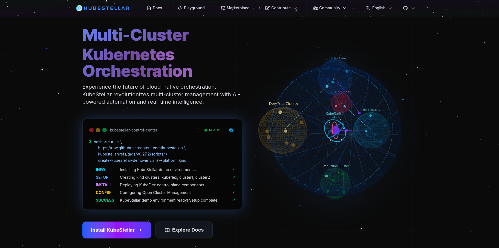

# KubeStellar Documentation

<p align="center">
  
</p>

<h2 align="center">Multi-cluster Configuration Management for Edge, Multi-Cloud, and Hybrid Cloud</h2>

<p align="center">
  Official documentation repository for <strong><a href="https://kubestellar.io" target="_blank">KubeStellar</a></strong>, 
  a CNCF Sandbox Project enabling seamless multi-cluster configuration management 
  for edge, multi-cloud, and hybrid cloud environments.
</p>

<p align="center">
  <a href="https://cloud-native.slack.com/archives/C097094RZ3M" target="_blank">
    
  </a>
  &nbsp;
  <a href="https://deepwiki.com/kubestellar/ui" target="_blank">
    
  </a>
</p>

## Preview of KubeStellar Docs Website

<p align="center">
  
</p>

Visit our website: [http://prod.previews.kubestellar.io/en](http://prod.previews.kubestellar.io/en)

## Overview

**KubeStellar** simplifies Kubernetes operations across distributed infrastructure by providing powerful multi-cluster configuration management capabilities. This repository serves as the canonical source for all KubeStellar documentation, powering the official documentation website at <a href="https://kubestellar.io" target="_blank">kubestellar.io</a>.

### Key Features

- **Flexible Binding Policies** — Define sophisticated relationships between clusters and Kubernetes resources
- **Familiar Tooling** — Leverage existing single-cluster tools and workflows for multi-cluster operations
- **Enhanced Operations** — Improve compliance, resilience, availability, and developer productivity across your infrastructure

### Documentation Content

This repository includes comprehensive documentation such as:

- **Getting Started Guides** — Quick start workflows and installation instructions
- **User & Operator Guides** — Detailed operational documentation
- **Architecture & Technical References** — In-depth design specifications
- **API Documentation** — Complete API reference materials
- **Roadmaps & Release Notes** — Project planning and version history
- **Contribution Guidelines** — Resources for contributors and maintainers
- **Real-World Examples** — Practical use cases and hands-on tutorials

## Local Development

This documentation site is built with [Next.js](https://nextjs.org/), providing a modern, performant documentation experience.

### Prerequisites

- **Node.js** v18.0.0 or higher ([Download](https://nodejs.org/))
- **npm** or **yarn** package manager

Verify your Node.js installation:

```bash
node --version
```

### Setup Instructions

1. **Clone the repository:**

   ```bash
   git clone https://github.com/kubestellar/kubestellar.git
   cd docd
   ```

2. **Install dependencies:**

   ```bash
   npm install
   # or
   yarn install
   ```

3. **Start the development server:**

   ```bash
   npm run dev
   # or
   yarn dev
   ```

   The site will be available at `http://localhost:3000` with hot-reload enabled for instant feedback.

4. **Build for production:**

   ```bash
   npm run build
   # or
   yarn build
   ```

5. **Preview the production build:**

   ```bash
   npm start
   # or
   yarn start
   ```

## Community & Support

We welcome contributions and engagement from the community. Here's how to get involved:

### Communication Channels

- **Slack**: Join [#kubestellar-dev](https://cloud-native.slack.com/archives/C097094RZ3M) in the [CNCF Slack Workspace](https://communityinviter.com/apps/cloud-native/cncf)
- **Mailing Lists**:
  - [kubestellar-dev](https://groups.google.com/g/kubestellar-dev) — Development discussions
  - [kubestellar-users](https://groups.google.com/g/kubestellar-users) — User community discussions
- **Community Meetings**: Subscribe to our [community calendar](https://calendar.google.com/calendar/event?action=TEMPLATE&tmeid=MWM4a2loZDZrOWwzZWQzZ29xanZwa3NuMWdfMjAyMzA1MThUMTQwMDAwWiBiM2Q2NWM5MmJlZDdhOTg4NGVmN2ZlOWUzZjZjOGZlZDE2ZjZmYjJmODExZjU3NTBmNTQ3NTY3YTVkZDU4ZmVkQGc&tmsrc=b3d65c92bed7a9884ef7fe9e3f6c8fed16f6fb2f811f5750f547567a5dd58fed%40group.calendar.google.com&scp=ALL)
  - Automatically subscribed via the [kubestellar-dev](https://groups.google.com/g/kubestellar-dev) mailing list
- **Meeting Recordings**: Available on [YouTube](https://www.youtube.com/@kubestellar)
- **Meeting Notes**: View [upcoming](https://github.com/kubestellar/kubestellar/issues?q=is%3Aissue+is%3Aopen+label%3Acommunity-meeting) and [past](https://github.com/kubestellar/kubestellar/issues?q=is%3Aissue+is%3Aclosed+label%3Acommunity-meeting) agendas

### Additional Resources

- **Shared Documents**: Access our [Google Drive](https://drive.google.com/drive/folders/1p68MwkX0sYdTvtup0DcnAEsnXElobFLS?usp=sharing) for design docs and collaborative materials
  - Available to [kubestellar-dev](https://groups.google.com/g/kubestellar-dev) mailing list members
- **Blog**: Read our latest updates on [Medium](https://medium.com/@kubestellar/list/predefined:e785a0675051:READING_LIST)
- **LinkedIn**: Follow [#kubestellar](https://www.linkedin.com/feed/hashtag/?keywords=kubestellar) for news and updates

## Contributing

We welcome contributions of all kinds — from documentation improvements to code contributions. Please review our [Contributing Guide](https://github.com/kubestellar/kubestellar/blob/main/CONTRIBUTING.md) to get started.

### Areas for Contribution

- Documentation improvements and corrections
- Tutorial and example development
- Translation and localization
- Code contributions to the core project
- Community support and engagement

<h2 align="left">
  
  Contributors
</h2>

<p align="center">
  <a href="https://github.com/kubestellar/docs/graphs/contributors">
    
  </a>
</p>

## CNCF Sandbox Project

<p align="center">
  
</p>

KubeStellar is a [Cloud Native Computing Foundation](https://cncf.io) Sandbox project, part of the broader cloud native ecosystem working to make cloud native computing universal and sustainable.

---
