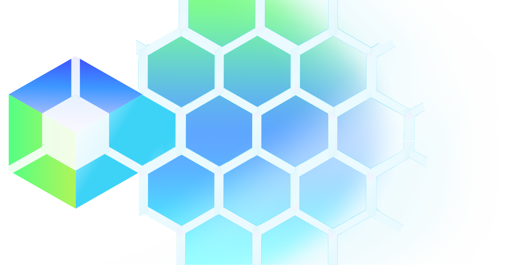

</img>
  
# KCP-Edge: heterogenous, consistent, and scalable edge configuration management
  

## Overview
KCP-Edge is a subproject of kcp focusing on concerns arising from edge multicluster use cases:

- Hierarchy, infrastructure & platform, roles & responsibilities, integration architecture, security issues
- Runtime in[ter]dependence: An edge location may need to operate independently of the center and other edge locations​
- Non-namespaced objects: need general support
- Cardinality of destinations: A source object may propagate to many thousands of destinations. ​ 

## Goals

- collaboratively design a component set similar to those found in the current kcp TMC implementation (dedicated Workspace type, scheduler, syncer-like mechanism, edge placement object definition, status collection strategy, and etc.)
- Specify a multi-phased proof-of-concept inclusive of component architecture, interfaces, and example workloads
- Validate phases of proof-of-concept with kcp, Kube SIG-Multicluster, and CNCF community members interested in Edge

## Areas of exploration

- Desired placement expression​: Need a way for one center object to express large number of desired copies​
- Scheduling/syncing interface​: Need something that scales to large number of destinations​
- Rollout control​: Client needs programmatic control of rollout, possibly including domain-specific logic​
- Customization: Need a way for one pattern in the center to express how to customize for all the desired destinations​
- Status from many destinations​: Center clients may need a way to access status from individual edge copies
- Status summarization​: Client needs a way to say how statuses from edge copies are processed/reduced along the way from edge to center​.

## Quickstart

TBD :building_construction:

## Next Steps

TBD :building_construction:

## Contributing

We ❤️ our contributors! If you're interested in helping us out, please head over to our [Contributing](CONTRIBUTING.md) guide.

## Getting in touch

There are several ways to communicate with us:

- The [`#kcp-dev` channel](https://app.slack.com/client/T09NY5SBT/C021U8WSAFK) in the [Kubernetes Slack workspace](https://slack.k8s.io)
- Our mailing lists:
    - [kcp-dev](https://groups.google.com/g/kcp-dev) for development discussions
    - [kcp-users](https://groups.google.com/g/kcp-users) for discussions among users and potential users
- Subscribe to the [community calendar](https://calendar.google.com/calendar/embed?src=ujjomvk4fa9fgdaem32afgl7g0%40group.calendar.google.com) for community meetings and events
    - The kcp-dev mailing list is subscribed to this calendar
- See recordings of past KCP-Edge community meetings on [YouTube](https://www.youtube.com/playlist?list=PL1ALKGr_qZKc9jyv1EfOFNfoAJo9Q6Ebd)
- See [upcoming](https://github.com/kcp-dev/edge-mc/issues?q=is%3Aissue+is%3Aopen+label%3Acommunity-meeting) and [past](https://github.com/kcp-dev/edge-mc/issues?q=is%3Aissue+is%3Aclosed+label%3Acommunity-meeting) community meeting agendas and notes
- Browse the [shared Google Drive](https://drive.google.com/drive/folders/1FN7AZ_Q1CQor6eK0gpuKwdGFNwYI517M?usp=sharing) to share design docs, notes, etc.
    - Members of the kcp-dev mailing list can view this drive
- Follow us on LinkedIn - [#kcpedge](https://www.linkedin.com/feed/hashtag/?keywords=kcpedge)
