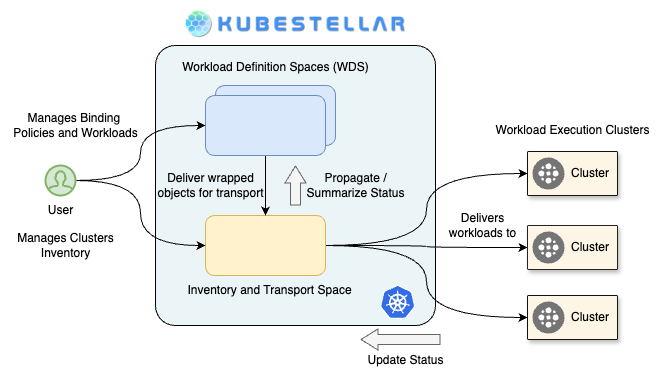

<!--
Note: This repo has two README files with nearly identical content:
- /README.md
- /docs/content/readme.md

If you update shared content in one, please make the same change in the other so they stay in sync.
-->

 
 
 
 

## Multi-cluster Configuration Management for Edge, Multi-Cloud, and Hybrid Cloud

&nbsp;&nbsp;&nbsp;

**KubeStellar** is a Cloud Native Computing Foundation (CNCF) Sandbox project that simplifies the deployment and configuration of applications across multiple Kubernetes clusters. It provides a seamless experience akin to using a single cluster, and it integrates with the tools you're already familiar with, eliminating the need to modify existing resources.

KubeStellar is particularly beneficial if you're currently deploying in a single cluster and are looking to expand to multiple clusters, or if you're already using multiple clusters and are seeking a more streamlined developer experience.

The use of multiple clusters offers several advantages, including:

- Separation of environments (e.g., development, testing, staging)
- Isolation of groups, teams, or departments
- Compliance with enterprise security or data governance requirements
- Enhanced resiliency, including across different clouds
- Improved resource availability
- Access to heterogeneous resources
- Capability to run applications on the edge, including in disconnected environments

In a single-cluster setup, developers typically access the cluster and deploy Kubernetes objects directly. Without KubeStellar, multiple clusters are usually deployed and configured individually, which can be time-consuming and complex.

KubeStellar simplifies this process by allowing developers to define a binding policy between clusters and Kubernetes objects. It then uses your regular single-cluster tooling to deploy and configure each cluster based on these binding policies, making multi-cluster operations as straightforward as managing a single cluster. This approach enhances productivity and efficiency, making KubeStellar a valuable tool in a multi-cluster Kubernetes environment.

## Ecosystem

KubeStellar is a platform — the core orchestration engine is complemented by sub-projects that deliver UI, AI agent tooling, and community content.

| Sub-project | Role | Links |
|-------------|------|-------|
| **kubestellar** *(this repo)* | Core engine — BindingPolicy, WDS, ITS, WEC workload propagation | [Docs](https://kubestellar.io) · [Quickstart](https://docs.kubestellar.io/latest/Getting-Started/quickstart/) |
| [console](https://github.com/kubestellar/console) | AI-powered web dashboard — 160+ cards, GPU monitoring, AI missions | [console.kubestellar.io](https://console.kubestellar.io) |
| [console-marketplace](https://github.com/kubestellar/console-marketplace) | 153+ community card presets — GPU/AI/ML, ArgoCD, OPA, Falco, LLM-d | [Browse](https://github.com/kubestellar/console-marketplace) |
| [console-kb](https://github.com/kubestellar/console-kb) | AI knowledge base — community missions and operational runbooks | [Browse](https://github.com/kubestellar/console-kb) |
| [kubestellar-mcp](https://github.com/kubestellar/kubestellar-mcp) | MCP server — AI agent tooling for Claude, Cursor, Windsurf, VS Code | [Install](https://github.com/kubestellar/kubestellar-mcp#installation) |

**[Try the Console →](https://console.kubestellar.io)** — start in demo mode, no install required. Monitor clusters, deploy workloads, manage GPU resources, and troubleshoot with 400+ AI-powered missions.

> **AI-native stack**: combine [`kubestellar-mcp`](https://github.com/kubestellar/kubestellar-mcp) (natural-language cluster ops via Claude/Cursor/Windsurf) with Console's LLM-d monitoring cards for end-to-end AI inference infrastructure management.

## UI Options

KubeStellar has two open-source UI projects. Here is a quick guide to help you choose:
| Project | [kubestellar/console](https://github.com/kubestellar/console) | [kubestellar/ui](https://github.com/kubestellar/ui) |
|---|---|---|
| **Best for** | New users — start here | Monitoring-focused deployments |
| **Key features** | AI-powered missions, multi-cluster policy, demo mode | Cluster dashboarding, Prometheus/Grafana integration |
| **Backend** | Go + SQLite | Go/Gin + PostgreSQL + Redis |
| **Try it** | [console.kubestellar.io](https://console.kubestellar.io) | See repo README |

### Console
Try the [KubeStellar Console](https://console.kubestellar.io) — an open-source web dashboard for managing multi-cluster Kubernetes deployments. Monitor clusters, deploy workloads, manage GPU resources, and troubleshoot with 400+ AI-powered missions. It starts in demo mode so you can explore immediately.

### UI
[kubestellar/ui](https://github.com/kubestellar/ui) is a cluster dashboarding interface focused on Prometheus and Grafana integration, with a PostgreSQL + Redis backend for production-grade persistence.

## Website
