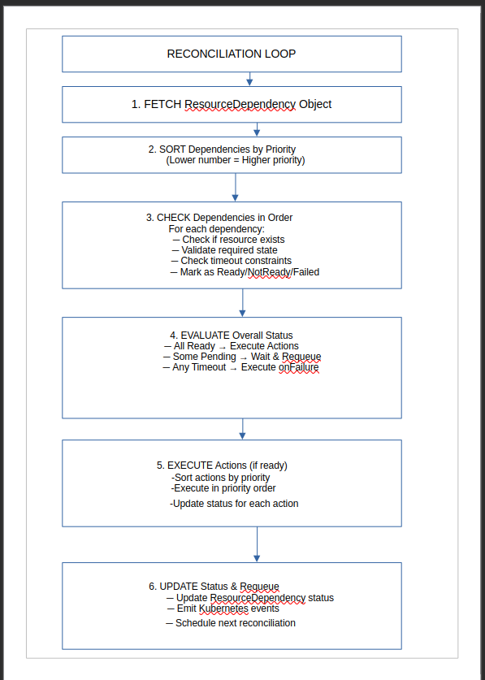

# Resource Dependency Operator - Complete Algorithm & Implementation logic

## Problem Statement

KubeStellar faces critical dependency management and security issues:

- **Security Vulnerabilities**: Multiple initContainers using outdated kubectl images introduce CVEs and security risks
- **Complex RBAC Requirements**: Current approach requires excessive privileges for initialization containers
- **Missing Helm Capabilities**: No native "wait for resource existence/state" or "create if not exists" functionality
- **Resource Monitoring Limitations**: Current snapshot-based approach instead of continuous watch/informer pattern
- **Inter-Chart Dependencies**: Problems with Helm chart dependencies and "null value" issues
- **Conditional Resource Creation**: No declarative way to create resources based on state of other resources
- **Pre-install Hook Limitations**: Limited ability to check for existing resources before installation

These issues create significant operational risks:
- Security vulnerabilities from outdated kubectl images
- Fragile bash scripts managing critical infrastructure
- Excessive RBAC permissions granted to initialization containers
- Delayed detection of deployment issues
- Difficult troubleshooting when resources fail to initialize properly
- Complex rollback procedures when dependency chains break

## Solution: Dependency Management Operator

A Kubernetes-native operator that handles resource dependencies, priority-based creation, and state waiting - eliminating the need for initContainers and kubectl images while providing continuous monitoring capabilities.

---

## Core Algorithm

### 1. **Resource Definition & Priority Algorithm**

```yaml
apiVersion: tools.kubestellar.io/v1
kind: ResourceDependency
metadata:
  name: kubestellar-bootstrap
spec:
  # Priority-based execution (lower number = higher priority)
  priority: 1
  
  # Dependencies to wait for
  dependencies:
    - resource: "namespace/kubestellar-system"
      timeout: "2m"
      priority: 1
    - resource: "deployment/kubeflex-controller-manager"
      namespace: "kubeflex-system"
      state: "Ready"
      minReplicas: 1
      timeout: "5m"
      priority: 2
    - resource: "crd/controlplanes.kubeflex.kubestellar.io"
      timeout: "1m"
      priority: 1

  # Actions to execute when dependencies are met
  actions:
    - priority: 1
      type: "create"
      resource:
        apiVersion: "v1"
        kind: "ConfigMap"
        metadata:
          name: "kubestellar-bootstrap-status"
          namespace: "kubestellar-system"
        data:
          phase: "dependencies-ready"
          timestamp: "{{ .Now }}"

    - priority: 2
      type: "template"
      template: |
        apiVersion: v1
        kind: Secret
        metadata:
          name: kubestellar-bootstrap
          namespace: {{ .Dependencies.namespace_kubestellar_system.Name }}
        data:
          config: {{ .Values.bootstrapConfig | b64enc }}

  # Failure handling
  onFailure:
    - type: "event"
      message: "KubeStellar bootstrap dependencies failed"
    - type: "status"
      phase: "Failed"
```

### 2. **Core Reconciliation Algorithm**


### 3. **Dependency Checking Algorithm**

```go
func (r *ResourceDependencyReconciler) checkDependency(ctx context.Context, dep Dependency) DependencyStatus {
    // Parse resource reference
    gvk, name, namespace := parseResourceRef(dep.Resource)
    
    // Apply timeout constraint
    if time.Since(dep.StartTime) > dep.Timeout {
        return DependencyStatus{
            State: "TimedOut",
            Message: fmt.Sprintf("Dependency %s timed out after %v", dep.Resource, dep.Timeout),
            LastChecked: time.Now(),
        }
    }
    
    // Check if resource exists
    obj := &unstructured.Unstructured{}
    obj.SetGroupVersionKind(gvk)
    
    err := r.Get(ctx, types.NamespacedName{Name: name, Namespace: namespace}, obj)
    if err != nil {
        if apierrors.IsNotFound(err) {
            return DependencyStatus{
                State: "NotFound",
                Message: fmt.Sprintf("Resource %s not found", dep.Resource),
                LastChecked: time.Now(),
            }
        }
        return DependencyStatus{State: "Error", Message: err.Error()}
    }
    
    // Check specific state requirements
    return r.validateResourceState(obj, dep)
}

func (r *ResourceDependencyReconciler) validateResourceState(obj *unstructured.Unstructured, dep Dependency) DependencyStatus {
    switch obj.GetKind() {
    case "Deployment":
        return r.checkDeploymentReady(obj, dep)
    case "StatefulSet":
        return r.checkStatefulSetReady(obj, dep)
    case "Pod":
        return r.checkPodReady(obj, dep)
    case "Service":
        return r.checkServiceReady(obj, dep)
    case "CustomResourceDefinition":
        return r.checkCRDReady(obj, dep)
    case "Namespace":
        return r.checkNamespaceReady(obj, dep)
    default:
        // For unknown resources, just check existence
        return DependencyStatus{
            State: "Ready",
            Message: fmt.Sprintf("Resource %s exists", dep.Resource),
            LastChecked: time.Now(),
        }
    }
}
```

### 4. **Priority-Based Action Execution Algorithm**

```go
func (r *ResourceDependencyReconciler) executeActions(ctx context.Context, actions []Action, depStatus map[string]DependencyStatus) error {
    // Sort actions by priority (ascending - lower numbers first)
    sort.Slice(actions, func(i, j int) bool {
        return actions[i].Priority < actions[j].Priority
    })
    
    // Execute actions in priority order
    for _, action := range actions {
        if err := r.executeAction(ctx, action, depStatus); err != nil {
            // Log error but continue with next action
            log.Error(err, "Failed to execute action", "priority", action.Priority, "type", action.Type)
            
            // Decide whether to fail fast or continue
            if action.FailFast {
                return fmt.Errorf("action failed with fail-fast enabled: %w", err)
            }
        }
        
        // Optional: Add delay between priority groups
        if action.DelayAfter != nil {
            time.Sleep(action.DelayAfter.Duration)
        }
    }
    
    return nil
}

func (r *ResourceDependencyReconciler) executeAction(ctx context.Context, action Action, depStatus map[string]DependencyStatus) error {
    switch action.Type {
    case "create":
        return r.createResource(ctx, action.Resource, depStatus)
    case "template":
        return r.createFromTemplate(ctx, action.Template, depStatus)
    case "patch":
        return r.patchResource(ctx, action.Patch, depStatus)
    case "delete":
        return r.deleteResource(ctx, action.Delete, depStatus)
    case "wait":
        return r.waitForDuration(ctx, action.Wait)
    case "exec":
        return r.executeCommand(ctx, action.Exec, depStatus)
    default:
        return fmt.Errorf("unknown action type: %s", action.Type)
    }
}
```

---

## Implementation Strategy

### Phase 1: Core Operator Structure (Week 1-2)

```bash
# Initialize project
kubebuilder init --domain kubestellar.io --repo github.com/kubestellar/resource-dependency-operator

# Create main API
kubebuilder create api --group tools --version v1 --kind ResourceDependency --resource --controller

# Create supplementary APIs for advanced features
kubebuilder create api --group tools --version v1 --kind DependencyGroup --resource --controller
```

**Deliverables:**
- Basic project structure with kubebuilder
- Initial CRD definitions
- Controller scaffolding
- Unit test framework

### Phase 2: Dependency Checking Engine (Week 3-4)

**Focus Areas:**
- Resource existence validation
- Resource state validation for standard Kubernetes resources
- Timeout and retry logic
- Status reporting
- Watch/informer pattern implementation for continuous monitoring

**Deliverables:**
- Complete dependency checking implementation
- Support for all standard Kubernetes resources
- Full unit test coverage for validation functions
- Integration tests with real Kubernetes resources
- Continuous watching for resource state changes

### Phase 3: Action Execution Engine (Week 5-6)

**Focus Areas:**
- Priority-based action execution
- Template processing engine
- Patch/create/delete implementations
- Conditional execution logic
- "Create if not exists" pattern implementation

**Deliverables:**
- Complete action execution implementation
- Go templating with dependency data injection
- Error handling and recovery mechanisms
- Integration tests for all action types
- Support for conditional resource creation

### Phase 4: KubeStellar Integration (Week 7-8)

**Focus Areas:**
- Custom validators for KubeStellar-specific resources (ControlPlane, WDS, ITS)
- Migration plan from initContainers to operator
- Example ResourceDependency objects for common KubeStellar patterns
- Documentation and usage examples
- Support for inter-chart dependencies

**Deliverables:**
- KubeStellar-specific extensions
- End-to-end tests with KubeStellar components
- Migration guides and examples
- Performance testing and optimization
- Pre-install hook replacement patterns

### Phase 5: Advanced Features & Stabilization (Week 9-10)

**Focus Areas:**
- DependencyGroup implementation
- Advanced conditional logic
- Performance optimization
- Documentation and examples
- Helm chart for operator deployment

**Deliverables:**
- Complete user documentation
- Advanced usage examples
- Performance benchmarks
- Production readiness review
- Helm chart for easy deployment

## KubeStellar-Specific Integration Examples

### Example 1: KubeFlex Bootstrap Without InitContainers

#### **Current Pattern with InitContainers**

```yaml
# Current approach with InitContainer
apiVersion: apps/v1
kind: Deployment
metadata:
  name: kubeflex-controller-manager
  namespace: kubeflex-system
spec:
  template:
    spec:
      initContainers:
      - name: wait-for-namespace
        image: bitnami/kubectl:1.25.8
        command: ['sh', '-c', 'until kubectl get namespace kubeflex-system; do echo "Waiting for namespace"; sleep 2; done']
      - name: wait-for-crds
        image: bitnami/kubectl:1.25.8
        command: ['sh', '-c', 'until kubectl get crd controlplanes.kubeflex.kubestellar.io; do echo "Waiting for CRDs"; sleep 2; done']
```

#### **New Pattern with ResourceDependency**

```yaml
# New approach with ResourceDependency operator
apiVersion: tools.kubestellar.io/v1
kind: ResourceDependency
metadata:
  name: kubeflex-bootstrap
  namespace: kubeflex-system
spec:
  priority: 1
  globalTimeout: "10m"
  
  dependencies:
    # Priority 1: Core infrastructure
    - resource: "namespace/kubeflex-system"
      priority: 1
      timeout: "2m"
    
    - resource: "crd/controlplanes.kubeflex.kubestellar.io"
      priority: 1
      timeout: "2m"
  
  actions:
    - priority: 1
      type: "create"
      resource:
        apiVersion: v1
        kind: ConfigMap
        metadata:
          name: kubeflex-prerequisites-ready
          namespace: kubeflex-system
        data:
          status: "ready"
          timestamp: "{{ .Now }}"
    
    - priority: 2
      type: "patch"
      patch:
        target:
          kind: "Deployment"
          name: "kubeflex-controller-manager"
          namespace: "kubeflex-system"
        patchType: "strategic"
        patch: |
          {"spec":{"template":{"metadata":{"annotations":{"kubectl.kubernetes.io/restartedAt":"{{ .Now }}"}}}}}}
```

### Example 2: ITS to WDS Dependency Chain

#### **Current Pattern with InitContainers**

```yaml
# Current approach with initContainers
apiVersion: apps/v1
kind: Deployment
metadata:
  name: wds-controller
  namespace: kubestellar-system
spec:
  template:
    spec:
      initContainers:
      - name: wait-for-its
        image: bitnami/kubectl:1.25.8
        command: ['sh', '-c', 'until kubectl get controlplane its1 -o jsonpath="{.status.phase}" | grep Running; do echo "Waiting for ITS"; sleep 5; done']
      - name: wait-for-ocm
        image: bitnami/kubectl:1.25.8
        command: ['sh', '-c', 'until kubectl get deployment -n its1 cluster-manager -o jsonpath="{.status.readyReplicas}" | grep 1; do echo "Waiting for OCM"; sleep 5; done']
```

#### **New Pattern with ResourceDependency**

```yaml
# New approach with ResourceDependency operator
apiVersion: tools.kubestellar.io/v1
kind: ResourceDependency
metadata:
  name: wds-prerequisites
  namespace: kubestellar-system
spec:
  priority: 2
  
  dependencies:
    # Wait for ITS to be ready
    - resource: "controlplane.kubeflex.kubestellar.io/its1"
      state: "Ready"
      priority: 1
      timeout: "8m"
      conditions:
        - jsonPath: ".status.phase"
          value: "Running"
    
    # Wait for OCM in ITS
    - resource: "deployment/cluster-manager"
      namespace: "its1"
      state: "Ready"
      priority: 2
      timeout: "5m"
      minReplicas: 1
  
  actions:
    - priority: 1
      type: "template"
      template: |
        apiVersion: v1
        kind: Secret
        metadata:
          name: wds-its-connection
          namespace: kubestellar-system
        data:
          its-endpoint: {{ .Dependencies.controlplane_its1.Status.Endpoint | b64enc }}
          its-kubeconfig: {{ .Dependencies.controlplane_its1.Status.Kubeconfig | b64enc }}
    
    - priority: 2
      type: "patch"
      patch:
        target:
          kind: "Deployment" 
          name: "wds-controller"
          namespace: "kubestellar-system"
        patchType: "strategic"
        patch: |
          {"spec":{"template":{"metadata":{"annotations":{"kubectl.kubernetes.io/restartedAt":"{{ .Now }}"}}}}}}
```

### Example 3: Conditional Resource Creation for PostgreSQL

#### **Current Pattern with Bash Scripts**

```yaml
# Current approach with bash scripts
apiVersion: batch/v1
kind: Job
metadata:
  name: postgres-setup
  namespace: kubestellar-system
spec:
  template:
    spec:
      containers:
      - name: setup
        image: bitnami/kubectl:1.25.8
        command:
        - /bin/bash
        - -c
        - |
          if ! kubectl get statefulset postgres -n kubestellar-system; then
            kubectl apply -f /manifests/postgres.yaml
            until kubectl get pod postgres-0 -n kubestellar-system -o jsonpath="{.status.phase}" | grep Running; do
              echo "Waiting for PostgreSQL"
              sleep 5
            done
            kubectl apply -f /manifests/database-init.yaml
          fi
```

#### **New Pattern with ResourceDependency**

```yaml
# New approach with ResourceDependency operator
apiVersion: tools.kubestellar.io/v1
kind: ResourceDependency
metadata:
  name: postgres-setup
  namespace: kubestellar-system
spec:
  priority: 1
  
  dependencies:
    # Check if PostgreSQL already exists (optional dependency)
    - resource: "statefulset/postgres"
      namespace: "kubestellar-system"
      priority: 1
      timeout: "1m"
      optional: true  # This dependency is optional
  
  actions:
    # Create PostgreSQL if it doesn't exist
    - priority: 1
      type: "create"
      condition:
        type: "dependency"
        dependency: "statefulset/postgres"
        state: "NotFound"
      resource:
        apiVersion: apps/v1
        kind: StatefulSet
        metadata:
          name: postgres
          namespace: kubestellar-system
        spec:
          serviceName: postgres
          replicas: 1
          # ... rest of StatefulSet definition ...
    
    # Wait for PostgreSQL to be ready
    - priority: 2
      type: "wait"
      wait: "10s"
      condition:
        type: "dependency" 
        dependency: "statefulset/postgres"
        state: "NotFound"
        negate: true
    
    # Create initialization job
    - priority: 3
      type: "create"
      condition:
        type: "dependency"
        dependency: "statefulset/postgres" 
        state: "Ready"
      resource:
        apiVersion: batch/v1
        kind: Job
        metadata:
          name: postgres-init
          namespace: kubestellar-system
        spec:
          # ... database initialization job ...
```

### Example 4: Resource Processing Example (Watch/Informer Pattern)

```yaml
# Resource processing example
apiVersion: tools.kubestellar.io/v1
kind: ResourceDependency
metadata:
  name: its-wds-binding
  namespace: kubestellar-system
spec:
  # Enable continuous watching instead of one-time check
  watchMode: true
  
  dependencies:
    - resource: "controlplane.kubeflex.kubestellar.io/its1"
      state: "Ready"
      watchEvents: ["update", "create"]  # Watch for these events
      
    - resource: "controlplane.kubeflex.kubestellar.io/wds1"
      state: "Ready"
      watchEvents: ["update", "create"]  # Watch for these events
  
  actions:
    - priority: 1
      type: "template"
      template: |
        apiVersion: kubestellar.io/v1alpha1
        kind: ITSWDSBinding
        metadata:
          name: its1-wds1-binding
          namespace: kubestellar-system
        spec:
          itsName: its1
          wdsName: wds1
          itsEndpoint: {{ .Dependencies.controlplane_its1.Status.Endpoint }}
          wdsEndpoint: {{ .Dependencies.controlplane_wds1.Status.Endpoint }}
      # This action will be re-executed whenever dependencies change
      runOnChanges: true
```

### Example 5: Helm Pre-Install Hook Replacement

```yaml
# Replaces Helm pre-install hooks with a more powerful pattern
apiVersion: tools.kubestellar.io/v1
kind: ResourceDependency
metadata:
  name: kubestellar-prereq-check
  namespace: kubestellar-system
  annotations:
    "helm.sh/hook": "pre-install"
spec:
  priority: 1
  
  dependencies:
    # Check for Kubernetes version
    - resource: "version/kubernetes"
      conditions:
        - jsonPath: ".major"
          value: "1"
          operator: "gte"
        - jsonPath: ".minor" 
          value: "24"
          operator: "gte"
    
    # Check if namespace exists
    - resource: "namespace/kubestellar-system"
      optional: true
  
  actions:
    # Create namespace if it doesn't exist
    - priority: 1
      type: "create"
      condition:
        type: "dependency"
        dependency: "namespace/kubestellar-system"
        state: "NotFound"
      resource:
        apiVersion: v1
        kind: Namespace
        metadata:
          name: kubestellar-system
          labels:
            app.kubernetes.io/managed-by: kubestellar
    
    # Update Helm values based on environment
    - priority: 2
      type: "template"
      template: |
        apiVersion: v1
        kind: ConfigMap
        metadata:
          name: kubestellar-helm-values
          namespace: kubestellar-system
        data:
          overrideValues.yaml: |
            global:
              kubernetesVersion: {{ .Dependencies.version_kubernetes.Status.version }}
              namespaceExists: {{ if eq .Dependencies.namespace_kubestellar_system.State "Ready" }}true{{ else }}false{{ end }}
```

### Example 6: Complete KubeStellar Deployment Chain

```yaml
apiVersion: tools.kubestellar.io/v1
kind: DependencyGroup
metadata:
  name: kubestellar-full-deployment
  namespace: kubestellar-system
spec:
  groups:
    # Phase 1: Infrastructure
    - name: "core-infrastructure"
      priority: 1
      dependencies:
        - name: "kubestellar-namespaces"
          resource: "namespace/kubestellar-system"
        - name: "kubeflex-namespaces"
          resource: "namespace/kubeflex-system"
        - name: "kubeflex-crds"
          resource: "crd/controlplanes.kubeflex.kubestellar.io"
        - name: "kubestellar-crds"
          resource: "crd/workloadclusters.kubestellar.io"
    
    # Phase 2: Operators
    - name: "operators"
      priority: 2
      dependsOn: ["core-infrastructure"]
      dependencies:
        - name: "kubeflex-controller"
          resource: "deployment/kubeflex-controller-manager"
          namespace: "kubeflex-system"
          state: "Ready"
          minReplicas: 1
    
    # Phase 3: Control Planes
    - name: "control-planes"
      priority: 3
      dependsOn: ["operators"]
      dependencies:
        - name: "its-controlplane"
          resource: "controlplane.kubeflex.kubestellar.io/its1"
          state: "Ready"
          conditions:
            - jsonPath: ".status.phase"
              value: "Running"
        - name: "ocm-controller"
          resource: "deployment/cluster-manager"
          namespace: "its1"
          state: "Ready"
    
    # Phase 4: WDS Setup
    - name: "wds-setup"
      priority: 4
      dependsOn: ["control-planes"]
      dependencies:
        - name: "wds-controlplane"
          resource: "controlplane.kubeflex.kubestellar.io/wds1"
          state: "Ready"
          conditions:
            - jsonPath: ".status.phase"
              value: "Running"
    
    # Phase 5: KubeStellar Controllers
    - name: "kubestellar-controllers"
      priority: 5
      dependsOn: ["wds-setup"]
      dependencies:
        - name: "kubestellar-controller"
          resource: "deployment/kubestellar-controller"
          namespace: "kubestellar-system"
          state: "Ready"
          minReplicas: 1
```

## How This Solution Addresses Franco's Specific Concerns

| Franco's Concern | How Our Solution Addresses It |
|------------------|-------------------------------|
| Security Issues with InitContainers | Completely eliminates the need for kubectl images and privilege escalation in initContainers |
| Resource Waiting | Provides a declarative way to wait for resources with specific states and timeout handling |
| Resource Processing | Implements watch/informer pattern with the `watchMode` and `runOnChanges` features |
| Pre-install Hooks Enhancement | Offers conditional resource creation and checking capabilities that go beyond Helm's hook system |
| Chart Dependencies | Solves inter-chart dependencies through ResourceDependency objects that can be included in charts |
| "Ensure a resource exists" | Implements the "create if not exists" pattern through conditional actions |
| "Wait for resource existence/state" | Core feature of the dependency checking algorithm |
| "If resource A has state B, then do this" | Implemented through conditional actions based on dependency states |

## Testing Strategy

### 1. Unit Tests

- Test dependency validation functions for each resource type
- Test template processing with dependency injection
- Test conditional logic for actions
- Test priority sorting and execution

### 2. Integration Tests

- Test complete ResourceDependency processing
- Test with real Kubernetes resources in a test cluster
- Test timeout and retry mechanisms
- Test error handling and recovery
- Test watch/informer pattern implementation

### 3. End-to-End Tests

- Replace actual KubeStellar initContainers with ResourceDependency
- Validate complete deployment chain
- Test failure scenarios and recovery
- Performance testing with large dependency chains
- Test inter-chart dependencies


## Benefits for KubeStellar

### 1. **Eliminates Current Pain Points**
- ❌ **No more initContainers with security risks**
- ❌ **No kubectl container images to maintain**
- ❌ **No complex RBAC for hook containers**
- ❌ **No bash scripts handling critical infrastructure**
- ❌ **No manual dependency tracking**

### 2. **Kubernetes-Native Solution**
- ✅ **Declarative resource management**
- ✅ **Built-in retry and backoff**
- ✅ **Proper status reporting**
- ✅ **Event-driven reconciliation**
- ✅ **Standard Kubernetes patterns**

### 3. **Advanced Capabilities**
- ✅ **Priority-based execution**
- ✅ **Complex dependency chains**
- ✅ **Template-based resource creation**
- ✅ **Conditional actions**
- ✅ **Timeout and failure handling**
- ✅ **Dynamic data injection from dependencies**
- ✅ **Continuous watching with informer pattern**

### 4. **Security Enhancements**
- ✅ **No privileged containers**
- ✅ **No cluster-admin RBAC for initialization**
- ✅ **No exposed kubectl images**
- ✅ **Fine-grained permissions model**
- ✅ **Audit trail through Kubernetes events**

### 5. **Developer Experience**
- ✅ **Clear visibility into deployment status**
- ✅ **Predictable behavior across environments**
- ✅ **Simplified debugging with detailed status**
- ✅ **Reusable patterns across KubeStellar components**
- ✅ **Self-documenting deployment dependencies**

### 6. **Reusability**
- ✅ **Works across all KubeStellar components**
- ✅ **Can be used by other projects**
- ✅ **Reduces code duplication**
- ✅ **Potential for community contribution**

This operator will transform KubeStellar's deployment model from script-based to fully declarative, Kubernetes-native dependency management, dramatically improving security, reliability, and maintainability while providing a reference implementation for the broader Kubernetes community.
