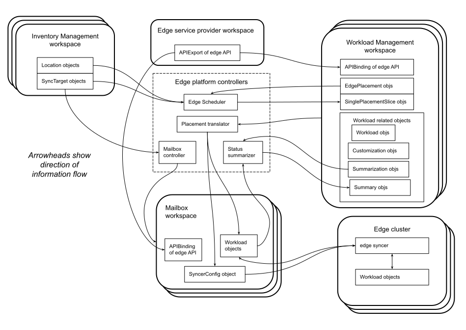

Want to get involved? Check out our [good-first-issue list]({{ config.repo_url }}/issues?q=is%3Aissue+is%3Aopen+label%3A%22good+first+issue%22).

## Status of this memo

This summarizes the current state of design work that is still in
progress.

## Introduction

This is a quick demo of a fragment of what we think is needed for edge
multi-cluster.  It is intended to demonstrate the following points.

- Separation of infrastructure and workload management.
- The focus here is on workload management, and that strictly reads
  an inventory of infrastructure.
- What passes from inventory to workload management is kcp TMC
  Location and SyncTarget objects.
- Use of a kcp workspace as the container for the central spec of a workload.
- Propagation of desired state from center to edge, as directed by
  EdgePlacement objects and the Location and SyncTarget objects they reference.
- Interfaces designed for a large number of edge clusters.
- Interfaces designed with the intention that edge clusters operate
  independently of each other and the center (e.g., can tolerate only
  occasional connectivity) and thus any "service providers" (in the
  technical sense from kcp) in the center or elsewhere.
- Rule-based customization of desired state.
- Propagation of reported state from edge to center.
- Summarization of reported state in the center.
- Return and/or summarization of state from associated objects (e.g.,
  ReplicaSet or Pod objects associated with a given Deployment
  object).
- The edge opens connections to the center, not vice-versa.
- An edge computing platform "product" that can be deployed (as
  opposed to a service that is used).

Some important things that are not attempted in this PoC include the following.

- An implementation that supports a large number of edge clusters or
  any other thing that requires sharding for scale. In this PoC we
  will use a single kcp server to hold all the workspaces, and will
  not shard any controller.
- More than one SyncTarget per Location.
- A hierarchy with more than two levels.
- User control over ordering of propagation from center to edge,
  either among destinations or kinds of objects.
- More than baseline security (baseline being, e.g., HTTPS, Secret
  objects, non-rotating bearer token based service authentication).
- A good design for bootstrapping the workload management in the edge
  clusters.
- Very strong isolation between tenants in the edge computing
  platform.

## Development Roadmap

Some features will get implemented later than others, so that we can
start being able to run interesting end-to-end scenarios relatively
soon.  Following is a list of features that will not be implemented at
first.

Of the following features, customization will be needed before the
others.

### Customization

We can have a complete system that ignores customization, as long as
it is only used for workloads that need no customization.

### Summarization

We can omit summarization at first.

### Return and/or summarization of state from associated objects

This will involve both defining a scalable interface for declaring
what should be returned as well as implementing it.  This will
certainly affect the syncer between mailbox workspace and edge
cluster, and the summarization part will affect the status summarizer.

### Good handling of workload conflicts

We could start by handling workload conflicts in a very simple way:
treating each as an error.  Later development can handle them better,
as outlined [later](#edgeplacement-objects).

### Denaturing/renaturing

We could start by not doing this.  For some resources, the effect of
leaving these resources natured in the center is only to add
authorizations in the center that are not needed and are undesired in
a well-secured environment but tolerable in early demonstrations ---
provided that there is not a conflict with an object of the same name
that is positively desired in the center.  In particular, these are:
`ClusterRole`, `ClusterRoleBinding`, `Role`, `RoleBinding`, and,
depending on the Kubernetes release and usage style, `ServiceAccount`.
The extra consideration for `ServiceAccount` is when an associated
`Secret` is a natural consequence.  However, that is not a practical
problem because such `Secret` objects are recognized as system
infrastructure (see [below](#system-infrastructure-objects)).  Another
consideration for `ServiceAccount` objects, as for `Secret` and
`ConfigMap` objects, is that some are in some sense "reverse-natured":
some are created by some other thing as part of the nature of that
other thing (object or external system).  Another way of looking at
these particular objects is that they are system infrastructure.

For some kinds of object, lack of denaturing/renaturing means that
KubeStellar will simply not be able to support workloads that contain such
objects.  These are: `MutatingWebhookConfiguration`,
`ValidatingWebhookConfiguration`, `LimitRange`, `ResourceQuota`.

For some resources, the need to denature is only a matter of
anticipation.  `FlowSchema` and `PriorityLevelConfiguration` currently
are not interpreted by kcp servers and so are effectively already
denatured there.  Hopefully they will be given interpretations in the
future, and then those resources will join the previous category.

## Roles and Responsibilities

### Developers/deployers/admins/users of the infrastructure management layer

### Developers of the workload management layer

### Deployers/admins of the workload management layer

### Users of the workload management layer

## Design overview

In very brief: the design approach is to achieve the multicast
semantics of edge placement by two layers of activity.  Between the
two layers sit _mailbox workspaces_: these exist in the center, and
there is one for each edge cluster.  One layer of activity runs in the
center and relates the edge placement problems to mailbox workspace
contents.  The other layer is _syncers_, one in each edge cluster,
that relate the corresponding mailbox contents with their local
clusters.

As in TMC, in this design we have _downsync_ and _upsync_ --- but they
are a little more complicated here.  Downsync involves propagation of
desired state from workload management workspace through mailbox
workspaces to edge and return/summarization of reported state.  Upsync
involves return/summarization of desired and reported state of objects
born on the edge clusters.  On the inward path, the reported or full
state goes from edge to the mailbox workspace and then is summarized
to the workload management workspace.  State propagation is maintained
in an eventually consistent way, it is not just one-and-done.

## Inventory Management workspaces (IMW)

In this design the primary interface between infrastructure management
and workload management is API objects in _inventory management_
workspaces.  We abuse the `Location` and `SyncTarget` object types
from [kcp TMC](https://github.com/kcp-dev/kcp/tree/v0.11.0/pkg/apis) for
this purpose.  The people doing infrastructure management are
responsible for creating the inventory management workspaces and
populating them with `Location` and `SyncTarget` objects, one
`Location` and one `SyncTarget` per edge cluster.  These inventory
management workspaces need to use APIBindings to APIExports defining
`Location` and `SyncTarget` so that the workload management layer can
use one APIExport view for each API group to read those objects.

To complete the plumbing of the syncers, each inventory workspace that
contains a SyncTarget needs to also contain the following associated
objects.  FYI, these are the things that `kubectl kcp workload sync`
directly creates besides the SyncTarget.  Ensuring their presence is
part of the problem of bootstrapping the workload management layer and
is not among the things that this PoC takes a position on.

1. A ServiceAccount that the syncer will authenticate as.
2. A ClusterRole manipulating that SyncTarget and the
   APIResourceImports (what are these?).
3. A ClusterRoleBinding that links that ServiceAccount with that
   ClusterRole.

## Edge Service Provider workspace (ESPW)

The edge multi-cluster service is provided by one workspace that
includes the following things.

- An APIExport of the edge API group.
- The edge controllers: scheduler, placement translator, mailbox
  controller, and status summarizer.

## Workload Management workspaces (WMW)

The users of edge multi-cluster primarily maintain these.  Each one of
these has both control (API objects that direct the behavior of the
edge computing platform) and data (API objects that hold workload
desired and reported state).

### Data objects

The workload desired state is represented by kube-style API objects,
in the way that is usual in the Kubernetes milieu.  For edge computing
we need to support both cluster-scoped (AKA non-namespaced) kinds as
well as namespaced kinds of objects.

The use of a workspace as a mere container presents a challenge,
because some kinds of kubernetes API objects at not merely data but
also modify the behavior of the apiserver holding them.  To resolve
this dilemma, the edge users of such a workspace will use a special
view of the workspace that holds only data objects.  The ones that
modify apiserver behavior will be translated by the view into
"denatured" versions of those objects in the actual workspace so that
they have no effect on it.  And for these objects, the transport from
center-to-edge will do the inverse: translate the denatured versions
into the regular ("natured"?) versions for appearance in the edge
cluster.  Furthermore, for some kinds of objects that modify apiserver
behavior we want them "natured" at both center and edge.  There are
thus a few categories of kinds of objects.  Following is a listing,
with with the particular kinds that appear in kcp or plain kubernetes.

#### Needs to be denatured in center, natured in edge

For these kinds of objects: clients of the real workload management
workspace can manipulate some such objects that will modify the
behavior of the workspace, while clients of the edge computing view
will manipulate distinct objects that have no effect on the behavior
of the workspace.  These are kinds of objects to which kcp normally
associates some behavior.  To be fully precise, the concern here is
with behavior that is externally visible (including externally visible
behavior of the server itself); we do not care to dissociate
server-internal behavior such as storing encrypted at rest.  The edge
computing platform will have to implement that view which dissociates
the normal kcp behavior.

| APIVERSION | KIND | NAMESPACED |
| ---------- | ---- | ---------- |
| admissionregistration.k8s.io/v1 | MutatingWebhookConfiguration | false |
| admissionregistration.k8s.io/v1 | ValidatingWebhookConfiguration | false |
| flowcontrol.apiserver.k8s.io/v1beta2 | FlowSchema | false |
| flowcontrol.apiserver.k8s.io/v1beta2 | PriorityLevelConfiguration | false |
| rbac.authorization.k8s.io/v1 | ClusterRole | false |
| rbac.authorization.k8s.io/v1 | ClusterRoleBinding | false |
| rbac.authorization.k8s.io/v1 | Role | true |
| rbac.authorization.k8s.io/v1 | RoleBinding | true |
| v1 | LimitRange | true |
| v1 | ResourceQuota | true |
| v1 | ServiceAccount | true |

#### Needs to be natured in center and edge

These should have their usual effect in both center and edge; they
need no distinct treatment.

Note, however, that they _do_ have some sequencing implications.  They
have to be created before any dependent objects, deleted after all
dependent objects.

| APIVERSION | KIND | NAMESPACED |
| ---------- | ---- | ---------- |
| apiextensions.k8s.io/v1 | CustomResourceDefinition | false |
| v1 | Namespace | false |

#### Needs to be natured in center, not destined for edge

| APIVERSION | KIND | NAMESPACED |
| ---------- | ---- | ---------- |
| apis.kcp.io/v1alpha1 | APIBinding | false |

A workload management workspace needs an APIBinding to the APIExport
of the API group `edge.kcp.io` from the edge service provider
workspace, in order to be able to contain EdgePlacement and related
objects.  These objects and that APIBinding are not destined for the
edge clusters.

The edge clusters are not presumed to be kcp workspaces, so
APIBindings do not propagate to the edge clusters.  However, it is
possible that APIBindings for workload APIs may exist in a workload
management workspace and be selected for downsync to mailbox
workspaces while the edge clusters have the same resources defined by
CRDs (as mentioned later in the discussion of built-in resources and
namespaces).

#### For features not supported

These are part of k8s or kcp APIs that are not supported by the edge
computing platform.

| APIVERSION | KIND | NAMESPACED |
| ---------- | ---- | ---------- |
| apiregistration.k8s.io/v1 | APIService | false |
| apiresource.kcp.io/v1alpha1 | APIResourceImport | false |
| apiresource.kcp.io/v1alpha1 | NegotiatedAPIResource | false |
| apis.kcp.io/v1alpha1 | APIConversion | false |

The APIService objects are of two sorts: (a) those that are built-in
and describe object types built into the apiserver and (b) those that
are added by admins to add API groups served by custom external
servers.  Sort (b) is not supported because this PoC does not support
custom external servers in the edge clusters.  Sort (a) is not
programmable in this PoC, but it might be inspectable.

#### Not destined for edge

These kinds of objects are concerned with either (a) TMC control or
(b) workload data that should only exist in the edge clusters.  These
will not be available in the view used by edge clients to maintain
their workload desired and reported state.

| APIVERSION | KIND | NAMESPACED |
| ---------- | ---- | ---------- |
| apis.kcp.io/v1alpha1 | APIExport | false |
| apis.kcp.io/v1alpha1 | APIExportEndpointSlice | false |
| apis.kcp.io/v1alpha1 | APIResourceSchema | false |
| apps/v1 | ControllerRevision | true |
| authentication.k8s.io/v1 | TokenReview | false |
| authorization.k8s.io/v1 | LocalSubjectAccessReview | true |
| authorization.k8s.io/v1 | SelfSubjectAccessReview | false |
| authorization.k8s.io/v1 | SelfSubjectRulesReview | false |
| authorization.k8s.io/v1 | SubjectAccessReview | false |
| certificates.k8s.io/v1 | CertificateSigningRequest | false |
| coordination.k8s.io/v1 | Lease | true |
| core.kcp.io/v1alpha1 | LogicalCluster | false |
| core.kcp.io/v1alpha1 | Shard | false |
| events.k8s.io/v1 | Event | true |
| scheduling.kcp.io/v1alpha1 | Location | false |
| scheduling.kcp.io/v1alpha1 | Placement | false |
| tenancy.kcp.io/v1alpha1 | ClusterWorkspace | false |
| tenancy.kcp.io/v1alpha1 | Workspace | false |
| tenancy.kcp.io/v1alpha1 | WorkspaceType | false |
| topology.kcp.io/v1alpha1 | Partition | false |
| topology.kcp.io/v1alpha1 | PartitionSet | false |
| v1 | Binding | true |
| v1 | ComponentStatus | false |
| v1 | Event | true |
| v1 | Node | false |
| workload.kcp.io/v1alpha1 | SyncTarget | false |

#### Already denatured in center, want natured in edge

These are kinds of objects that kcp already gives no interpretation
to, and that is what KubeStellar needs from the center workspaces.

This is the default category of kind of object --- any kind of data
object not specifically listed in another category is implicitly in
this category.  Following are the kinds from k8s and kcp that fall in
this category.

| APIVERSION | KIND | NAMESPACED |
| ---------- | ---- | ---------- |
| apps/v1 | DaemonSet | true |
| apps/v1 | Deployment | true |
| apps/v1 | ReplicaSet | true |
| apps/v1 | StatefulSet | true |
| autoscaling/v2 | HorizontalPodAutoscaler | true |
| batch/v1 | CronJob | true |
| batch/v1 | Job | true |
| networking.k8s.io/v1 | Ingress | true |
| networking.k8s.io/v1 | IngressClass | false |
| networking.k8s.io/v1 | NetworkPolicy | true |
| node.k8s.io/v1 | RuntimeClass | false |
| policy/v1 | PodDisruptionBudget | true |
| scheduling.k8s.io/v1 | PriorityClass | false |
| storage.k8s.io/v1 | CSIDriver | false |
| storage.k8s.io/v1 | CSINode | false |
| storage.k8s.io/v1 | CSIStorageCapacity | true |
| storage.k8s.io/v1 | StorageClass | false |
| storage.k8s.io/v1 | VolumeAttachment | false |
| v1 | ConfigMap | true |
| v1 | Endpoints | true |
| v1 | PersistentVolume | false |
| v1 | PersistentVolumeClaim | true |
| v1 | Pod | true |
| v1 | PodTemplate | true |
| v1 | ReplicationController | true |
| v1 | Secret | true |
| v1 | Service | true |

Note that some `ConfigMap` and `Secret` objects are treated
differently, as explained in the next section.

#### System infrastructure objects

Even in a kcp workspace, some certain objects --- called here "system
infrastructure objects" --- are created as a consequence of certain
other objects or things.  The system infrastructure objects are
tolerated in the center and do not propagate toward the edge.  Here is
an initial list of system infrastructure objects:

- `Secret` objects whose _type_ is
  `kubernetes.io/service-account-token` (these are automatically
  created to support a `ServiceAccount` in some circumstances) or
  `bootstrap.kubernetes.io/token`;
- `ConfigMap` objects named `kube-root-ca.crt`;
- `ServiceAcount` objects named `default` (these are automatically
  created as a consequence of a namespace being created).

### Built-in resources and namespaces

An edge cluster has some built-in resources (i.e, kinds of objects)
and namespaces.  A resource may be built-in by any of several ways: it
can be built-in to the apiserver, it can be defined by a CRD, its API
group can be delegated by an APIService to a custom external server
(each of the latter two is sometimes called "aggregation").  Note also
that a resource may be defined in edge clusters one way (e.g., by
being built into kube-apiserver) and in the workload management
workspace another way (e.g., by a CustomResourceDefinition).

In this PoC, all edge clusters are considered to have the same
built-in resources and namespaces.

As a matter of scoping the work here, it is also assumed that each API
group built into the edge clusters supports the API versions chosen by
the conflict resolution rules below when they are applied to the
workload sources.

At deployment time the workload management platform is configured with
lists of resources and namespaces built into the edge clusters.

Propagation from center to edge does not attempt to manage the
resource and namespace definitions that are built into the edge
clusters.

The mailbox workspaces will have built-in resources and namespaces
that are a subset of those built into the edge clusters.  The
propagation from workload management workspace to mailbox workspace
does not attempt to manage the resource and namespace definitions that
are built into the mailbox workspaces.

The above wording is deliberately restrained, for the sake of
flexibility regarding resources that are defined one way in the edge
clusters and another way in workload management workspace.  For
example, the following scenario is allowed.

- Some central team owns an API group and produces some
  CustomResourceDefinition (CRD) objects that populate that API group.
- That team derives APIResourceSchemas from those CRDs and a
  corresponding APIExport of their API group.
- That team maintains a kcp workspace holding those APIResourceSchemas
  and that APIExport.
- Some workload management workspaces have APIBindings to that
  APIExport, and EdgePlacement objects that (1) select those
  APIBinding objects for downsync and (2) select objects of kinds
  defined through those APIBindings for either downsync or upsync.
- Those resources are built into the edge clusters by pre-deploying
  the aforementioned CRDs there.
- Those resources are _not_ built into the mailbox workspaces.  In
  this case the APIBindings would propagate from workload management
  workspace to mailbox workspaces but not edge clusters.
- As a consequence of those propagated APIBindings, the APIExport's
  view includes all of the objects (in workload management workspaces,
  in mailbox workspaces, and in any other workspaces where they
  appear) whose kind is defined through those APIBindings.

### Control objects

These are the EdgePlacement objects, their associated
SinglePlacementSlice objects, and the objects that direct
customization and summarization.

#### EdgePlacement objects

One of these is a binding between a "what" predicate and a "where"
predicate.

Overlaps between EdgePlacement objects are explicitly allowed.  Two
EdgePlacement objects may have "where" predicates that both match some
of the same destinations.  Two EdgePlacement objects may have "what"
predicates that match some of the same workload descriptions.  Two
EdgePlacement objects may overlap in both ways.

An EdgePlacement object deliberately _only_ binds "what" and "where",
without any adverbs (such as prescriptions of customization or
summarization).  This means that overlapping EdgePlacement objects can
not conflict in those adverbs.

However, another sort of conflict remains possible.  This is because
the user controls the IDs --- that is, the names --- of the parts of
the workload.  In full, a Kubernetes API object is identified by API
group, API major version, Kind (equivalently, resource name),
namespace if relevant, and name.  For simplicity in this PoC we will
not worry about differences in API major version; each API group in
Kubernetes and/or kcp currently has only one major version.

Two different workload descriptions can have objects with the same ID
(i.e., if they appear in different workspaces).  These objects, when
rendered to the same API version, might have different values.  And
the objects may be available in different API versions in different
source workspaces.  See
[client-go](https://github.com/kubernetes/client-go/blob/release-1.24/discovery/discovery_client.go#L89)
for what an API server says about which versions it can serve for a
given API group, and
[meta/v1](https://github.com/kubernetes/apimachinery/blob/release-1.24/pkg/apis/meta/v1/types.go#L1045)
for the supporting details on an APIGroup struct.

When multiple workload objects with the same APIGroup, Kind, namespace
(if namespaced), and name are directed to the same edge cluster, they
are merged with conflicts handled by (a) a rule for resolution and (b)
reporting via both error logging and Kubernetes Event creation.  These
conflicts are serious matters: they mean user expectations are not
being met (because they are inconsistent); this is why the placement
translator tries hard to make the user aware.

The first part of merging a set of objects is to read them all at the
same API version.  The placement translator solves the problem of
picking API version at the level of API groups rather than
object-by-object.  The API version for an given API group is chosen as
follows.  First, take the intersection of [the supported
versions](https://github.com/kubernetes/apimachinery/blob/release-1.24/pkg/apis/meta/v1/types.go#L1050)
from the various sources.  If this intersection is empty then this is
a conflict.  It is resolved by throwing out the APIGroup with the
lowest version and repeating with the reduced set of APIGroup structs.
Next, take the union of [the preferred
versions](https://github.com/kubernetes/apimachinery/blob/release-1.24/pkg/apis/meta/v1/types.go#L1054).
If this union has a non-empty intersection with the intersection of
the supported versions, take the following steps with this
intersection; otherwise proceed with just the intersection of the
supported versions.  When first (since process startup) presented with
an instance of this problem, the placement translator picks the
highest version from this intersection.  Subsequently for the same API
group, the placement translator sticks with its previous decision as
long as that is still in the intersection.  If the previous choice is
no longer available, the highest version is picked.  This preference
for highest version is based on the expectation that rolling forward
will be more common than rolling back; using the intersection ensures
that both work (as long as the collection of sources has an overlap in
supported versions, which is basic sanity).

A workload prescription object that is in the process of graceful
deletion (i.e., with `DeletionTimestamp` set to something) is
considered here to already be gone.

Once they have been read at a consistent API version, merging of
multiple objects is done as follows.  Different parts of the object
are handled differently.

- **TypeMeta**.  This can not conflict because it is part of what
  identifies an object.
- **ObjectMeta**.
  - **Labels and Annotations**.  These are handled on a key-by-key
    basis.  Distinct keys do not conflict.  When multiple objects have
    a label or annotation with the same key, the corresponding value
    in the result is the value from the most recently updated of those
    objects.
  - **OwnerReferences**.  This is handled analogously to labels and
    annotations.  The key is the combination of APIVersion, Kind, and
    Name.
  - **Finalizers**.  This is simply a set of strings.  The result of
    merging is the union of the sets.
  - **ManagedFields**.  This is metadata that is not propagated.
- **Spec**.  Beyond TypeMeta and ObjectMeta, the remaining object
  fields are specific to the kind of object.  Many have a field named
  "Spec" in the Go language source, "spec" in the JSON representation.
  For objects that have Spec fields, merging has a conflict if those
  field values are not all equal when considered as JSON data, and the
  resolution is to take the value from the most recently updated
  object.
- **Status**.  Status is handled analogously to Spec.  For both, we
  consider a missing field to be the same as a field with a value of
  `nil`.  That is expected to be the common case for the Status of
  these workload prescription objects.
- **Other fields**.  If all the values are maps (objects in
  JavaScript) then they are merged key-by-key, as for labels and
  annotations.  Otherwise they are treated as monoliths, as for Spec
  and Status.

For the above, the most recently updated object is determined by
parsing the ResourceVersion as an `int64` and picking the highest
value.  This is meaningful under the assumption that all the source
workspaces are from the same kcp server --- which will be true for
this PoC but is not a reasonable assumption in general.  Also:
interpreting ResourceVersion breaks a rule for Kubernetes clients ---
but this is dismayingly common.  Beyond this PoC we could hope to do
better by looking at the ManagedFields.  But currently kcp does not
include https://github.com/kubernetes/kubernetes/pull/110058 so the
ManagedFields often do not properly reflect the update times.  Even
so, those timestamps have only 1-second precision --- so conflicts
will remain possible (although, hopefully, unlikely).

There is special handling for Namespace objects.  When a workload
includes namespaced objects, the propagation has to include ensuring
that the corresponding Namespace object exists in the destination.  An
EdgePlacement's "what" predicate MAY fail to match a relevant
Namespace object.  This is taken to mean that this EdgePlacement is
not requesting propagation of the details (Spec, labels, etc.) of that
Namespace object but only expects propagation to somehow ensure that
the namespace exists.  When merging overlapping workloads that have
namespaces in common, only the Namespace objects that come from
matching a "what" predicate need to be merged.

The above also provide an answer to the question of what version is
used when writing to the mailbox workspace and edge cluster.  The
version used for that is the version chosen above.  In the case of no
conflicts, this means that the writes are done using the preferred
version from the API group from the workload management workspace.

## Mailbox workspaces

The mailbox controller maintains one mailbox workspace for each
SyncTarget.  A mailbox workspace acts as a workload source for the
corresponding syncer, prescribing the workload to go to the
corresponding edge cluster and the `SyncerConfig` object that guides
the syncer.

A mailbox workspace contains the following items.

1. APIBindings (maintained by the mailbox controller) to APIExports of
   workload object types.
2. Workload objects, post customization in the case of downsynced
   objects.
3. A `SyncerConfig` object.

## Edge cluster

Also called edge pcluster.

One of these contains the following items.  FYI, these are the things
in the YAML output by `kubectl kcp workload edge-sync`.  The
responsibility for creating and maintaining these objects is part of
the problem of bootstrapping the workload management layer and is not
among the things that this PoC takes a position on.

- A namespace that holds the syncer and associated objects.
- A ServiceAccount that the syncer authenticates as when accessing the
  views of the center and when accessing the edge cluster.
- A Secret holding that ServiceAccount's authorization token.
- A ClusterRole listing the non-namespaced privileges that the
  syncer will use in the edge cluster.
- A ClusterRoleBinding linking the syncer's ServiceAccount and ClusterRole.
- A Role listing the namespaced privileges that the syncer will use in
  the edge cluster.
- A RoleBinding linking the syncer's ServiceAccount and Role.
- A Secret holding the kubeconfig that the syncer will use to access
  the edge cluster.
- A Deployment of the syncer.

## Mailbox Controller

This controller maintains one mailbox workspace per SyncTarget.  Each
of these mailbox workspaces is used for a distinct syncing problem:
downsynced objects go here from their workload management workspaces,
and upsynced objects go here from the edge cluster.  These workspaces
are all children of the edge service provider workspace.

## KubeStellar Scheduler

This controller monitors the EdgePlacement, Location, and SyncTarget
objects and maintains the results of matching.  For each EdgePlacement
object this controller maintains an associated collection of
SinglePlacementSlice objects holding the matches for that
EdgePlacement.  These SinglePlacementSlice objects appear in the same
workspace as the corresponding EdgePlacement; the remainder of how
they are linked is TBD.

## Placement Translator

This controller continually monitors all the EdgePlacement objects,
SinglePlacementSlice objects, and related workload objects, and
maintains the proper projections of those into mailbox workspace
contents.  The customization, if any, is done in this process.  Note
also that everything that has to be denatured in the workload
management workspace also has to be denatured in the mailbox
workspace.

The job of the placement translator can be broken down into the
following five parts.

- Resolve each EdgePlacement's "what" part to a list of particular
  workspace items (namespaces and non-namespaced objects).
- Monitor the SinglePlacementSlice objects that report the scheduler's
  resolutions of the "where" part of the EdgePlacement objects.
- Maintain the association between the resolved "where" from the
  scheduler and the resolved what.
- Maintain the copies, with customization, of the workload objects
  from source workspace to mailbox workspaces.
- Maintain the SyncerConfig object in each mailbox workspace to direct
  the corresponding syncer.

## Syncers

In this PoC there is a 1:1:1 relation between edge cluster, mailbox
workspace, and syncer.  The syncer runs in the edge cluster and does
downsync from and upsync to the mailbox workspace.  The syncer
monitors a SyncerConfig object in the mailbox workspace to know what
to downsync and upsync.

For those familiar with kcp's TMC syncer, note that the edge syncer
differs in the following ways.

- Create self-sufficient edge clusters.
- Re-nature objects that KubeStellar forcibly denatures at the center.
- Return reported state from associated objects.
- Does not access the SyncTarget object.

## Status Summarizer

For each EdgePlacement object and related objects this controller
maintains the directed status summary objects.

## Usage Scenario

The usage scenario breaks, at the highest level, into two parts:
inventory and workload.

### Inventory Usage

A user with infrastructure authority creates one or more inventory
management workspaces.  Each such workspace needs to have the
following items, which that user will create if they are not
pre-populated by the workspace type.

- An APIBinding to the `workload.kcp.io` APIExport to get
  `SyncTarget`.
- An APIBinding to the `scheduling.kcp.io` APIExport to get
  `Location`.
- A ServiceAccount (with associated token-bearing Secret) (details
  TBD) that the mailbox controller authenticates as.
- A ClusterRole and ClusterRoleBinding that authorize said
  ServiceAccount to do what the mailbox controller needs to do.

This user also creates one or more edge clusters.

For each of those edge clusters, this user creates the following.

- a corresponding SyncTarget, in one of those inventory management
  workspaces;
- a Location, in the same workspace, that matches only that
  SyncTarget.

### Workload usage

A user with workload authority starts by creating one or more workload
management workspaces.  Each needs to have the following, which that
user creates if the workload type did not already provide.

- An APIBinding to the APIExport of `edge.kcp.io` from the edge
  service provider workspace.
- For each of the Scheduler, the Placement Translator, and the
  Status Summarizer:
  - A ServiceAccount for that controller to authenticate as;
  - A ClusterRole granting the privileges needed by that controller;
  - A ClusterRoleBinding that binds those two.

This user also uses the edge-workspace-as-container view of each such
workspace to describe the workload desired state.

This user creates one or more EdgePlacement objects to say which
workload goes where.  These may be accompanied by API objects that
specify rule-based customization, specify how status is to be
summarized.

The KubeStellar implementation propagates the desired state from center to
edge and collects the specified information from edge to center.

The edge user monitors status summary objects in their workload
management workspaces.

The status summaries may include limited-length lists of broken
objects.

Full status from the edge is available in the mailbox workspaces.
