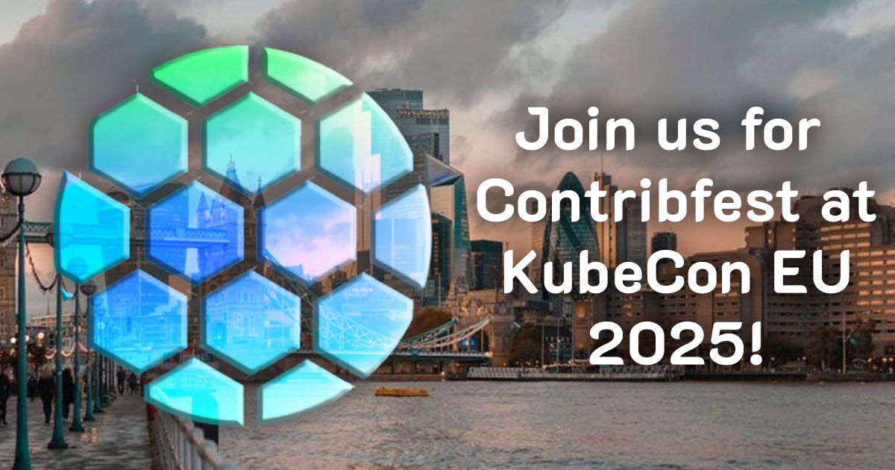

# Join us for KubeStellar's Contribfest at KubeCon EU 2025 in London, UK!

We’re thrilled to be hosting a Contribfest session at KubeCon + CloudNativeCon Europe 2025 in London, UK! Join us on Thursday, April 3, 2025, from 4:00pm to 5:15pm BST in ExceL London, Level 3 | ICC Capital Suite 1.

As a Sandbox CNCF project, KubeStellar is at an exciting stage of growth, and there’s never been a better time to get involved as an open-source contributor. In this post, we’ll explain what Contribfest is, highlight some beginner-friendly issues, and show you how you can join the fun, whether you're attending in London or contributing remotely.

### What is Contribfest?
Contribfest is an interactive session where attendees can collaborate with project maintainers and community contributors to tackle beginner-friendly issues, hunt bugs, discuss feature ideas, and even pair program to contribute directly to CNCF projects.

At this year’s KubeStellar Contribfest, project maintainers will guide contributors of all experience levels through the KubeStellar codebase, share insights into its architecture, and help attendees make their first contributions to this groundbreaking project for multicluster application orchestration.

Whether you're new to KubeStellar or ready to dive deep, you'll have the chance to get familiar with the KubeStellar developer experience, work side-by-side with maintainers, and become part of the community driving innovation in the cloud-native ecosystem.

### Good first issues
Want to get started ahead of Contribfest? Here are some open issues to consider bringing to the session—or to start working on right now:

[FEATURE] TODO - Enhance .... (#4521)
[BUG] TODO - Fix ... (#4398)
Explore the complete list of issues on KubeStellar's GitHub [https://github.com/kubestellar/kubestellar/issues](https://github.com/kubestellar/kubestellar/issues).

### Join us!
If you’re in London, join us for Contribfest on Thursday, April 3, 2025, from 4:00pm to 5:15pm BST in ExCeL London, Level 3 | ICC Capital Suite 1.

No matter where you are, you can connect with us anytime on the KubeStellar Slack or during our weekly community meetings every Wednesday at 4:00pm UTC. Come hang out, learn about multicluster orchestration, and discover how you can contribute to KubeStellar!

## We can’t wait to see you at KubeCon EU 2025!