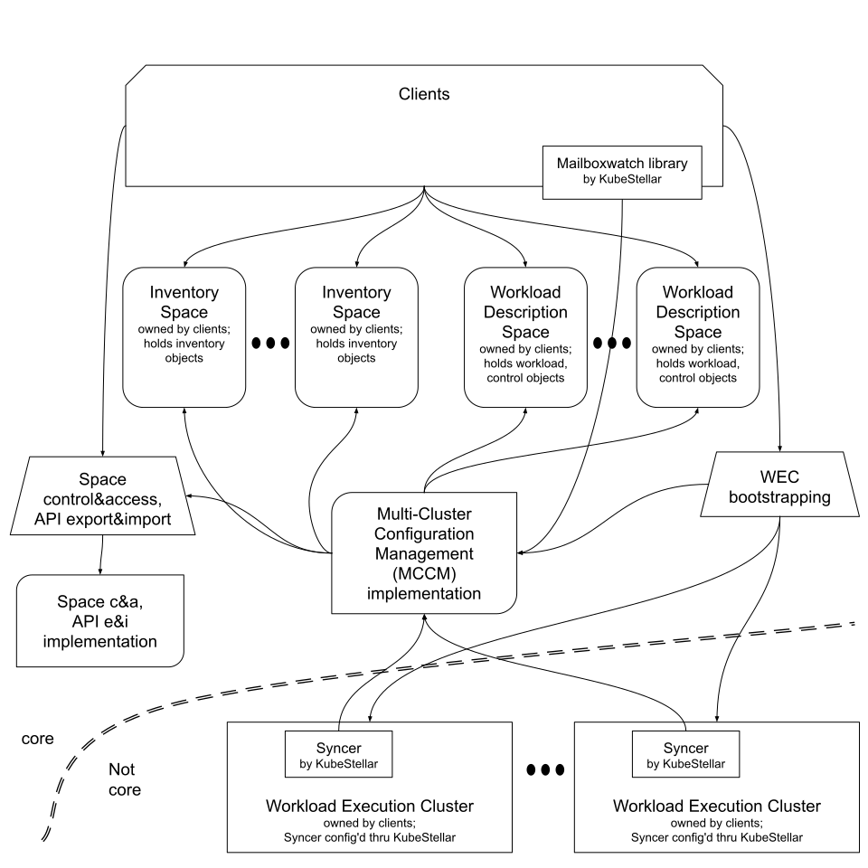

# User Guide

The KubeStellar git repo is a "monorepo", and its most prominent component is concerned with multi-cluster configuration management (MCCM).

## KubeStellar multi-cluster configuration management overview

This is a work in progress.  See the Introduction sections of [the 2023q1 PoC](../../Coding%20Milestones/PoC2023q1/outline/) and [the 2023q4 PoC](../../Coding%20Milestones/PoC2023q4/outline/) for a summary of the goals and aspirations for further development.

The following picture shows a consumer's view of the architecture of the current state of development.

KubeStellar MCCM is currently set in the context of [kcp](https://github.com/kcp-dev/kcp) --- release v0.11.0, to be specific. KubeStellar MCCM makes use of the multiplicity of kcp workspaces to separate various concerns: separate clients from each other and from implementation, allow a client to separate workloads that might clash in cluster-scoped objects, allow a client to have an inventory that does not comfortably fit in one etcd cluster (as you have seen, high scale is a concern in the interface but not yet in the implementation).

A deployment of KubeStellar MCCM supports multiple clients. Each owns some Workload Execution Clusters (WECs), which are Kubernetes clusters of whatever sort the client wants. A client wants to manage the configuration of the Kubernetes API objects in the WECs from a central place. A client has an inventory of WECs, and manages one or more inventory spaces (ISes) to hold that inventory. The inventory holds a pair of kube-style API objects per WEC, of kind `SyncTarget` and `Location`. A client has one or more workloads that the client wants to be run on the WECs. KubeStellar MCCM does not have an opinion on how a client divides its objects between "workloads"; the MCCM interfaces deal directly with kube-style API objects and we use the term "workload" only informally in documentation. A client maintains its workload descriptions in Workload Description Spaces (WDSes). A client maintains just one copy of each workload object in the core (the MCCM core is the central place where the clients interact with MCCM; it includes the ISes and WDSes). To convey its wishes about what goes where, a client maintains control objects of kind `EdgePlacement` in the WDSes. Each `EdgePlacement` object binds a selection of WECs with both (a) a definition of which workload objects are downsynced and (b) a definition of which workload objects are upsynced. The MCCM implementation implements the prescribed behavior.

In KubeStellar MCCM there are downsynced objects and upsynced objects. A downsynced object is one that a client creates in a WDS. Its desired state propagates from WDS to WEC, and its reported state propagates back towards the core. An upsynced object is created in a WEC and MCCM transports it back towards the core.

For each WEC there is a setup step that establishes its relationship with the core. This is called "WEC bootstrapping".

KubeStellar MCCM uses the APIExport/APIBinding technology of kcp to separate consumers and the provider of MCCM functionality and the uses and definition of the Kubernetes resources for the management of containerized workloads.

KubeStellar MCCM contemplates two classes of users: those who create/admin a deployment of KubeStellar MCCM, and those who use an existing deployment. Naturally, a deployment of KS MCCM has to be created before it can be used.

## Pre-requisites for using KS MCCM

First see the pre-requisites section of [the quickstart](../quickstart/) or of [the extended example](../../Coding%20Milestones/PoC2023q1/example1/).

Next you will need kcp and KubeStellar MCCM. There are a few different ways you could do this.

For a user who will _not_ be creating the deployment, it suffices to get the needed executables and associated run-time files from a release archive and augment your shell's `PATH` envar. The quickstart describes [a way](../quickstart/#deploy-kcp-and-kubestellar-as-bare-processes) to use a curl-to-bash script to fetch _and deploy_ kcp and KubeStellar MCCM and print instructions for what you need to add to your shell's environment variables. Using the `--deploy false` option will skip creating the deployment. The extended example [points](../../Coding%20Milestones/PoC2023q1/example1/#start-kcp) to instructions for how to get kcp's executables and put them on your `$PATH` and [describes](../../Coding%20Milestones/PoC2023q1/example1/#get-kubestellar) how to get the KubeStellar MCCM executables and other runtime files and augment your `$PATH`.

For a user who _will_ be creating the deployment, see the next section; the instructions for creating the deployment are bundled together with the instructions for getting kcp and KS MCCM.

In any case, once the deployment has been made, a user of KS MCCM will need to have the kcp and KS MCCM executables on their shell's `$PATH`.

## Deploying KubeStellar MCCM

For a user who _will_ be creating a deployment, the first question is the style of deployment: KubeStellar MCCM can be deployed as bare processes or as workload in a Kubernetes cluster used to host KS MCCM. Here we focus on the latter. A user wishing to do this has two choices. One is to use the curl-to-bash script [from the quickstart](../quickstart/#deploy-kcp-and-kubestellar-as-kubernetes-workload) to both fetch and deploy both kcp and KubeStellar MCCM. The other choice is to follow [the instructions in the extended example](../../Coding%20Milestones/PoC2023q1/example1/#deploy-kcp-and-kubestellar-as-a-workload-in-a-kubernetes-cluster) for both fetching and deploying both kcp and KS MCCM.

Both of the deployment paths above end with delivering a distinct kubeconfig for users of KS MCCM to use. This kubeconfig file will use the external hostname for the ingress to the kcp server in their server URLs. Users must be ever vigilant for [a certain sharp edge in kcp](https://github.com/kubestellar/kubestellar/issues/920): accidentally issuing the wrong command will cause that kubeconfig file to be FUBAR; the symptom is kubectl failing to connect to a server identified by IP address rather than the aforementioned domain name.

## Using KubeStellar MCCM

### Background on kube and kcp client config

It is worth remembering that in the Kubernetes world a client has two degrees of control over the configuration it uses to access an apiserver. The first is the selection of which kubeconfig file to use. Deploying KS MCCM as a workload in a hosting cluster produces a _distinct_ kubeconfig from that used to access the hosting cluster. Users must be clearly aware of which kubeconfig file they are using for a particular task. The other degree of control is the selection of a so-called "context" within the chosen kubeconfig file. A kubeconfig file has a concept of named contexts, and one may be designated as "the current context" --- that is the one that is used unless a different context is specified on the command line.

kcp introduces some more client state, but implements it by particular ways of using contexts in the chosen kubeconfig file. kcp defines a "current workspace" and a "previous workspace". Whenever those change, kcp's kubectl plugin for working with workspaces modifies the kubeconfig file accordingly. Because of these modifications, commands that modify the current/previous workspace state must not be run concurrently with other commands that access the same kubeconfig file.

### Usage overview

The main activities in using KubeStellar MCCM are as follows.

- Creating WECs (which is outside the scope of KS MCCM).
- Bootstrapping WECs.
- Maintaining inventory of WECs.
- Maintaining workload descriptions in WDSes.
- Maintaining MCCM control objects in WDSes.
- Observing results of MCCM activity.

### Bootstrapping WECs

See [an example in the extended example](../../Coding%20Milestones/PoC2023q1/example1/#connect-guilder-edge-cluster-with-its-mailbox-workspace), [documentation for the main command](../../Coding%20Milestones/PoC2023q1/commands/#syncer-preparation-and-installation), and [documentation for the bundle with inventory](../../Coding%20Milestones/PoC2023q1/commands/#edge-cluster-on-boarding).

### Maintaining inventory of WECs

A client owns the ISes in which its inventory objects exist. The client creates and deletes ISes as desired. See [an example in the extended example](../../Coding%20Milestones/PoC2023q1/example1/#create-an-inventory-management-workspace).

A cliennt maintains inventory objects in the client's ISes. See [an example in the extended example](../../Coding%20Milestones/PoC2023q1/example1/#create-synctarget-and-location-objects-to-represent-the-florin-and-guilder-clusters), and documentation for the [postive](../../Coding%20Milestones/PoC2023q1/commands/#creating-synctargetlocation-pairs) and [negative](../../Coding%20Milestones/PoC2023q1/commands/#removing-synctargetlocation-pairs) commands.

### Maintaining workload descriptions in WDSes

A client owns the WDSes that it uses. The client creates and deletes WDSes as desired. See the [positive](../../Coding%20Milestones/PoC2023q1/commands/#creating-a-workload-management-workspace) and [negative](../../Coding%20Milestones/PoC2023q1/commands/#removing-a-workload-management-workspace) commands.

A workload description is ordinary Kubernetes API objects. KubeStellar MCCM does not stipulate the use of any sort of "wrapper" objects. A client's workload objects may actually be some sort of wrapper, if the client has equipped its WECs with controllers that act on those wrappers. KS MCCM will transport the objects are they appear in the WDSes and WECs.

### Maintaining MCCM control objects in WDSes

The primary kind of control object is `EdgePlacement`. One of these goes in a WDS and binds "what" and "where". The semantics of the EdgePlacement objects are combined by OR: a workload object goes to/from a WEC if any EdgePlacement says so.

There is also an API for specifying how downsynced objects may be customized on the way from the core to the WECs; see `customize.go`.

### Observing results of MCCM activity

For each `EdgePlacement` object, MCCM maintains a corresponding `SinglePlacementSlice` object that holds the result of evaluating the EdgePlacement's "where predicate" against the current inventory. The two objects have the same name. In a more scalable future there might be more than one corresponding SinglePlacementSlice object and the correspondence would be accordingly more flexible.

The first stop in the core for returned state is a 1:1 copy of what was in the WECs. When the EdgePlacements call for a 1:N distribution, this will not fit in the normal data model for the object. The client can use the mailboxwatch package to create an informer on these 1:1 copies. Because each object delivered by such an informer reports from only one WEC, the normal data model applies.

We have a feature under development that will give a client an API by which they can indicate that N should be 1 (which does not override the EdgePlacement semantics), and while N actually is 1 MCCM will return the reported state all the way back to the copy in the WDS. While this is requested, MCCM will also report --- on each downsynced object --- how many WECs it is being downsynced to.

We also have an aspiration for enabling clients to specify how the reported state from the general N copies can be aggregated into summary objects.

## Glossary

Following are brief definitions of commonly used terms.  Please note that this project is a work in progress and older terminology, described [below](#older-terminology), still appears in some places.

**Downsynced Object** - One of two categories of workload object, complementary to "upsynced object".  In KubeStellar, a downsynced object first appears in a Workload Description Space and the object's desired state propagates from there through Mailbox Spaces to Workload Execution Clusters and that object's reported state originates in the Workload Execution Clusters and propagates back to the Mailbox Spaces and in the future will be summarized into the Workload Description Space.

**EdgePlacement** - A kind of Kubernetes API object, in a Workload Description Space. One of objects these binds some workload ("what") with a set of workload execution clusters ("where") it should run. The workload is identified by a predicate over namespaced objects and a predicate over cluster-scoped objects. The where is identified by a predicate over workload execution clusters as represented by `Location` objects.

**Inventory Space (IS)** - Holds the `SyncTarget` and `Location` objects describing the Workload Execution Clusters. 

**kcp** - A project in whose context KubeStellar currently sits.  See [kcp.io](https://www.kcp.io) and [its concepts page](https://docs.kcp.io/kcp/main/concepts/).  KubeStellar relies on two aspects of the functionality of the core of kcp: (1) "logical clusters" and their API, "workspaces", and (2) API export and binding.  KubeStellar is in the process of separating from kcp, introducing an abstraction layer for "spaces" and developing the ability to use [kube-bind](https://github.com/kube-bind/kube-bind) for API export and binding.

**KubeStellar Core Space (KCS)** - Exports the Kubestellar API.

**KubeStellar Syncer** - The KubeStellar agent in a Workload Execution Cluster; syncs workload objects between the Workload Execution Cluster and the corresponding Mailbox Space.

**Location** - A kind of Kubernetes API object, in an Inventory Space. Paired one-to-one with a `SyncTarget` object in the same space. Together these describe a workload execution cluster. The Location's labels are tested by the "where predicate" in an `EdgePlacement` object, and this object's labels and annotations provide values used in customization of workload objects going to the workload execution cluster.

**Mailbox Controller** - One of the central KubeStellar controllers; maintains a Mailbox Space for each `SyncTarget` object. This includes putting an APIBinding to the KubeStellar API into those mailbox spaces.

**Mailbox Space** - There is one Mailbox Space for each workload execution cluster. It stores the `SyncerConfig` object and copies of the workload(s).

**PlacementTranslator** - One of the central KubeStellar controllers; maintains the `SyncerConfig` objects in the Mailbox Spaces and syncs workload objects between the Workload Description Spaces and the Mailbox Spaces.

**SinglePlacementSlice** - A kind of Kubernetes API object, in a Workload Description Space.  Such an object holds a list of references to `Location` & `SyncTarget` objects that match the "where predicate" of an `EdgePlacement`.  Currently there is exactly one `SinglePlacementSlice` for each `EdgePlacement` but in the future the matches for one `EdgePlacement` could be spread among several `SinglePlacementSlice` objects (analogously to `EndpointSlice` vs `Service` in Kubernetes).

**Space Object** - A kind of Kubernetes API object that _represents_ a physical space.  Its "kind" is `Space`, so we include the "object" part when writing specifically about the API objects to clearly distinguish them from what they represent.

**Space**, **physical space** (use the latter term to clearly distinguish from "space object") - A thing that behaves like a Kubernetes kube-apiserver (including the persistent storage behind it) and the subset of controllers in the kube-controller-manager that are concerned with API machinery generalities (not management of containerized workloads). A kcp logical cluster is an example. A regular Kubernetes cluster is another example.

**Status Summarizer** - A planned central KubeStellar controller that will maintain the status summary objects in the Workload Description Spaces as a function of the `EdgePlacement` objects and the workload objects in the Mailbox Spaces.

**SyncerConfig** - A kind of Kubernetes API object, in a Mailbox Space. Such an object holds the dynamic configuration for the syncer in the corresponding workload execution cluster.

**SyncTarget** - A kind of Kubernetes API object, in an Inventory Space. Paired one-to-one with a Location in the same space, jointly representing a Workload Execution Cluster.

**Upsynced Object** - One of two categories of workload object, complementary to "downsynced object".  Upsynced objects originate in Workload Execution Clusters and propagate inward to Mailbox Spaces and in the future will be summarized into Workload Description Spaces.

**Where Resolver** - One of the central KubeStellar controllers; tests the `Location` objects against the "where predicates" in the `EdgePlacement` objects to maintain the corresponding `SinglePlacementSlice` objects.

**Workload Description Space (WDS)** - Holds workload objects and the adjacent KubeStellar control objects, which are the `EdgePlacement`, `SinglePlacementSlice`, and `Customizer` objects and, eventually, the ones developed to prescribe summarization.

**Workload Execution Cluster** - A Kubernetes cluster which can execute a workload. In the examples on this website, we use [Kind](https://kind.sigs.k8s.io/) clusters.

### Older Terminology

There have been some terminology shifts since the start of the project.  The project started with a focus on edge computing scenarios; later we realized that the technical problems addressed are not limited to those scenarios.  The project started in the context of [kcp](https://github.com/kcp-dev/kcp) and unabashedly used concepts from kcp; later we began working on generalizing KubeStellar so that it can run in the context of kcp and also can run in other contexts that do not have kcp.

- The term "space" is intended to be a generalization covering both a kcp "logical cluster" or "workspace" and other things that have the same essential behavior
- The term "workload execution cluster" was formerly "edge cluster"
- The term "workload description space" was formerly "workload management workspace"
- The term "inventory space" was formerly "inventory management workspace"
- The term "kubestellar core space" was formerly "edge service provider workspace"
- The term "mailbox space" was formerly "mailbox workspace"
