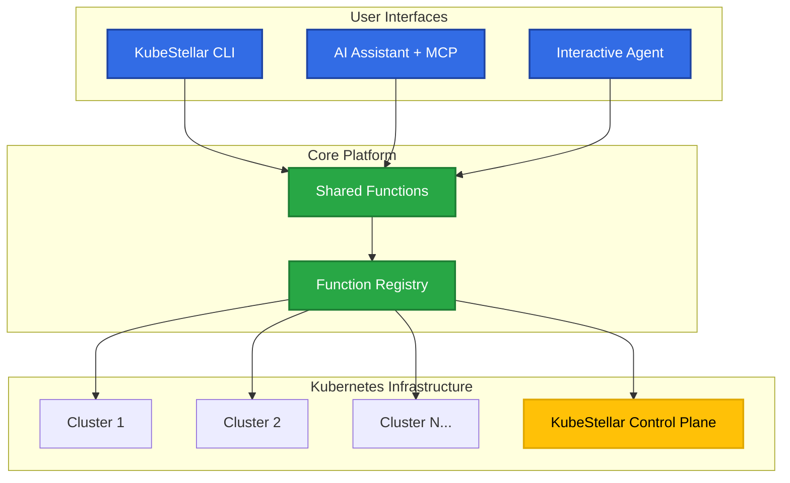

# Getting Started Overview

Welcome to KubeStellar A2A! This section will guide you through everything you need to know to get up and running with the most advanced multi-cluster Kubernetes management platform.

## What You'll Learn

By the end of this getting started guide, you'll be able to:

- ✅ **Install and configure** KubeStellar A2A on your system
- ✅ **Execute basic operations** across multiple Kubernetes clusters
- ✅ **Deploy applications** using Helm with advanced targeting
- ✅ **Use both CLI and AI interfaces** for cluster management
- ✅ **Integrate with KubeStellar** binding policies and architectures

## Prerequisites

Before you begin, make sure you have:

### Required
- **Python 3.11 or higher** - KubeStellar A2A is built with modern Python
- **kubectl configured** - At least one Kubernetes cluster accessible
- **Basic Kubernetes knowledge** - Understanding of pods, services, deployments

### Recommended
- **[uv package manager](https://github.com/astral-sh/uv)** - For the best development experience
- **Multiple Kubernetes clusters** - To fully experience multi-cluster capabilities
- **Helm 3.x** - For advanced Helm deployment features

### Optional (for AI features)
- **Claude Desktop** - For MCP server integration
- **OpenAI API Key** - For interactive agent mode (currently only supported provider)

## Learning Path

Choose your path based on your role and needs:

### 🚀 **Quick Start** (5 minutes)
Perfect if you want to see KubeStellar A2A in action immediately.

**[→ Quick Start Guide](./quick-start)**

### 📚 **Complete Setup** (15 minutes)
Comprehensive installation and configuration for production use.

**[→ Installation Guide](./installation)**

### ⚙️ **Configuration Deep Dive** (10 minutes)
Advanced configuration options and customization.

**[→ Troubleshooting Guide](../troubleshooting)**

## Architecture At A Glance

KubeStellar A2A provides multiple ways to interact with your Kubernetes infrastructure:

## Key Concepts

### **Functions**
Self-contained operations that can be executed via CLI or AI interface. Examples:
- `get_kubeconfig` - Analyze cluster configurations
- `helm_deploy` - Deploy Helm charts with binding policies
- `kubestellar_management` - Advanced KubeStellar automation

### **Multi-Cluster Operations**
All functions support advanced cluster targeting:
- **Specific clusters**: Target named clusters
- **Label selectors**: Use Kubernetes-style labels
- **All clusters**: Operate across your entire fleet

### **Namespace Management**
Sophisticated namespace handling:
- **All namespaces**: `--all-namespaces` flag
- **Specific namespaces**: Target individual namespaces
- **Namespace selectors**: Label-based namespace targeting

### **KubeStellar Integration**
Native support for KubeStellar 2024 architecture:
- **WDS/ITS/WEC** cluster types
- **Binding Policies** for workload placement
- **Work Status** tracking and management

## Next Steps

Ready to begin? Choose your preferred starting point:

  
    <h3>🚀 I want to try it now</h3>
    Get KubeStellar A2A running in 5 minutes with our quick start guide.
    [→ Quick Start](./quick-start)
  
  
  
    <h3>📦 I want the full setup</h3>
    Complete installation with all features configured for production use.
    [→ Installation Guide](./installation)
  

## Need Help?

- **Documentation Issues**: [Report on GitHub](https://github.com/kubestellar/a2a/issues)
- **Feature Requests**: [GitHub Discussions](https://github.com/kubestellar/a2a/discussions)
- **General Questions**: Check our [Troubleshooting Guide](../troubleshooting)

---

*Ready to revolutionize your Kubernetes multi-cluster management? Let's get started! 🚀*