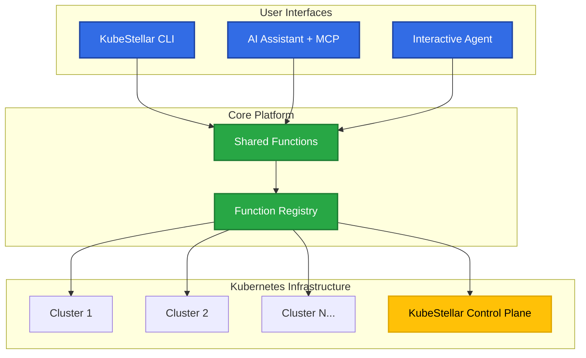

# KubeStellar A2A Agent

Welcome to **KubeStellar A2A** - the most advanced multi-cluster Kubernetes management platform with AI-powered automation capabilities. This unified implementation provides both MCP (Model Context Protocol) server and KubeStellar Agent CLI tool with shared functions for seamless Kubernetes multi-cluster management and orchestration.

## What is KubeStellar A2A?

KubeStellar A2A is a comprehensive tool designed to simplify Kubernetes multi-cluster management through a dual-interface approach:

### 🤖 **AI-Powered Interface**
- **MCP Server**: Direct integration with AI assistants like Claude Desktop for intelligent cluster management
- **Interactive Agent Mode**: Natural language processing for Kubernetes operations with real-time analysis

### ⚡ **CLI Interface** 
- **Direct Command-Line Access**: Full programmatic control for developers and operators
- **Script Integration**: Perfect for automation, CI/CD pipelines, and infrastructure-as-code

## Key Features

### 🔄 **Dual Interface Architecture**
Use the same powerful functions via CLI or through AI assistants - ensuring consistency and flexibility across all interaction methods.

### 🌐 **Multi-Cluster Support** 
Manage multiple Kubernetes clusters from a single interface with advanced targeting and customization options.

### ⚓ **Helm Integration**
Complete Helm chart deployment with KubeStellar binding policies, supporting:
- Chart repositories and local charts
- Cluster-specific values and configurations
- Automatic resource labeling for BindingPolicy compatibility

### 🏷️ **Multi-Namespace Operations**
Full support for:
- All-namespaces operations
- Namespace selectors and targeted deployments
- Advanced namespace management and resource discovery

### 🔍 **GVRC Discovery**
Complete resource discovery including Groups, Versions, Resources, and Categories across your entire cluster topology.

### 🎯 **KubeStellar 2024 Architecture**
Full support for the latest KubeStellar architecture:
- **WDS (Workload Description Spaces)**: Define and manage workload descriptions
- **ITS (Inventory and Transport Spaces)**: Handle cluster inventory and workload transport
- **WEC (Workload Execution Clusters)**: Execute workloads on target clusters
- **Binding Policies**: Advanced resource placement and management

### 🔧 **Extensible Architecture**
- Easy to add new functions and capabilities
- Plugin-style function registration system
- Well-defined interfaces for custom integrations

### 🔒 **Enterprise Ready**
- Full type hints and schema validation for reliability
- Comprehensive test suite with 60+ passing tests
- Built with modern async/await patterns for performance
- Security-focused design with best practices

## Quick Overview

### For End Users
- **Natural Language Interface**: "Deploy nginx to all production clusters with high availability"
- **Intelligent Automation**: AI understands context and suggests optimal configurations
- **Real-time Monitoring**: Get instant feedback on cluster health and deployment status

### For Developers
- **Rich CLI Experience**: Powerful command-line tools with extensive parameter support
- **Programmatic Access**: Full API for integration with existing tools and workflows
- **Extensible Platform**: Add custom functions and integrate with your infrastructure

### For Operations Teams
- **Multi-Cluster Visibility**: Unified view across all your Kubernetes environments
- **Policy Management**: Advanced binding policies for workload placement and governance
- **Troubleshooting Tools**: Deep analysis capabilities for cluster health and resource issues

## Architecture Overview



## Getting Started

Ready to transform your Kubernetes multi-cluster management experience?

### Quick Install

```bash
# Install with uv
uv pip install -e ".[dev]"

# Verify installation
uv run kubestellar --help
```

### Essential CLI Commands

```bash
# List all available functions
uv run kubestellar list-functions

# Execute a function
uv run kubestellar execute <function_name>

# Start interactive AI agent
uv run kubestellar agent

# Get function details
uv run kubestellar describe <function_name>
```

### Quick Examples

```bash
# Get cluster information
uv run kubestellar execute get_kubeconfig

# Deploy Helm chart
uv run kubestellar execute helm_deploy \
  -P chart_name=nginx \
  -P repository_url=https://charts.bitnami.com/bitnami \
  -P target_clusters='["prod-cluster"]'

# Discover resources
uv run kubestellar execute gvrc_discovery

# List all namespaces
uv run kubestellar execute namespace_utils -P all_namespaces=true
```

### MCP Server Setup

Add to Claude Desktop config (`~/Library/Application Support/Claude/claude_desktop_config.json`):

```json
{
  "mcpServers": {
    "kubestellar": {
      "command": "uv",
      "args": ["run", "kubestellar-mcp"],
      "cwd": "/path/to/a2a"
    }
  }
}
```

### Documentation

👉 **[Installation Guide →](./getting-started/installation)**

👉 **[CLI Reference →](./cli-reference)**

👉 **[Quick Start Guide →](./getting-started/quick-start)**

👉 **[Troubleshooting →](./troubleshooting)**

## Community & Support

- **GitHub Repository**: [kubestellar/a2a](https://github.com/kubestellar/a2a)
- **Issues & Bug Reports**: [GitHub Issues](https://github.com/kubestellar/a2a/issues) 
- **Feature Requests**: [GitHub Discussions](https://github.com/kubestellar/a2a/discussions)
- **KubeStellar Project**: [kubestellar.io](https://kubestellar.io)

## What's New

### 🆕 **Latest Features**
- **Enhanced Helm Integration**: Advanced multi-cluster Helm deployments with binding policies
- **Interactive Agent Mode**: Natural language interface for Kubernetes operations
- **KubeStellar 2024 Support**: Full compatibility with the latest KubeStellar architecture
- **Advanced GVRC Discovery**: Complete API resource discovery and analysis
- **Multi-Namespace Operations**: Sophisticated namespace targeting and management

### ✅ **Production Ready**
- **60+ Test Suite**: Comprehensive testing across all functionality
- **Type Safety**: Full TypeScript-style type hints and validation
- **Performance Optimized**: Async architecture for high-performance operations
- **Security Focused**: Built with security best practices from the ground up

---

*Built with ❤️ by the KubeStellar community*
