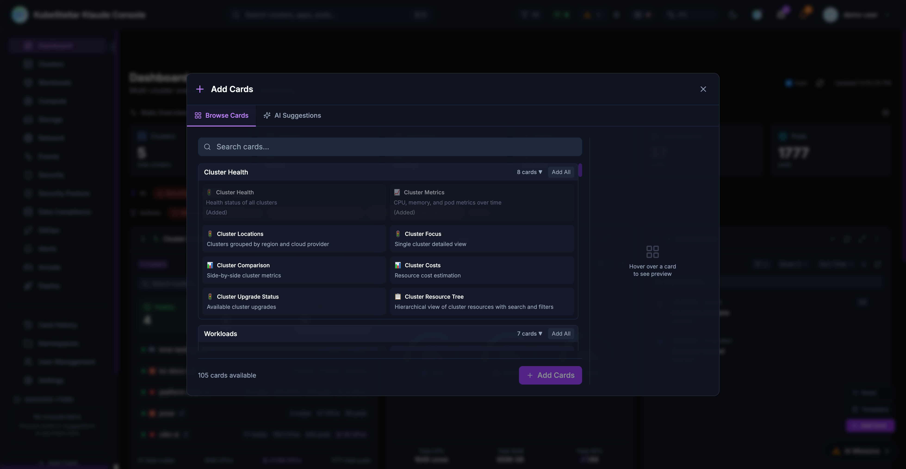

# Card Reference

The Klaude Console includes over 100 dashboard cards organized into categories. Cards can display live data from your clusters or demo data for evaluation.

## Card Categories

### Cluster Health (8 cards)

| Card | Description | Data Source |
|------|-------------|-------------|
| Cluster Health | Health status of all clusters | Live |
| Cluster Metrics | CPU, memory, and pod metrics over time | Live |
| Cluster Locations | Clusters grouped by region and cloud provider | Live |
| Cluster Focus | Single cluster detailed view | Live |
| Cluster Comparison | Side-by-side cluster metrics | Live |
| Cluster Costs | Resource cost estimation | Demo |
| Cluster Upgrade Status | Available cluster upgrades | Live |
| Cluster Resource Tree | Hierarchical view of cluster resources | Live |

### Workloads (7 cards)

| Card | Description | Data Source |
|------|-------------|-------------|
| Deployment Status | Deployment health across clusters | Live |
| Deployment Issues | Deployments with problems | Live |
| Deployment Progress | Rolling update progress | Live |
| Pod Issues | Pods with errors or restarts | Live |
| Top Pods | Highest resource consuming pods | Live |
| Workload Status | Workload health overview | Live |
| Workload Deployment | Multi-cluster workload deployment | Live |

### Compute (8 cards)

| Card | Description | Data Source |
|------|-------------|-------------|
| Compute Overview | CPU, memory, and GPU summary | Live |
| Resource Usage | CPU and memory utilization | Live |
| Resource Capacity | Cluster capacity and allocation | Live |
| GPU Overview | Total GPUs across clusters | Live |
| GPU Status | GPU utilization by state | Live |
| GPU Inventory | Detailed GPU list | Live |
| GPU Workloads | Pods running on GPU nodes | Live |
| GPU Usage Trend | GPU used vs available over time | Live |

### Storage (2 cards)

| Card | Description | Data Source |
|------|-------------|-------------|
| Storage Overview | Total storage capacity and PVC summary | Live |
| PVC Status | Persistent Volume Claims with status | Live |

### Network (7 cards)

| Card | Description | Data Source |
|------|-------------|-------------|
| Network Overview | Services breakdown by type | Live |
| Service Status | Service list with type and ports | Live |
| Cluster Network | API server and network info | Live |
| Service Exports (MCS) | Multi-cluster service exports | Live |
| Service Imports (MCS) | Multi-cluster service imports | Live |
| Gateway API | Kubernetes Gateway API resources | Live |
| Service Topology | Animated service mesh visualization | Demo |

### GitOps (7 cards)

| Card | Description | Data Source |
|------|-------------|-------------|
| Helm Releases | Helm release status and versions | Live |
| Helm History | Release revision history | Live |
| Helm Values Diff | Compare values vs defaults | Live |
| Helm Chart Versions | Available chart upgrades | Live |
| Kustomization Status | Flux kustomizations health | Live |
| Overlay Comparison | Compare kustomize overlays | Demo |
| GitOps Drift | Configuration drift detection | Live |

### ArgoCD (3 cards)

| Card | Description | Data Source |
|------|-------------|-------------|
| ArgoCD Applications | ArgoCD app status | Live |
| ArgoCD Sync Status | Sync state of applications | Live |
| ArgoCD Health | Application health overview | Live |

### Operators (3 cards)

| Card | Description | Data Source |
|------|-------------|-------------|
| OLM Operators | Operator Lifecycle Manager status | Live |
| Operator Subscriptions | Subscriptions and pending upgrades | Live |
| CRD Health | Custom resource definitions status | Live |

### Namespaces (5 cards)

| Card | Description | Data Source |
|------|-------------|-------------|
| Namespace Monitor | Real-time resource monitoring | Live |
| Namespace Overview | Namespace resources and health | Live |
| Namespace Quotas | Resource quota usage | Live |
| Namespace RBAC | Roles, bindings, service accounts | Live |
| Namespace Events | Events in namespace | Live |

### Security and Events (3 cards)

| Card | Description | Data Source |
|------|-------------|-------------|
| Security Issues | Security findings and vulnerabilities | Live |
| Event Stream | Live Kubernetes event feed | Live |
| User Management | Console users and Kubernetes RBAC | Live |

### Live Trends (4 cards)

| Card | Description | Data Source |
|------|-------------|-------------|
| Events Timeline | Warning vs normal events over time | Live |
| Pod Health Trend | Healthy/unhealthy/pending pods | Live |
| Resource Trend | CPU, memory, pods, nodes over time | Live |
| GPU Utilization | GPU allocation trend | Live |

### Klaude AI (3 cards)

| Card | Description | Data Source |
|------|-------------|-------------|
| Klaude Issues | AI-powered issue detection | Live |
| Klaude Kubeconfig Audit | Audit kubeconfig for stale contexts | Live |
| Klaude Health Check | Comprehensive AI health analysis | Live |

### Alerting (2 cards)

| Card | Description | Data Source |
|------|-------------|-------------|
| Active Alerts | Firing alerts with severity | Live |
| Alert Rules | Manage alert rules and notifications | Live |

### Cost Management (3 cards)

| Card | Description | Data Source |
|------|-------------|-------------|
| Cluster Costs | Resource cost estimation by cluster | Demo |
| OpenCost | Cost allocation by namespace | Demo |
| Kubecost | Cost optimization recommendations | Demo |

### Security Posture (7 cards)

| Card | Description | Data Source |
|------|-------------|-------------|
| OPA Gatekeeper | Policy enforcement status | Live |
| Kyverno Policies | Kubernetes-native policy management | Live |
| Falco Alerts | Runtime security monitoring | Demo |
| Trivy Scanner | Vulnerability scanning | Demo |
| Kubescape | Security posture management | Demo |
| Policy Violations | Aggregated policy violations | Live |
| Compliance Score | Overall compliance posture | Demo |

### Data Compliance (4 cards)

| Card | Description | Data Source |
|------|-------------|-------------|
| HashiCorp Vault | Secrets management | Demo |
| External Secrets | Sync secrets from external providers | Live |
| Cert-Manager | TLS certificate lifecycle | Live |
| Access Controls | RBAC policies and auditing | Live |

### Workload Detection (7 cards)

| Card | Description | Data Source |
|------|-------------|-------------|
| Prow Jobs | Prow CI/CD job status | Live |
| Prow Status | Prow controller health | Live |
| Prow History | Recent Prow job runs | Live |
| llm-d inference | vLLM, llm-d, TGI server status | Live |
| llm-d models | Deployed language models | Live |
| ML Training Jobs | Kubeflow, Ray training status | Demo |
| ML Notebooks | Running Jupyter notebook servers | Demo |

### Arcade (21 cards)

Fun games and entertainment:

- Kube-Man (Pac-Man style)
- Kube Kong (Donkey Kong style)
- Node Invaders (Space Invaders)
- Pod Pitfall (Pitfall adventure)
- Container Tetris
- Flappy Pod
- Pod Sweeper (Minesweeper)
- Kube 2048
- AI Checkers
- AI Chess
- Kube Solitaire
- Kube Match (Memory game)
- Kubedle (Wordle style)
- Sudoku
- Pod Brothers (Mario style)
- Kube Kart (Racing)
- Kube Pong
- Kube Snake
- Kube Galaga
- KubeCraft 2D
- KubeCraft 3D

### Utilities (4 cards)

| Card | Description | Data Source |
|------|-------------|-------------|
| Network Utils | Ping hosts, check ports | Live |
| Mobile Browser | iPhone-style web browser | Live |
| RSS Feed | Read RSS feeds from tech sources | Live |
| Iframe Embed | Embed external dashboards | Live |

### Miscellaneous (4 cards)

| Card | Description | Data Source |
|------|-------------|-------------|
| Weather | Weather with forecasts | Live |
| GitHub Activity | Monitor GitHub repository activity | Live |
| Kubectl | Interactive kubectl terminal | Live |
| Stock Market Ticker | Track stocks with charts | Live |

## Adding Cards

1. Click **Add Card** on the dashboard
2. Browse categories or search for specific cards
3. Click a card to add it to your dashboard
4. Drag to reposition, use the menu to configure

## Card Data Sources

- **Live**: Data fetched from your connected clusters
- **Demo**: Simulated data for demonstration purposes

Demo cards can be useful for:
- Evaluating features before deployment
- Training and onboarding
- Showcasing capabilities
