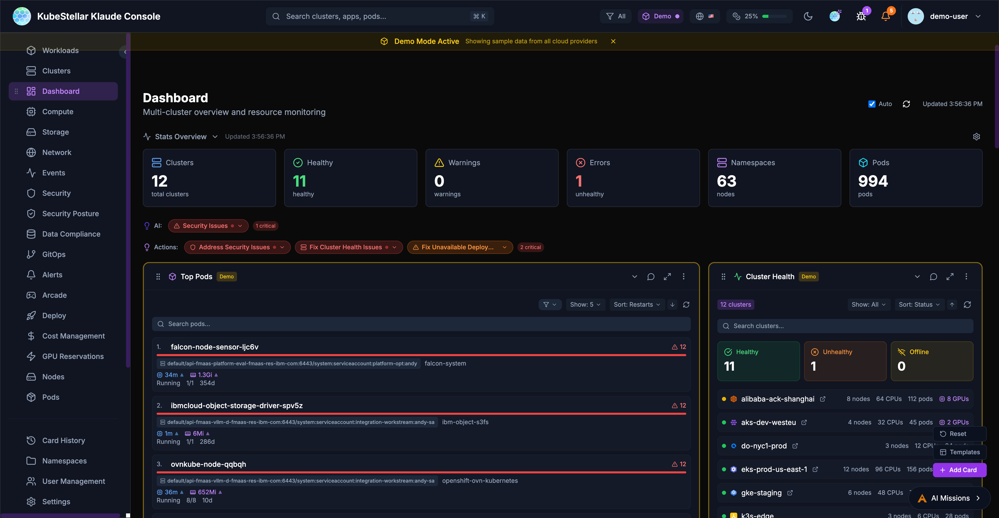
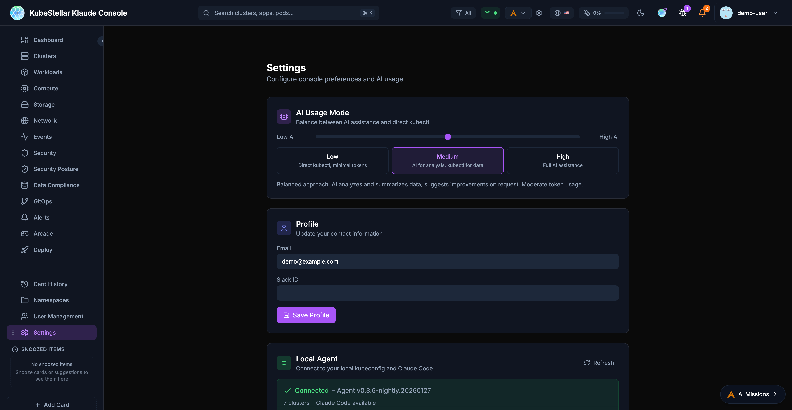
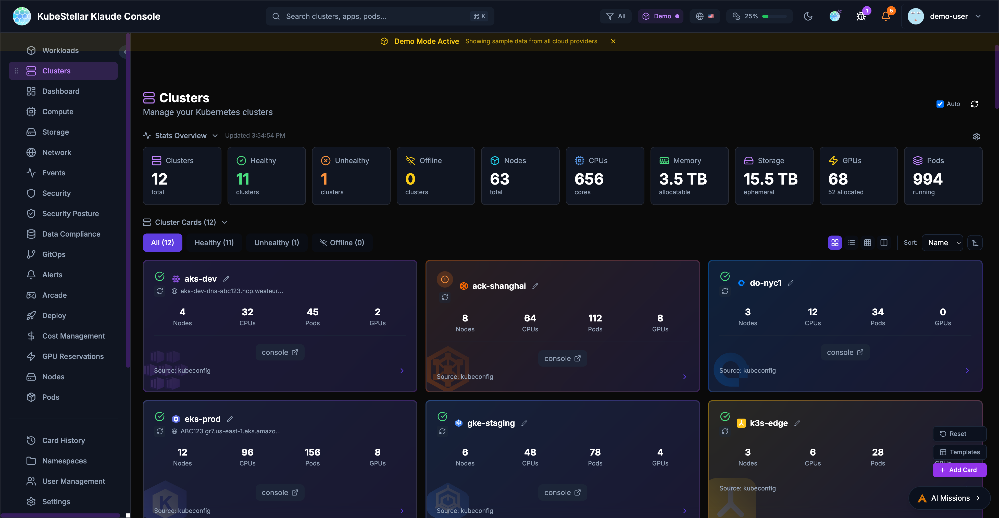
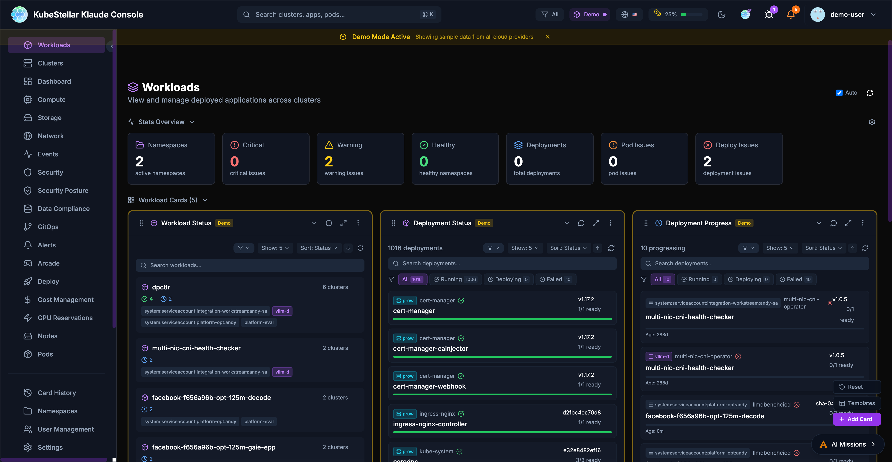
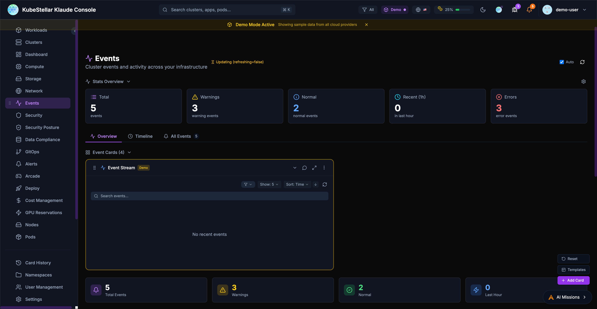
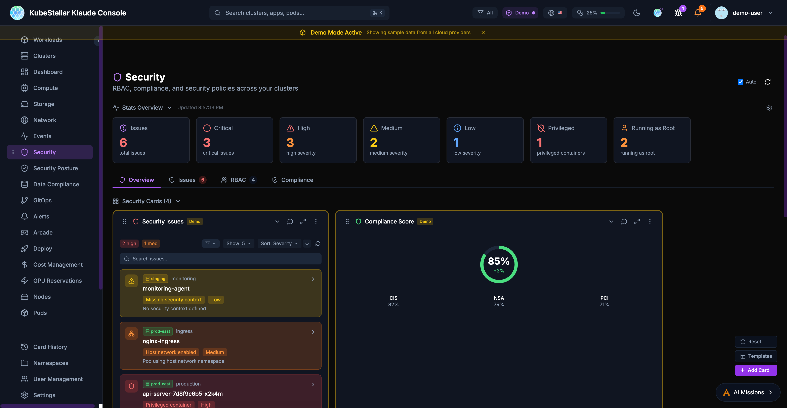
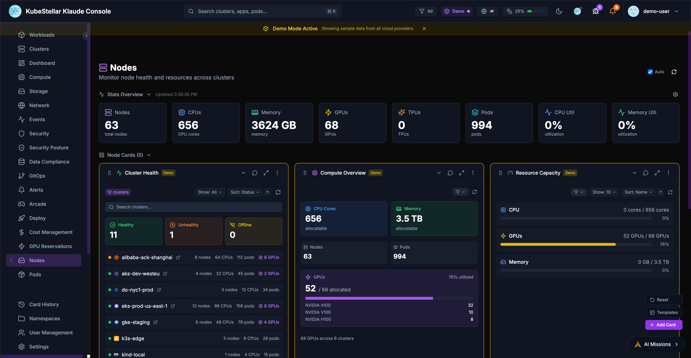
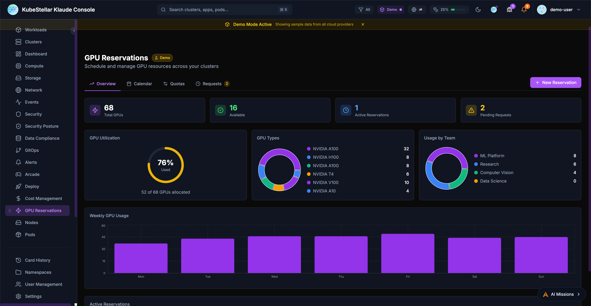

# Klaude Console Features

This guide covers the main features of the KubeStellar Klaude Console.

## Dashboard

The main dashboard provides a customizable view of your multi-cluster environment with real-time metrics, cluster health, and resource allocation across all connected clusters.

### Stats Overview

The stats bar at the top of the dashboard displays key metrics:

- **Clusters**: Total cluster count and health status
- **Nodes**: Total nodes across all clusters
- **Pods**: Total pod count with status breakdown
- **AI Insights**: Security issues and recommended actions

### Dashboard Cards

Cards are the building blocks of the dashboard. Each card displays specific information about your clusters:

- Drag cards to reorder them
- Resize cards by adjusting their width
- Collapse cards to save space
- Use the AI button to get insights about card data

### Dashboard Templates

Pre-configured dashboard layouts for common use cases:

- **Operations**: Cluster health, deployments, events
- **GPU Monitoring**: GPU utilization, workloads, trends
- **Security**: OPA policies, alerts, vulnerabilities
- **GitOps**: Helm releases, drift detection, sync status

## Settings

The settings page allows you to configure all aspects of the console.

### AI Usage Mode

Control how much AI assistance you receive:

- **Low**: Direct kubectl commands, minimal token usage
- **Medium**: AI for analysis and suggestions
- **High**: Full AI assistance for all operations

### Local Agent

Connect to your local kubeconfig and Claude Code:

- View agent version and connection status
- See connected clusters
- Monitor token usage (session, daily, monthly)

### Update Channels

Choose your release channel:

- **Stable (Weekly)**: Tested releases every week
- **Nightly**: Latest features, updated daily

### Appearance

Customize the look and feel:

- Multiple themes: KubeStellar, Batman, Dracula, Nord, Tokyo Night, Cyberpunk, Matrix
- Visual effects: star field, glow effects, gradients
- Accessibility: color blind mode, reduce motion, high contrast

### Token Usage

Monitor and limit AI token consumption:

- Set monthly token limits
- Configure warning and critical thresholds
- Reset usage counters

## Clusters

The Clusters page provides detailed information about all connected Kubernetes clusters, including health status, resource utilization, and quick links to cloud provider consoles.

## Workloads

Monitor and manage deployments, pods, and jobs across all your clusters from a single view.

## Events

Track Kubernetes events across all clusters with filtering by type, cluster, and time range.

## Security

Monitor security issues, compliance scores, and RBAC configurations across your infrastructure.

## Nodes

View node health, resource capacity, and utilization across all clusters.

## GPU Reservations

Schedule and manage GPU resources with team quotas and reservation calendars.

## Navigation

The sidebar provides access to all major sections:

### Primary Navigation

- **Dashboard**: Main multi-cluster overview
- **Clusters**: Detailed cluster management
- **Workloads**: Deployments, pods, and jobs
- **Compute**: CPU, memory, and GPU resources
- **Storage**: Persistent volumes and claims
- **Network**: Services, ingresses, and network policies
- **Events**: Kubernetes event stream
- **Security**: Security posture and alerts
- **GitOps**: Helm, Kustomize, and ArgoCD

### Secondary Navigation

- **Card History**: Previously viewed cards
- **Namespaces**: Namespace-specific views
- **User Management**: RBAC and access control
- **Settings**: Console configuration

### Special Sections

- **Arcade**: Games and entertainment
- **Deploy**: Multi-cluster deployment tools

## Search

The global search bar (`Cmd/Ctrl + K`) enables quick navigation:

- Search clusters by name
- Find applications and pods
- Navigate to specific namespaces
- Filter by resource type

## Alerts

The alert system keeps you informed:

- Real-time notifications for critical events
- Configurable alert rules
- Integration with external notification systems
- Alert history and acknowledgment

## AI Missions

AI-powered automation for common tasks:

- Automatic issue detection
- Suggested remediation steps
- One-click fixes for common problems
- Custom mission definitions
