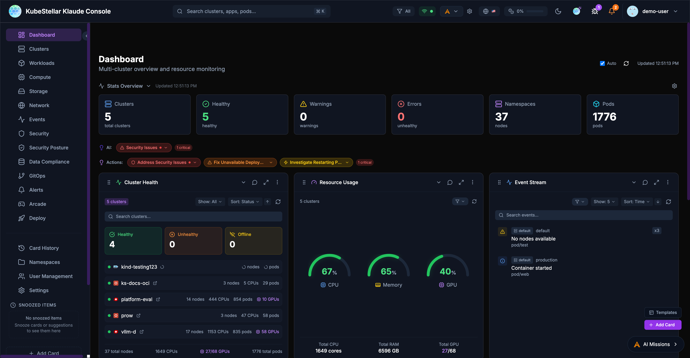

# KubeStellar Klaude Console

The KubeStellar Klaude Console is a modern, AI-powered multi-cluster management interface that provides real-time monitoring, intelligent insights, and a customizable dashboard experience for managing Kubernetes clusters at scale.



## Key Features

### Multi-Cluster Management
- Monitor and manage multiple Kubernetes clusters from a single dashboard
- Support for various cluster types: OpenShift, OKE, EKS, GKE, AKS, kind, and more
- Unified view of cluster health, resources, and workloads across all clusters

### AI-Powered Insights
- AI missions for automated issue detection and remediation
- Intelligent recommendations for cluster optimization
- Natural language queries about cluster state and resources

### Customizable Dashboards
- 100+ dashboard cards for different monitoring needs
- Drag-and-drop card arrangement
- Dashboard templates for quick setup
- Configurable stat blocks for at-a-glance metrics

### Real-Time Monitoring
- Live cluster metrics with historical charts
- Event streaming across clusters
- GPU monitoring and utilization tracking
- Pod and deployment status tracking

## Getting Started

### Demo Mode

The Klaude Console includes a demo mode that showcases all features with simulated data. To run in demo mode:

```bash
cd web
VITE_DEMO_MODE=true npm run dev -- --port 5174
```

Navigate to `http://localhost:5174` to explore the console with demo data.

### Production Setup

For production use, the console requires:

1. **KKC Agent**: A local agent that connects to your kubeconfig
2. **Backend API**: The KKC API server running on port 8080

See the [setup guide](README.md) for detailed installation instructions.

## Architecture

The Klaude Console consists of:

- **Frontend**: React + TypeScript + Vite application
- **KKC Agent**: Go-based agent that interfaces with Kubernetes clusters
- **Backend API**: REST API for data aggregation and AI features

## Documentation

- [Features Guide](klaude-console-features.md) - Detailed feature documentation
- [Card Reference](klaude-console-cards.md) - Complete list of available cards
- [Rewards System](klaude-console-rewards.md) - Community engagement and rewards
- [Updates](klaude-console-updates.md) - Release channels and version management

## Community

Join the KubeStellar community:

- [GitHub Repository](https://github.com/kubestellar/console)
- [Slack Channel](https://kubestellar.io/community)
- [Weekly Community Meetings](https://kubestellar.io/meetings)
