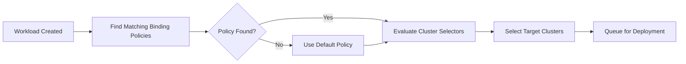
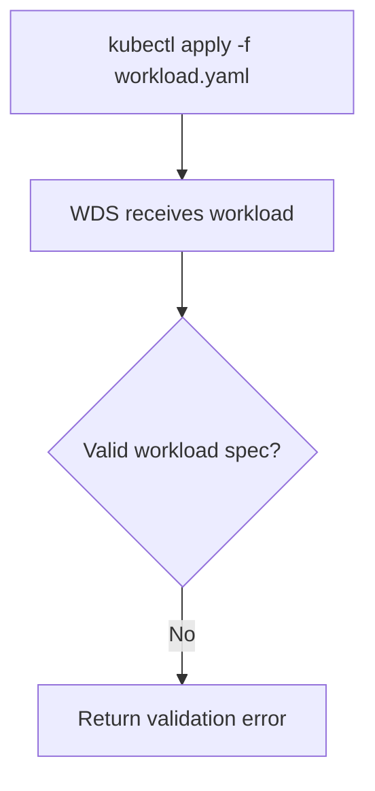
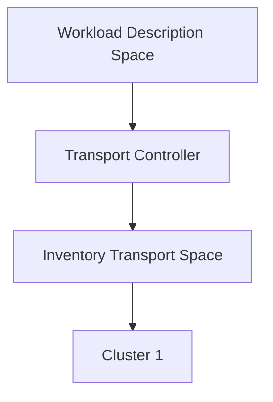
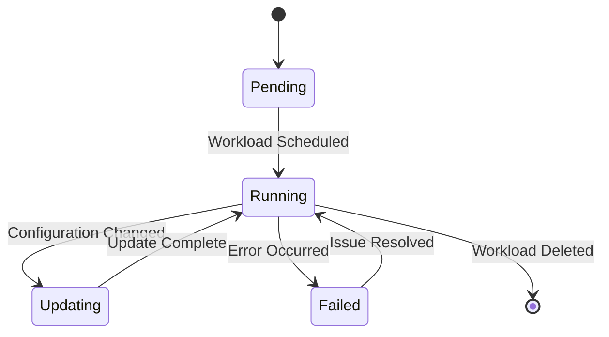
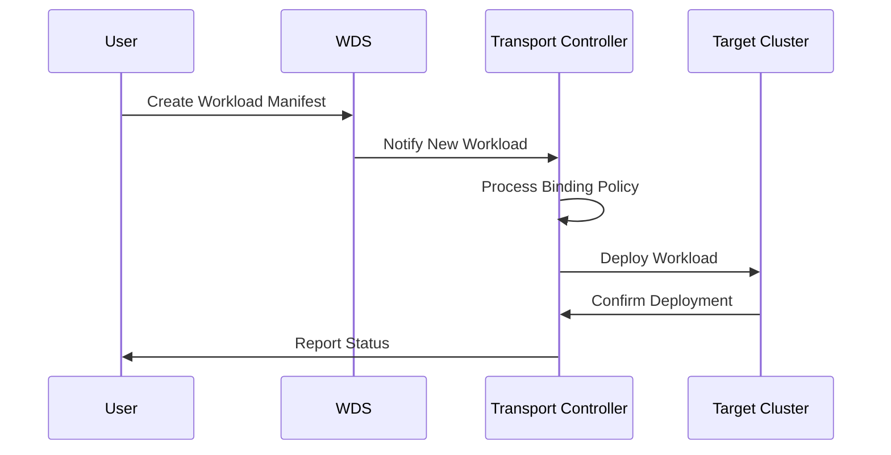

# KubeStellar Documentation Style Guide

_This is only a starting point for much more comprehensive style guide and toolbox being worked on as a CNCF LXF Mentorship project in 2025_

## Why have a Style Guide?

In order for the website and other documentation of KubeStellar to be effective and helpful, pages must be readable and accessible by its public. Since an open-source project operates with a cooperative effort, a Style Guide facilitates that many contributors can write and keep the documentation in a uniform and comprehensible format and author voice.

A longer-term [Design System for KubeStellar's UI and websites is in progress](https://github.com/kubestellar/ui/blob/dev/docs/design-progress.md) in mid-2025. The **Design Guide** that comes out of it will regulate the visual language and components of KubeStellar UIs and docs.
The **Style Guide** here is meant to supplement the Design Guide to regulate the _prose_ (text/written language) components of the KubeStellar ecosystem, and will grow with the Design Guide.

## Basic Style Considerations

As a beginning, following are some simple things to keep in mind while doing documentation for KubeStellar and its parts:

-  [Use clear and concise language]
-  [Do not use emojis (particularly in titles)]
-  [Always provide alt-text for images]
-  [Use caution if using generative AI] for writing help. Look at text closely to ensure it is both coherent and correct.
-  [Always check spelling and grammar] prior to committing docs changes

### Use Clear and Concise Prose

The aim of written documentation should be "just enough." Adequate detail to enable the reader to locate information they require, but not such over-detailedness that they need to search relentlessly to locate the important points.

It must also be **concise**: definitions and jargon must be explained on their first occurrence. Lengthy, rambling explanations should be reviewed to determine whether they could more effectively be split into manageable pieces.

A good deal of KubeStellar's current documentation -- particularly introductory and overview documentation -- has been written in slightly casual, breezy tones. That is intentional; however, it does not mean the texts are not supposed to be technically correct.

### Avoid Use of Emojis in Prose

The **Design Guide** will contain instructions on use and positioning of iconography in KubeStellar UIs and docs.
In prose documentation, however, emojis can disrupt rendering and navigation of website documentation, _especially_ in headings or titles. They also can render the documenation off-limits to visitors who need to use screen reader technology.

### Always include alt-text for images

This is a minimum accessibility requirement. Images and diagrams must always have a proper alt-text attribute, too. Overall, be mindful of the [W3C Guidelines for Accessibility](https://www.w3.org/TR/WCAG21/) when writing/illustrating KubeStellar documentation

### Use Care If Using Generative AI

There is growing use of generative AI as a writing aid. Any text produced through genAI must be **thoroughly** checked to ensure it is coherent and accurate. It should also be scanned for plagiarism since some LLMs may have used copyrighted material.

### Always Do a Spelling and Grammar Check

Before committing and/or pushing new docs to the repository and creating a pull request, be sure to check your written content for spelling and grammar errors. This will a) prevent the need to do a secondary commit to correct any discovered during the PR review and b) avoid the risk that such an error will confuse or throw a reader out of the text when they are using the documentation.

## Writing Guidelines

### Voice and Tone

#### Consistent Voice

Be consistent in your treatment of the reader throughout documentation:

- **Use second person ("you")** for tutorials and procedural documentation: "You can set up the cluster by editing the configuration file"
- **Use imperative mood** for step-by-step directions: "Run the command", "Edit the config file"
- **Use third person** for conceptual descriptions: "The transport controller controls workload allocation between clusters"

#### Active Voice Preference

Use active voice where possible to provide clearer, more concise documentation:

- **Recommended**: "The controller sends workloads to target clusters"
- **Avoid**: "Workloads are sent to target clusters by the controller"

Active voice makes instructions simpler to understand and less ambiguous as to who or what does what.

#### Balancing Technical Accuracy with Approachability

KubeStellar documentation is both conversational in tone and technically precise:

- Write complex concepts in plain language
- Context and examples from the real world
- Explain technical jargon when it is first mentioned
- Divide complicated processes into manageable steps

### Language and Terminology

#### Standard Terminology

Conform to well-established Kubernetes and cloud-native terminology:

- **cluster** - A Kubernetes cluster (not "environment")
- **namespace** - Kubernetes namespace (not "project" unless describing other systems)
- **workload** - Applications or services that are deployed to clusters
- **manifest** - YAML or JSON resource declarations
- **controller** - Software that controls Kubernetes resources

#### KubeStellar-Specific Terms

Explain project-specific terms clearly the first time they are used:

- **WDS (Workload Description Space)** - A logical space with workload object descriptions
- **ITS (Inventory and Transport Space)** - A space with cluster inventory and transport management
- **Binding Policy** - Specifies which workloads to deploy to which clusters
- **Transport Controller** - Controls distribution of workloads among clusters

#### Inclusive Language

Use CNCF community guidelines for inclusive language:

- Use **allow list/deny list** rather than whitelist/blacklist
- Use **primary/secondary** rather than master/slave
- Use **leader/follower** for architectural patterns
- Use person-first language when referring to accessibility

#### Abbreviations and Acronyms

Spell out abbreviations on first mention, then use the abbreviated version consistently:

- First mention: "Application Programming Interface (API)"
- Later mentions: "API"

Common abbreviations which can be used without definition are: CPU, RAM, URL, HTTP, HTTPS, SSH, DNS.

## Content Structure

### Document Organization

#### Standard Document Structure

Organize documentation with consistent patterns:

**For Tutorials:**
1. Overview and learning objectives
2. Prerequisites and requirements
3. Step-by-step instructions
4. Verification steps
5. Cleanup procedures (where applicable)
6. Next steps and related resources

**For Reference Documentation:**
1. Purpose and scope
2. Syntax or usage patterns
3. Parameter descriptions
4. Examples
5. Related resources

**For Troubleshooting Guides:**
1. Problem description
2. Possible causes
3. Diagnostic procedures
4. Resolution steps
5. Prevention measures

#### Headings and Navigation

Use semantic heading hierarchy:

- **H1 (`#`)** - Document title (one per document)
- **H2 (`##`)** - Significant sections
- **H3 (`###`)** - Subsections
- **H4 (`####`)** - Minor subsections (sparingly used)

Compose descriptive headings that explicitly suggest the contents of the section. Refrain from using generic titles such as "Overview" or "Introduction" when there are more descriptive alternatives available.

#### Cross-References and Links

**Internal Links:**
- Use descriptive link text that is intelligible out of context
- Link to specific sections where useful
- Keep relative links for content within the same repository

**External Links:**
- Reference authoritative sources
- Use stable URLs instead of version-specific ones when the content is applicable across the board
- Provide context regarding why the external resource is important

## Technical Content Guidelines

### Code Examples

#### Code Formatting

**Inline Code:**
Use single backticks for brief code blocks, commands, filenames, and API objects:
- Commands: `kubectl get pods`
- Filenames: `kubestellar-controller.yaml`
- API objects: `Deployment`, `Service`
- Configuration values: `replicas: 3`

**Code Blocks:**
Use fenced code blocks with language indication for syntax highlighting:

```yaml
apiVersion: apps/v1
```
kind: Deployment
metadata:
  name: example-deployment
  namespace: default
spec:
  replicas: 3
  selector:
    matchLabels:
      app: example
```

#### Algorithm and Process Documentation

For highly complex algorithms or processes, include code examples along with flowcharts:

**Example: Binding Policy Resolution**

```yaml
apiVersion: control.kubestellar.io/v1alpha1
kind: BindingPolicy
metadata:
  name: nginx-policy
spec:
  clusterSelectors:
  - matchLabels:
      environment: production
  downsync:
  - objectSelectors:
    - matchLabels:
```
app: nginx

```



This method facilitates both the configuration syntax and underlying reasoning to be better understood by readers.

#### Command Line Examples

**Shell Commands:**
Display commands without shell prompts for copy and paste ease:

```bash
kubectl apply -f deployment.yaml
kubectl get deployment example-deployment
```

**Multi-line Commands:**
Employ backslashes for line continuation:

```bash
kubectl create configmap app-config \
  --from-literal=database-url=postgresql://localhost:5432/mydb \
  --from-literal=redis-url=redis://localhost:6379
```

#### Variable Placeholders

Employ consistent placeholder naming:
- Angle brackets for user-specific values: `<your-cluster-name>`
- ALL_CAPS for environment variables: `KUBESTELLAR_VERSION`
- Descriptive names that state the expected content type

#### Full Examples

Document full, functional examples that consist of:
- Required context or setup
- All necessary parameters
- Desired output or outcomes
- Standard variations or alternatives

#### Code Flow Documentation

When explaining complicated code flows, add flowcharts to show the path of execution:


C -->|Yes| E[Store in WDS]
    E --> F[Trigger transport controller]
    F --> G[Evaluate binding policies]
    G --> H[Select target clusters]
    H --> I[Deploy to clusters]
    I --> J[Monitor deployment status]
    J --> K[Update workload status]
```

Use code flow diagrams to:
- Illustrate the order of operations in complicated procedures
- Present error handling and recovery paths
- Inspect API request/response cycles
- Describe multi-step configuration procedures

### API Documentation

When documenting APIs or configuration settings:

**Parameter Documentation:**
- **Name** - Parameter name
- **Type** - Data type (string, integer, boolean, array, object)
- **Required** - If the parameter is required
- **Default** - Default value when not specified
- **Description** - Precise description of purpose and usage

**Example Format:**
```yaml
# replicas specifies the number of pod replicas to create
```
# Type: integer
# Required: false
# Default: 1
replicas: 3

## Accessibility and Inclusive Design

### Visual Content

#### Diagrams and Flowcharts

Employ visual representations to explain intricate concepts, architectures, and workflows. KubeStellar documentation must feature diagrams for:

**Architecture Diagrams:**
Illustrate component interactions and data flow:


ITS --> C2[Cluster 2]
    ITS --> C3[Cluster 3]

    subgraph "Multi-Cluster Environment"
        C1
        C2 
        C3
    end

**Process Flowcharts:**
Document workflows and decision processes:

```mermaid
flowchart TD
```
A[User Creates Workload] --> B{Binding Policy Exists?}
    B -->|Yes| C[Transport Controller Processes]
    B -->|No| D[Create Binding Policy]
    D --> C
    C --> E[Workload Distributed to Target Clusters]
    E --> F[Verify Deployment Status]
    F --> G[Report Success/Failure]
```

**State Diagrams:**
Show component state transitions:



**Sequence Diagrams:**
Illustrate interactions between components:



#### Diagram Standards

**Consistency Requirements:**
- Utilize uniform color schemes in all diagrams
- Implement identical shapes for analogous component types
- Use uniform arrow styles and meaning
- Use legends in the case of multiple symbol types

**Diagrams' Accessibility:**
- Offer lengthy alt-text showing the flow and the relationships
- Utilize high contrast colors
- Make use of text labels in addition to colors
- Provide text-based equivalents for rich visual information

#### Image Alt-text

Provide descriptive alt-text conveying the key information presented in images:

**For Screenshots:**
Describe interface components and their status:
```html

```

**For Architecture Diagrams:**
Describe relationships and flow presented:
```html

```

**For Flowcharts:**
Describe process and decision points:
```html


**For Purely Decorative Images:**
Employ empty alt-text for purely decorative images:
```html

```

#### Color and Contrast

- Do not send information solely through color
- Provide enough contrast between background and text
- Employ other visual indicators (icons, patterns, typography) in combination with color

### Table Accessibility

Organize data tables using correct headers and scope attributes:

```html
<table>
```
<caption>KubeStellar Component Resource Requirements</caption>
  <thead>
    <tr>
      <th scope="col">Component</th>
      <th scope="col">CPU</th>
      <th scope="col">Memory</th>
      <th scope="col">Storage</th>
    </tr>
  </thead>
  <tbody>
    <tr>
      <th scope="row">Transport Controller</th>
      <td>500m</td>
<td>256Mi</td>
      <td>1Gi</td>
    </tr>
  </tbody>
</table>

```

## Version Management and Maintenance

### Version-Specific Content

Explicitly state version compatibility and requirements:

- State KubeStellar version requirements at the start of tutorials
- Label deprecated functionality with transparent timelines
- Include migration instructions for breaking changes
- Utilize version-targeted examples and references

### Content Lifecycle

**Regular Review:**
- Confirm accuracy of technical steps
- Test code samples and commands
- Update version citations and compatibility data
- Verify external link functionality

**Deprecation Process:**
- Clearly mark old content
- Offer alternative methods or revised procedures
- Establish definitive timelines for removing content
- Appropriate archive removed content

## Quality Assurance

### Pre-publication Checklist

Prior to submitting documentation:

**Technical Accuracy:**
- Run all commands and procedures
- Ensure code examples build and execute
- Validate version compatibility assertions
- Check external references

**Style Consistency:**
- Adhere to voice and tone standards
- Employ standard nomenclature
- Use consistent formatting
- Validate heading hierarchy

**Accessibility:**
- Provide alt-text for images
- Set up tables with proper headers
- Provide adequate color contrast
- Use descriptive link text

**Completeness:**
- Provide all required context
- Offer required prerequisites
- Insert verification steps
- Reference related resources

### Review Process

**Peer Review Focus Areas:**
- Technical correctness and completeness
- Target audience clarity
- Compliance with style guidelines
- Accessibility compliance
- Consistency with current documentation

**Testing Requirements:**
- Adhere to procedures from beginning to end
- Test in clean environments where possible
- Ensure commands function on supported platforms
- Ensure examples give desired results

## Contributing to Documentation

### Getting Started

New contributors should:

1. Carefully read this style guide
2. Check current documentation for examples
3. Begin with small corrections or improvements
4. Ask questions on GitHub issues or community channels

### Contribution Workflow

1. **Identify** areas for improvement
2. **Discuss** major changes in GitHub issues
3. **Draft** content according to these guidelines
4. **Test** procedure and example
5. **Submit** pull requests with descriptions
6. **Respond** to feedback from reviews timely

### Community Guidelines

- Be respectful in all communication
- Keep feedback on content thorough, not contributors
- Assume best intentions
- Assist newcomers learning project conventions
- Celebrate improvements and contributions

This style guide grows with the KubeStellar project. We encourage contributions and suggestions for enhancing documentation quality and consistency throughout the ecosystem.