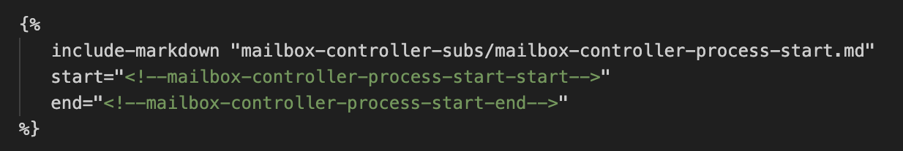
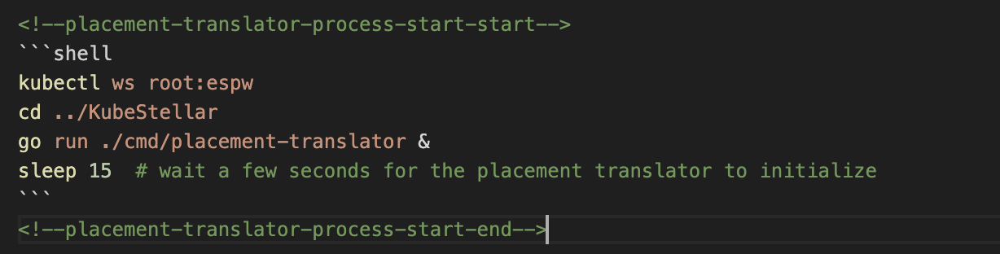

# KubeStellar Website Documentation Management

This page provides comprehensive guidance for contributing to the KubeStellar website documentation. It covers how the website is built, how to preview changes, and how to test documentation pull requests.

## Table of Contents

- [Website Overview](#website-overview)
- [Technology Stack](#technology-stack)
- [Previewing Website Changes](#previewing-website-changes)
  - [Global Preview via GitHub](#global-preview-via-github)
  - [Local Preview](#local-preview)
- [Testing Documentation PRs](#testing-documentation-prs)
- [Website Structure and Configuration](#website-structure-and-configuration)
- [Publishing and Versioning](#publishing-and-versioning)
- [Shortcut URLs](#shortcut-urls)

## Website Overview

We have two websites:

- **`https://kubestellar.io`** - Hosted by GoDaddy and administered by [Andy Anderson](mailto://andy@clubanderson.com). Contains redirects, with `https://kubestellar.io/` redirecting to `https://docs.kubestellar.io/`.
- **`https://docs.kubestellar.io`** - GitHub Pages website based on the `github.com/kubestellar/kubestellar/` repository.

**Contributor websites**: Contributors may have their own copy of the website at `https://${repo_owner}.github.io/${fork_name}` if they have set up their fork properly to render webpages. This is useful for generating previews of changes before merging into the main branch. **A PR that modifies the website should include such a preview.**

### Dual-use documentation sources

The documentation rendered to the website is designed to also be usefully viewed directly on GitHub. For example, you can view this page both (a) on the website at [https://docs.kubestellar.io/unreleased-development/contribution-guidelines/operations/document-management/](https://docs.kubestellar.io/unreleased-development/contribution-guidelines/operations/document-management/) and (b) directly in GitHub at [https://github.com/kubestellar/kubestellar/blob/main/docs/content/contribution-guidelines/operations/document-management.md](https://github.com/kubestellar/kubestellar/blob/main/docs/content/contribution-guidelines/operations/document-management.md). Where rendering differs, website rendering takes precedence.

## Technology Stack

Our documentation is powered by:

- **[mike](https://github.com/jimporter/mike)** and **[MkDocs](https://www.mkdocs.org/)** for multi-version documentation
- **[Python-Markdown](https://pypi.org/project/Markdown/)** for markdown processing
- **[Material for MkDocs](https://squidfunk.github.io/mkdocs-material/)** theme
- **[awesome-pages](https://github.com/lukasgeiter/mkdocs-awesome-pages-plugin)** plugin for navigation control
- **[macros](https://mkdocs-macros-plugin.readthedocs.io/en/latest/)** plugin for templating
- **[include-markdown](https://github.com/clubanderson/mkdocs-include-markdown-plugin)** plugin for reusing content
- **[SuperFences](https://facelessuser.github.io/pymdown-extensions/extensions/superfences/)** and **[Highlight](https://facelessuser.github.io/pymdown-extensions/extensions/highlight/)** for code blocks
- **[Pygments](https://pypi.org/project/Pygments/)** for syntax highlighting
- **[mkdocs-static-i18n](https://github.com/ultrabug/mkdocs-static-i18n/tree/0.53#readme)** for multi-language support (currently English only)

#### Note on Include-Markdown for "Wrapper" Files

Several website pages are generated by including files from the repository root, wrapped in short files in the docs tree via include directives. This is especially used for including REQUIRED files from the root (denoted by all-caps filenames). For ease of navigation during editing, such wrapper files should include **-inc** or **-include** in their filename to reduce confusion.

## Previewing Website Changes

You can preview website changes in two ways: globally from a fork on GitHub, or locally on your development machine.

### Global Preview via GitHub

You can create an online, shareable rendering of the website using the ["Generate and Push Docs" GitHub Actions workflow](https://github.com/kubestellar/kubestellar/blob/v{{ config.ks_latest_release }}/.github/workflows/docs-gen-and-push.yml). This is particularly useful for documentation PRs as it allows sharing previews via URL.

#### Setting Up a Fork for GitHub Actions

1. **Create a proper fork**:
   - Log into GitHub and navigate to `github.com/kubestellar/kubestellar`
   - Select the **Forks** dropdown and click the plus sign to create a new fork
   - **Important**: Uncheck "copy the `main` branch only" to include the `gh-pages` branch
   - If you already created a fork with only the main branch, propagate the `gh-pages` branch using git commands

2. **Configure GitHub Pages**:
   - Go to your fork's Settings tab
   - Select "Pages" in the left navigation
   - Configure GitHub to publish your site based on the `gh-pages` branch

#### Manual Website Generation

1. Work on documents in a branch of your fork and commit changes
2. Push changes to your fork if working locally
3. Go to the Actions tab in your fork's repository page
4. Select "Generate and Push Docs" from the left sidebar
5. Click "Run Workflow" on the right
6. Select your branch and click the second "Run Workflow" button
7. The workflow will automatically call the "Pages build and deployment" workflow
8. Monitor progress on the Actions page (green checkmark indicates success)
9. After about a minute, preview your website at `https://${repo_owner}.github.io/${fork_name}/${branch_name}`

#### Automatic Generation

Create a branch starting with **doc-** (e.g., `doc-myversion`) and the workflow will trigger automatically when you commit changes.

#### Version Switching

Each branch renders as its own version. Use the release dropdown in the rendered pages to switch between versions. Note: the **main** branch renders as `https://${repo_owner}.github.io/${fork_name}/main`, not as "unreleased-development".

#### Cleanup

You can use `mike` to remove outdated versions or replace `gh-pages` with a copy of the shared version.

#### Informational Errors

The "Generate and push docs" workflow triggers the broken links crawler workflow, which will fail when there are broken links. This failure also marks the "Generate and push docs" workflow as failed, even though it did not actually fail to generate and push. Do not be discouraged by these informational failures.

### Local Preview

You can view and modify documentation in your local development environment.

#### Basic Local Setup

```shell
git clone git@github.com:{{ config.repo_short_name }}.git
cd {{ config.repo_default_file_path }}/docs
git checkout {{ config.ks_branch }}
```

##### Using Global Python Environment

```shell
pip install -r requirements.txt
mkdocs serve
```

Then open a browser to [`http://localhost:8000/`](http://localhost:8000/)

##### Using Virtual Environment (Recommended)

```shell
( cd ..; make venv )
. venv/bin/activate
mkdocs serve
```

Then open a browser to [`http://localhost:8000/`](http://localhost:8000/)

##### Using Mike for Multi-Version Local Viewing

To view all branches/versions locally using mike (reflects what's deployed to `gh-pages`):

```shell
git clone git@github.com:{{ config.repo_short_name }}.git
cd {{ config.repo_default_file_path }}
git checkout {{ config.ks_branch }}
cd docs
mike set-default {{ config.ks_branch }}
cd ..
make serve-docs
```

Then open a browser to [`http://localhost:8000/`](http://localhost:8000/)

## Testing Documentation PRs

If a contributor has **not** created a shareable preview of a documentation PR [as documented above](#global-preview-via-github), here are the steps to checkout a git pull request for local testing.

### Step 1: Checkout the Pull Request

#### 1.1 Use `git fetch` to get a local copy of the PR's branch

Fetch the reference to the pull request based on its ID number, creating a new branch locally. Replace `ID` with your PR number and `BRANCH_NAME` with your desired branch name.

```shell
git fetch upstream pull/ID/head:BRANCH_NAME
```

This assumes your local workspace has a "git remote" named "upstream" that refers to the shared repository at `github.com/kubestellar/kubestellar`.

#### 1.2 Switch to the new branch

```shell
git checkout BRANCH_NAME
```

At this point, you can run local tests or merge other branches into this branch.

### Step 2: Test and Build the Documentation

See [Local Preview](#local-preview) for how to view and modify the documentation in the branch you have checked out.

## Website Structure and Configuration

All documentation-related items live in the `docs` directory (with small exceptions for various `make` targets and helper scripts in `hack`).

### Directory Structure

| Path                        | Description                                                                       |
|-----------------------------|-----------------------------------------------------------------------------------|
| config/$language/mkdocs.yml | Language-specific `mkdocs` configuration.                                         |
| content/$language           | Language-specific website content.                                                |
| generated/branch            | All generated content for all languages for the current version.                  |
| generated/branch/$language  | Generated content for a single language. Never added to git.                      |
| generated/branch/index.html | Minimal index for the current version that redirects to the default language (en) |
| overrides                   | Global (not language-specific) content.                                           |
| Dockerfile                  | Builds the kubestellar-docs image containing mkdocs + associated tooling.                 |
| mkdocs.yml                  | Minimal `mkdocs` configuration for `mike` for multi-version support.              |
| requirements.txt            | List of Python modules used to build the site.                                    |

### Global Variables

Many global variables are defined in [docs/mkdocs.yml]({{ config.repo_raw_url }}/{{ config.ks_branch }}/docs/mkdocs.yml). Common variables you should use in documentation:

- `site_name`: {{ config.site_name }}
- `repo_url`: {{ config.repo_url }}
- `site_url`: {{ config.site_url }}
- `repo_default_file_path`: {{ config.repo_default_file_path }}
- `repo_short_name`: {{ config.repo_short_name }}
- `docs_url`: {{ config.docs_url }}
- `repo_raw_url`: {{ config.repo_raw_url }}
- `edit_uri`: {{ config.edit_uri }}
- `ks_branch`: {{ config.ks_branch }}
- `ks_tag`: {{ config.ks_tag }}
- `ks_latest_regular_release`: {{ config.ks_latest_regular_release }}
- `ks_latest_release`: {{ config.ks_latest_release }}

To use a variable/macro in your documentation, reference it like this: `{{ config.<var_name> }}`.

#### Jinja Templating

Our documentation stack includes [Jinja](https://jinja.palletsprojects.com/en/3.1.x/). Jinja constructs (`{# comment #}`, `{{ expression }}`, and ``) can appear in markdown sources.

#### Page Variables

A markdown source file can contribute additional variables by defining them in `name: value` lines at the start of the file, set off by lines of triple dashes. For example:

```markdown
---
short_name: example1
manifest_name: 'docs/content/Coding Milestones/PoC2023q1/example1.md'
---
```

These variables can be referenced as `{{ page.meta.short_name }}` and `{{ page.meta.manifest_name }}`.

#### Including External Markdown

We make extensive use of 'include-markdown' to help keep our documentation modular and up-to-date. To use 'include-markdown', add a block in your document that refers to a block in your external document content:

In your original markdown document, add a block that refers to the external markdown you want to include:



In the document you want to include, add the start and end tags you configured in the include-markdown block in your original document:



For more information on the 'include-markdown' plugin for mkdocs look [here](https://github.com/mondeja/mkdocs-include-markdown-plugin)

#### Codeblocks

MkDocs has helpful ways to include blocks of code in a style that makes it clear to readers that console interaction is necessary. There are options to include a plain codeblock (```), shell (shell), console (console - not used in our documentation), language or format-specific (yaml, etc.), and others. For more detailed information, check out the [mkdocs information on codeblocks](https://squidfunk.github.io/mkdocs-material/reference/code-blocks/).

**NOTE**: The docs-ecutable technology does _not_ apply Jinja at any stage; Jinja source inside executed code blocks will not be expanded by Jinja but rather seen directly by `bash`.

Here are some examples of how we use codeblocks.

##### Seen and executed

For a codeblock that can be 'tested' (and seen by the reader) as part of our CI, use the `shell` block:

````
```shell
mkdocs serve
```
````

##### Executed but not seen

For a codeblock that should be 'tested', BUT not seen by the reader, use `.bash .hide-me` style:

````
``` {.bash .hide-me}
sleep 10
```
````

##### Seen but not executed

For a codeblock that should _not_ be 'tested' as part of our CI, use `.bash` without the `.hide-me` style:

````
``` {.bash}
mkdocs server
```
````

##### Seen but not executed and no copy button

For a codeblock that should not be 'tested', be seen by the reader, and not include a 'copy' icon (great for output-only instances), use `.bash .no-copy`:

```` {.bash .no-copy}
``` {.bash .no-copy}
I0412 15:15:57.867837   94634 shared_informer.go:282] Waiting for caches to sync for placement-translator
I0412 15:15:57.969533   94634 shared_informer.go:289] Caches are synced for placement-translator
I0412 15:15:57.970003   94634 shared_informer.go:282] Waiting for caches to sync for what-resolver
```
````

##### Other language-specific highlighting

For other language-specific highlighting (yaml, etc.), use the `yaml` codeblock:

````
```yaml
nav:
  - Home: index.md
  - QuickStart: Getting-Started/quickstart.md
  - Contributing: 
      - Guidelines: Contribution guidelines/CONTRIBUTING.md
```
````

##### Codeblock with a title

For a codeblock that has a title, and will not be tested, use the `title` parameter:

````
``` title="testing.sh"
#!/bin/sh
echo hello KubeStellar
```
````

#### Testing/Running Docs

We 'execute' our documentation in our CI using automation called 'docs-ecutable'.

- Create your .md file as you normally would
- Add codeblocks that can be tested, tested but hidden, or not tested at all:
    - Use `shell` to indicate code you want to be tested
    - Use `.bash .hide-me` for code you want to be tested, but hidden from the reader
    - Use plain codeblock (```) if you want to show sample output that is not to be tested
- You can use 'include-markdown' blocks, and they will also be executed (or not), depending on the codeblock style you use in the included markdown files.

##### The GitHub Workflow:

- Example workflow: [docs-ecutable-where-resolver.yml](https://github.com/kubestellar/kubestellar/blob/main/.github/workflows/docs-ecutable-where-resolver.yml)
- Example workflow using newer technology: [docs-ecutable-example1.yml](https://github.com/kubestellar/kubestellar/blob/main/.github/workflows/docs-ecutable-example1.yml)

##### The original secret sauce:

- [docs/scripts/docs-ecutable.sh](https://github.com/kubestellar/kubestellar/blob/main/docs/scripts/docs-ecutable.sh)
    - Parses the .md file to pull out all the 'shell' and '.bash .hide-me' blocks
    - Traverses include-markdown blocks
    - Jinja constructs are not expanded by this code
    - Creates a file called 'generate_script.sh' which is then run

All of this is invoked in a target in our [Makefile](https://github.com/kubestellar/kubestellar/blob/main/Makefile):

```makefile
.PHONY: docs-ecutable
docs-ecutable: 
	MANIFEST=$(MANIFEST) docs/scripts/docs-ecutable.sh
```

You give the path from that follows the '{{config.repo_url}}/docs' path, and name of the .md file you want to 'execute'/'test' as the value for the `MANIFEST` variable:

```shell
make MANIFEST="'docs/content/Getting-Started/quickstart.md'" docs-ecutable
```

##### The new and improved secret sauce:

- [docs/scripts/execute-html.sh](https://github.com/kubestellar/kubestellar/blob/main/docs/scripts/execute-html.sh)
    - Parses the HTML generated by MkDocs to extract all the fenced code blocks tagged for the "shell" language
    - Reads the generated HTML, so Jinja constructs have their usual effects
    - Creates a file called 'generated_script.sh' which is then run

All of this is invoked in a target in our [Makefile](https://github.com/kubestellar/kubestellar/blob/main/Makefile):

```makefile
.PHONY: execute-html
execute-html: venv
	. $(VENV)/activate; \
	cd docs; \
	mkdocs build; \
	scripts/execute-html.sh "$$PWD/.." "generated/$(MANIFEST)/index.html"
```

The `make` target requires the variable `MANIFEST` to be set to the directory that contains the generated `index.html` file, relative to '{{config.repo_url}}/docs/generated'.

```shell
make MANIFEST="Coding Milestones/PoC2023q1/example1" execute-html
```

### Important files in our gh-pages branch

#### index.html and home.html

These appear in the branch named `gh-pages` and redirect from the root to the version named `latest`. The one named `index.html` is managed by `mike set-default`. The other should be kept consistent.

- [home.html](https://github.com/kubestellar/kubestellar/blob/gh-pages/home.html)
- [index.html](https://github.com/kubestellar/kubestellar/blob/gh-pages/index.html)

Both files have content similar to:

```html title="index.html and home.html"
<!DOCTYPE html>
<html>
<head>
<title>KubeStellar</title>
<meta http-equiv="content-type" content="text/html; charset=utf-8" >
<meta http-equiv="refresh" content="0; URL=https://docs.kubestellar.io/latest" />
</head>
```

Do not remove these files!

#### CNAME

The CNAME file has to be in the gh-pages root to allow github to recognize the url TLS cert served by our hosting provider. Do not remove this file!

The CNAME file must have the following content:

``` title="CNAME"
docs.kubestellar.io
```

#### versions.json

The versions.json file contains the version and alias information required by 'mike' to properly serve our doc site. This file is maintained by the 'mike' environment and should not be edited by hand.

```json
[{"version": "release-0.22.0", "title": "release-0.22.0", "aliases": ["latest"]}, ...]
```

### In case of emergency
If you find yourself in a jam and the pages are not showing up at kubestellar.io or docs.kubestellar.io, check the following:
1. Is the index.html, home.html, CNAME, and versions.json file in the gh-pages branch alongside the folders for the compiled documents? If not, then recreate those files as indicated above (except for versions.json which is programmatically created by 'mike').
2. Is GitHub settings for 'Pages' for the domain pointing at the https://docs.kubestellar.io url? If not, paste it in and check off 'enforce https'.
3. If the above did not work, then you might have an issue with the GoDaddy domain (expired, files missing, etc.)

### How to recreate the gh-pages branch
To recreate the gh-pages branch, do the following:
- Checkout the gh-pages branch to your local system
```shell
git clone -b gh-pages {{ config.repo_url }} KubeStellar
cd KubeStellar
```
- Delete all files in the branch and push it to GitHub
```shell
rm -rf *
git add .
git commit -m "removing all gh-pages files"
git push -u origin gh-pages
```
- Switch to the 'release' branch, switch to /docs and run 'mike deploy' for the release branch. Add the alias 'latest' for the latest release 
```shell
git checkout release-0.22
git pull
mike deploy --push --rebase --update-aliases release-0.22 latest
```
- Switch back to the gh-pages branch and recreate the home.html, index.html, and CNAME files as needed
```shell
cd ..
git checkout gh-pages
git pull
vi index.html
vi home.html
vi CNAME
```
- Push the new files into gh-pages
```shell
git add .
git commit -m "add index, home, and CNAME files"
git push -u origin gh-pages
```
- Go into the GitHub UI and go to the settings for the project and click on 'Pages' to add https://docs.kubestellar.io as the domain and check the box to enforce https.

### How to delete a rendering of a branch

Use `mike delete $branch_name`, either acting locally on your checked out `gh-pages` branch (after pull and before git commit and push) or acting more directly on the remote repo using `--remote` and `--push`. See [the mike delete command doc](https://github.com/jimporter/mike?tab=readme-ov-file#deleting-docs).

## Publishing Workflow

All documentation building and publishing is done using GitHub Actions in `.github/workflows/docs-gen-and-push.yml`. This workflow is triggered either manually or by a push to a branch named `main` or `release-<something>` or `doc-<something>`. This workflow will actually do something _ONLY_ if either (a) it is acting on the shared GitHub repository at `github.com/kubestellar/kubestellar` and on behalf of the repository owner or (b) it is acting on a contributor's fork of that repo and on behalf of that same contributor. The published site appears at `https://pages.github.io/kubestellar/${branch}` in case (a) and at `https://${repo_owner}.github.io/${fork_name}/${branch}` in case (b). This workflow will build and publish a website _version_ whose name is the same as the name of the branch that it is working on. This workflow will also update the relevant `mike` alias, if necessary.
