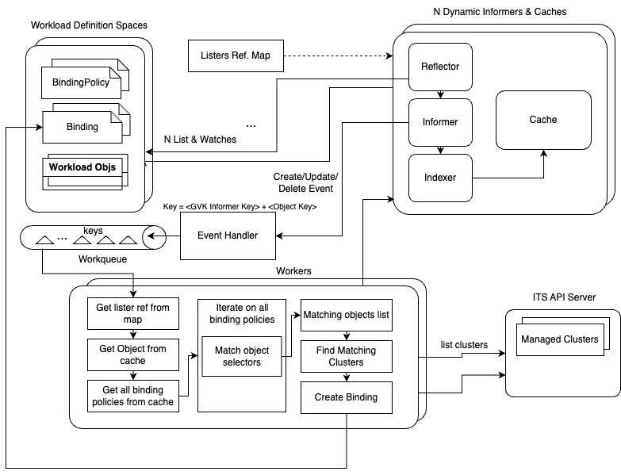
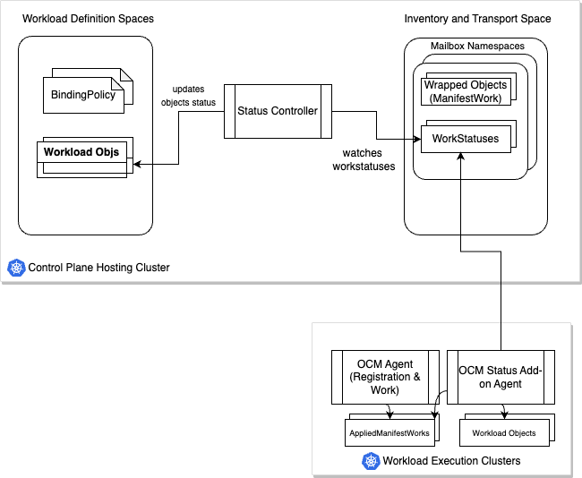

# KubeStellar Architecture

KubeStellar provides multi-cluster deployment of Kubernetes objects, controlled by simple `BindingPolicy` objects, where Kubernetes objects are expressed in their native format with no wrapping or bundling. The high-level architecture for KubeStellar is illustrated in Figure 1.

KubeStellar relies on the concept of *spaces*.  
A Space is an abstraction to represent an API service that 
behaves like a Kubernetes kube-apiserver (including the persistent storage behind it) 
and the subset of controllers in the kube-controller-manager that are concerned with 
API machinery generalities (not management of containerized workloads). 
A KubeFlex `ControlPlane` is an example. A regular Kubernetes cluster is another example.
Users can use spaces to perform these tasks:

1. Create *Workload Definition Spaces* (WDSs) to store the definitions of their workloads.
A Kubernetes workload is an application that runs on Kubernetes. A workload can be made by a 
single Kubernetes object or several objects that work together.
2. Create *Inventory and Transport Spaces* (ITSs) to manage the inventory of clusters and 
the transport of workloads.
3. Register and label Workload Execution Clusters (WECs) with the Inventory and 
Transport Space, to keep track of the available clusters and their characteristics.
4. Define `BindingPolicy` to specify *what* objects and *where* should be 
deployed on the WECs.
5. Submit objects in the native Kubernetes format to the WDSs, 
and let the `BindingPolicy` govern which WECs should receive them.
6. Check the status of submitted objects from the WDS.

In KubeStellar, users can assume a variety of roles and responsibilities. 
These roles could range from system administrators and application owners 
to CISOs and DevOps Engineers. However, for the purpose of this document, 
we will not differentiate between these roles. Instead we will use the term 
'user' broadly, without attempting to make distinctions among roles.

Examples of users interaction with KubeStellar are illustrated in the
[KubeStellar Usage Examples](./examples.md) section.

The KubeStellar architecture has these main modules:

- *KubeStellar Controller Manager*: this module is responsible for watching `BindingPolicy` objects and create from it a matching `Binding` object that contains list of references to the concrete objects and list of references to the concrete clusters, and for updating the status of objects in the WDS.

- *Pluggable Transport Controller*: this module is responsible for delivering workload objects from the WDS to the ITS according to `Binding` objects.

- *Space Manager*: This module manages the lifecycle of spaces.

- *OCM Cluster Manager*: This module syncs objects from the ITS to the Workload Execution 
Clusters (WECs). In the ITS, each mailbox namespace is associated with one WEC. Objects 
that are put in a mailbox namespace are delivered to the matching WEC.

- *Status Add-On Controller*: This module installs the OCM status add-on agent 
on all WECs and sets the RBAC permissions for it using the OCM add-on framework.

- *OCM Agent*: This module registers the WEC to the OCM Hub, watches for 
ManifestWorks and unwraps and syncs the objects into the WEC.

- *OCM Status Add-On Agent*: This module watches *AppliedManifestWorks* 
to find objects that are synced by the OCM agent, gets their status 
and updates *WorkStatus* objects in the ITS namespace associated with the WEC.

## KubeStellar Controller Manager

This module manages binding controller, and status controller. 
* The binding controller watches `BindingPolicy` and workload objects on the Workload Definition Space (WDS), and maintains
a `Binding` object for each `BindingPolicy` in the WDS. The `Binding` object contains references to the concrete list of
workload objects and references to the concrete list of clusters that were selected by the `BindingPolicy` selectors.

* The status controller watches for *WorkStatus* objects on the ITS and updates the
status of objects in the WDS when singleton status is requested in the `BindingPolicy` for those objects. 

There is one instance of a KubeStellar Controller Manager for each WDS. 
Currently this controller-manager runs in the KubeFlex hosting cluster and is responsible for installing the required 
CRDs in the associated WDS.
More details on the internals of this module are provided in [KubeStellar Controllers Architecture](#kubestellar-controllers-architecture).

## Pluggable Transport Controller

* The pluggable transport controller watches `Binding` objects on the WDS, and maintains in the Inventory and Transport Space (ITS) 
a wrapped object per `Binding` to be delivered.
* This controller is pluggable and can potentially be implemented using different options. Currently the only option we support is based on the [Open Cluster Management Project](https://open-cluster-management.io) 

There is one instance of the pluggable transport controller for each WDS. 
Currently this controller runs in an executable process. This is a work in progress and we're working on running this controller in a dedicated pod.
More details on the internals of this module are provided in [KubeStellar Controllers Architecture](#kubestellar-controllers-architecture).

## Space Manager

The Space Manager handles the lifecycle of spaces. 
KubeStellar uses the [KubeFlex project](https://github.com/kubestellar/kubeflex)
for space management. In KubeFlex, a space is named a `ControlPlane`, and we will use 
both terms in this document. KubeSteller currently prereqs KubeFlex to 
provide one or more spaces. We plan to make this optional in the near future.

KubeFlex is a flexible framework that supports various kinds of control planes, such
as *k8s*, a basic Kubernetes API Server with a subset of kube controllers, and 
*vcluster*: a virtual cluster that runs on the hosting cluster based on the
[vCluster Project](https://www.vcluster.com). More detailed information
on the different types of control planes and architecture are described
in the [KubeFlex Architecture](https://github.com/kubestellar/kubeflex/blob/main/docs/architecture.md).

There are currently two roles for spaces managed by KubeFlex: Inventory and Transport Space 
(ITS) and Workload Description Space (WDS). The former runs the [OCM Cluster Manager](#ocm-cluster-manager) on a vcluster-type control plane, and the latter runs on a k8s-type control plane.

An ITS holds the OCM inventory (`ManagedCluster`) objects and mailbox namespaces. The mailbox namespaces and their contents are implementation details that users do not deal with. Each mailbox namespace corresponds 1:1 with a WEC and holds `ManifestWork` objects managed by the central KubeStellar controllers.

A WDS holds user workload objects and the user's objects that form the interface to KubeStellar control. 
Currently, the user control objects are `BindingPolicy` and `Binding` objects.
We plan to later add objects to specify customization and summarization.

KubeFlex provides the ability to start controllers connected to a
Control Plane API Server or to deploy Helm Charts into a Control Plane
API server with [<u>post-create
hooks</u>](https://github.com/kubestellar/kubeflex/blob/main/docs/users.md#post-create-hooks).
This feature is currently adopted for KubeStellar modules startup, as it allows to
create a Workload Description Space (WDS) and start the KubeStellar Controller Manager, and create an Inventory and Transport Space (ITS) in a
`vcluster` and install the [<u>Open Cluster Management
Hub</u>](https://open-cluster-management.io/) there.

## OCM Cluster Manager

This module is based on the [Open Cluster Management Project](https://open-cluster-management.io),
a community-driven project that focuses on multicluster and multicloud scenarios for Kubernetes apps. 
It provides APIs for cluster registration, work distribution and much more. 
The project is based on a hub-spoke architecture, where a single hub cluster 
handles the distribution of workloads through manifests, and one or more spoke clusters 
receive and apply the workload objects from the manifests. In Open Cluster Management, spoke clusters 
are called *managed clusters*, and the component running on the hub cluster is the *cluster manager*.
Manifests provide a summary for the status of each object, however in some use 
cases this might not be sufficient as the full status for objects may be required. 
OCM provides an add-on framework that allows to automatically install additional 
agents on the managed clusters to provide specific features. This framework is used to
install the status add-on on all managed clusters.
KubeStellar currently exposes users directly to OCM inventory management and WEC registration.
We plan to make the transport features provided by the OCM project pluggable in the near future.

## Status Add-On Controller

This module automates the installation of the status add-on agent 
on all managed clusters. It is based on the 
[OCM Add-on Framework](https://open-cluster-management.io/concepts/addon/), 
which is a framework that helps developers to develop extensions 
for working with multiple clusters in custom cases. A module based on 
the add-on framework has two components: a controller and the 
add-on agent. The controller interacts with the add-on manager to register 
the add-on, manage the distribution of the add-on to all clusters, and set 
up the RBAC permissions required by the add-on agent to interact with the mailbox 
namespace associated with the managed cluster. More specifically, the status 
add-on controller sets up RBAC permissions to allow the add-on agent to 
list and get *ManifestWork* objects and create and update *WorkStatus* objects.

## OCM Agent

The OCM Agent Module (a.k.a klusterlet) has two main controllers: the *registration agent*
and the *work agent*. 

The **registration agent** is responsible for registering 
a new cluster into OCM. The agent creates an unaccepted *ManagedCluster* into 
the hub cluster along with a temporary *CertificateSigningRequest* (CSR) resource. 
The cluster will be accepted by the hub control plane if the CSR is approved and 
signed by any certificate provider setting filling `.status.certificate` with legit 
X.509 certificates, and the ManagedCluster resource is approved by setting 
`.spec.hubAcceptsClient` to true in the spec. Upon approval, the registration 
agent observes the signed certificate and persists them as a local secret 
named `hub-kubeconfig-secret` (by default in the `open-cluster-management-agent` namespace) 
which will be mounted to the other fundamental components of klusterlet such as 
the work agent. The registration process in OCM is called *double opt-in* mechanism, 
which means that a successful cluster registration requires both sides of approval 
and commitment from the hub cluster and the managed cluster.

The **work agent** monitors the `ManifestWork` resource in the cluster namespace 
on the hub cluster. The work agent tracks all the resources defined in ManifestWork 
and updates its status. There are two types of status in ManifestWork: the *resourceStatus* 
tracks the status of each manifest in the ManifestWork, and *conditions* reflects the overall 
status of the ManifestWork. The work agent checks whether a resource is *Available*, 
meaning the resource exists on the managed cluster, and *Applied*, meaning the resource 
defined in ManifestWork has been applied to the managed cluster. To ensure the resources 
applied by ManifestWork are reliably recorded, the work agent creates an *AppliedManifestWork* 
on the managed cluster for each ManifestWork as an anchor for resources relating to ManifestWork. 
When ManifestWork is deleted, the work agent runs a *Foreground* deletion, and that ManifestWork 
will stay in deleting state until all its related resources have been fully cleaned in the managed 
cluster.

## OCM Status Add-On Agent

The OCM Status Add-On Agent is a controller that runs alongside the OCM Agent 
in the managed cluster. Its primary function is to track objects delivered 
by the work agent and report the full status of those objects back to the ITS. 
The KubeStellar controller can then use different user-defined summarization 
policies to report status, such as the `wantSingletonReportedState` policy that reports 
full status for each deployed object when the workload is delivered only to one 
cluster. The controller watches *AppliedManifestWork* objects to determine which 
objects have been delivered through the work agent. It then starts dynamic informers 
to watch those objects, collect their individual statuses, and report back the status 
updating *WorkStatus* objects in the namespace associated with the WEC in the ITS.
Installing the status add-on cause status to be returned to `WorkStatus` 
objects for all downsynced objects.

## KubeStellar Controllers Architecture

The KubeStellar controllers architecture is based on common patterns and best 
practices for Kubernetes controllers, such as the 
[<u>Kubernetes Sample Controller</u>](https://github.com/kubernetes/sample-controller). 
A Kubernetes controller uses informers to watch for changes in Kubernetes
objects, caches to store the objects, event handlers to react to
events, work queues for parallel processing of tasks, and a reconciler
to ensure the actual state matches the desired state. However, that
pattern has been extended to provide the following features:

- Using dynamic informers
- Starting informers on all API Resources (except some that do not need
  watching)
- Informers and Listers references are maintained in a hash map and
  indexed by GVR (Group, Version, Resource) of the watched objects.
- Using a common work queue and set of workers, where the key is defined as follows:
  - Key is a struct instead than a string, and contains the following:
    - GVR of the informer and lister for the object that generated the
      event
    - Structured Name of the object 
    - For delete event: Shallow copy of the object being deleted. This
      is required for objects that need to be deleted
      from the managed clusters (WECs)
- Starting & stopping informers dynamically based on creation or
  deletion of CRDs (which add/remove APIs on the WDS).
- One client connected to the WDS space and one (or more in the future)
  to connect to one or more OCM shards.
  - The WDS-connected client is used to start the dynamic
    informers/listers for most API resources in the WDS
  - The OCM-connected client is used to start informers/listers for OCM
    ManagedClusters and to copy/update/remove the wrapped objects
    into/from the OCM mailbox namespaces.

There are three controllers in the KubeStellar controller manager:
- Binding Controller - one client connected to the WDS space and one
  (or more in the future) to connect to one or more ITS shards.
  - The WDS-connected client is used to start the dynamic
    informers/listers for most API resources in the WDS.
  - The OCM-connected client is used to start informers/listers for OCM
    ManagedClusters. This is a temporary state until cluster inventory abstraction is implemented and decoupled from OCM (and then this client should be removed and we would need to use client to inventory space). 
- Transport controller - one client connected to the WDS space 
  and one client (or more in the future) to connect to one or more ITS shards.
  - The OCM-connected client is used to copy/update/remove the wrapped objects
    into/from the OCM mailbox namespaces.
- Status controller - TODO 

### Binding Controller

The Binding controller is responsible for watching workload objects and 
`BindingPolicy` objects, and maintains for each of the latter a matching `Binding` object in the WDS. 
A `Binding` object is mapped 1:1 to a `BindingPolicy` object and contains references to the concrete list of workload 
objects and references to the concrete list of destinations that were selected by the policy.

The architecture and the event flow of the code for create/update object events is
illustrated in Figure 3 (some details might be omitted to make the flow easier
to understand). 

At startup, the controller code sets up the dynamic informers, the event
handler and the work queue as follows:

- lists all API preferred resources (using discovery client's ServerPreferredResources()
  to return only one preferred storage version for API group)
- Filters out some resources
- For each resource:
  - Creates GVR key
  - Registers Event Handler
  - Starts Informer
  - Indexes informer and lister in a map by GVR key
- Waits for all caches to sync
- Starts N workers to process work queue

The reflector is started as part of the informer and watches specific
resources on the WDS API Server; on create/update/delete object events it
puts a copy of the object into the local cache. The informer invokes the
event handler. The handler implements the event handling functions
(AddFunc, UpdateFunc, DeleteFunc)

A typical event flow for a create/update object event will run as
follows:

1.  Informer invokes the event handler AddFunc or UpdateFunc

2.  The event handler does some filtering (for example, to ignore update
    events where the object content is not modified) and then creates a
    key to store a reference to the object in the work queue. The key
    contains the GVR key used to retrieve a reference to the informer
    and lister for that kind of object, and a namespace + name key to
    retrieve the actual object. Storing the key in the work queue is a
    common pattern in client-go as the object may have changed in the
    cache (which is kept updated by the reflector) by the time a worker
    gets a copy from the work queue. Workers should always receive the
    key and use it to retrieve the object from the cache.

3.  A worker pulls a key from the work queue, and then does the
    following processing:

    -  Uses the GVR key to get the reference to the lister for the
        object
    -  Gets the object from the lister cache using the NamespacedName of 
       the object.
    -  If the object was not found (because it was deleted) worker returns. 
       A delete event for that object consumed by the event handler enqueues 
       a key for [Object Deleted](#object-deleted).
    -  Gets the lister for BindingPolicy objects and list all binding-policies
    -  Iterates on all binding-policies, and for each of them:
        - Evaluates whether the object matches the downsync selection 
          criteria in the `BindingPolicy`.
        - Whether the object is a match or not, the worker notes it through the in-memory representation 
       of the relevant `Binding`. If the noting of an object results in a change in the in-memory representation of the
         `Binding`, the worker enqueues the latter for syncing.
        - If a matched `BindingPolicy` has `WantSingletonReportedState` set to true (**see note below), the object is 
       labeled with a special label in order to be able to track it for status reporting.
        - If no matching `BindingPolicy` has `WantSingletonReportedState` set to true, the worker sets the label value
       to false if the label exists.
    - Worker returns and is ready to pick other keys from the queue.

**WantSingletonReportedState**:
currently it is the user's responsibility to make sure that a binding-policy that sets `WantSingletonReportedState` to
true is not in conflict with other binding-policies that do the same, and that the binding-policy selects only a single
cluster.

There are other event flows, based on the object GVK and type of event. 
Error conditions may cause the re-enqueing of keys, resulting in retries.
The following sections broadly describe these flows.

#### Object Deleted 

When an object is deleted from the WDS, the handler’s *DeleteFunc* is
invoked. A shallow copy of the object is added to a field in the key 
before pushing it to the work queue. Then:

- Worker pulls the key from the work queue

- Flow continues the same way as in the create/update scenario, however
  the deletedObject field in the key indicates that the object has been
  deleted and that it needs to be removed from all clusters.

- In-memory representations of affected bindings are updated to remove the object.
If any are indeed affected, they are enqueued for syncing.

- Worker returns and is ready to pick other keys from the queue.

#### BindingPolicy Created or Updated 

Worker pulls key from queue; if it is a binding-policy and it has not been
deleted (deletion timestamp not set) it follows the following flow:

- Re-enqueues all objects to force re-evaluation: this is done by 
  iterating all GVR-indexed listers, listing objects for each lister
  and re-enqueuing the key for each object.
- Notes the `BindingPolicy` to create an empty in-memory representation for its `Binding`.
- Lists ManagedClusters and finds the matching clusters using the label selector expression for clusters.
  - If there are matching clusters, the in-memory `Binding` representation is updated with the list of clusters.
- Enqueues the representation of the relevant `Binding` for syncing.

Re-enqueuing all object keys forces the re-evaluation of all objects vs.
all binding-policies. This is a shortcut as it would be more efficient to
re-evaluate all objects vs. the changed binding-policy only, but it saves
some additional complexity in the code.

#### BindingPolicy Deleted

When the binding controller first processes a new `BindingPolicy`, the binding 
controller sets a finalizer on it. The Worker pulls a key from queue; if it is 
a `BindingPolicy` and it has been deleted (deletion timestamp is set) it follows the flow below:

- Deletes the in-memory representation of the `Binding`. Note that the actual `Binding` object
  is garbage collected due to the deletion of the `BindingPolicy` and the latter being an owner of the former (using `OwnerReference`).
- If the `BindingPolicy` had `WantSingletonReportedState` set to true, the worker enqueues all objects selected by the
`BindingPolicy` for re-evaluation of the label.
- Deletes `BindingPolicy` finalizer.

#### Binding Syncing

When a binding is enqueued for syncing, the worker pulls the key from the queue and
follows the flow below:

- If an in memory representation of the binding is not found, the worker returns.
- The key is used to retrieve the object from the WDS.
  - If the object is not found, then a `Binding` object should be created. For the convenience of the flow,
  the worker sets the "retrived object" as an empty `Binding` object with the appropriate Meta fields,
  including the `BindingPolicy` object as the single owner reference.
- The worker compares the in-memory representation of the binding with the retrieved object.
  - If the two are the same, the worker returns.
  - If the two are different, the worker updates the binding object resource to reflect the state of the
  in-memory representation.

#### New CRD Added

When a new CRD is added, the binding controller needs to start a new informer to watch instances of the new CRD on the WDS.

The worker pulls a key from queue and creates a GVR Key; if it is a CRD and
not deleted:

- Checks if an informer for that GVR was already started, return if that
  is the case.
- If not, creates a new informer
- Registers the event handler for the informer (same one used for all
  other api resources)
- Starts the new informer with a stopper channel, so that it can be
  stopped later on by closing the channel.
- adds informer, lister and stopper channel references to the hashmap
  indexed by the GVR key.

#### CRD Deleted

When a CRD is deleted, the controller needs to stop the informer that
was used to watch instances of that CRD on the WDS. This is because
informers on CRs will keep on throwing exceptions for missing CRDs.

The worker pulls a key from queue and creates a GVR Key; if it is a CRD and it
has been deleted:

- Uses the GVR key to retrieve the stopper channel for the informer.
- Closes the stopper channel
- Removes informer, lister and stopper channel references from the
  hashmap indexed by the GVR key.

### Status Controller

The status controller watches for *WorkStatus* objects on the ITS, and
for WDS objects propagated by a `BindingPolicy` with  the flag
`wantSingletonReportedState` set to true, updates the status of those
objects with the corresponding status found in the workstatus object.

The *WorkStatus* objects are created and updated on the ITS by the status add-on.
The high-level flow for the singleton status update is described in Figure 4.

The status add-on tracks objects applied by the work agent by watching 
*AppliedManifestWork* objects. These objects list the GVR, name
and namespace (the latter for namespaced objects) of each object applied
by the related *ManifestWork*. The status add-on then uses this information 
to ensure that a singleton informer is started for each GVR, 
and to track status updates of each tracked object. The status add-on
then creates/updates *WorkStatus* objects in the ITS with the status
of tracked objects in the namespace associated with the WEC cluster.
A `WorkStatus` object contains status for exactly one object, so that 
status updates for one object do not require updates of a whole bundle. 

### Transport Controller

The transport controller is pluggable and allows the option to plug different
implementations of the transport interface. The interface between the plugin and the generic code is a Go language interface (in `pkg/transport/transport.go`) that the plugin has to implement. This interface requires the following from the plugin.

- Upon registration of a new WEC, plugin should create a namespace for the WEC in the ITS and delete the namespace once the WEC registration goes away (mailbox namespace per WEC);
- Plugin must be able to wrap any number of objects into a single wrapped object;
- Have an agent that can be used to pull the wrapped objects from the mailbox namespace and apply them to the WEC. A single example for such an agent is an agent that runs on the WEC and watches the wrapped object in the corresponding namespace in the central hub and is able to unwrap it and apply the objects to the WEC. 
- Have inventory representation for the clusters.

The above list is required in order to comply with [<u>SIG Multi-Cluster Work API</u>](https://multicluster.sigs.k8s.io/concepts/work-api/).

Each plugin has an executable with a `main` func that calls the generic code (in `pkg/transport/cmd/generic-main.go`), passing the plugin object that implements the plugin interface.

KubeStellar currently has one transport plugin implementation which is based on CNCF Sandbox project [Open Cluster Management](https://open-cluster-management.io). OCM transport plugin implements the above interface and supplies a function to start the transport controller using the specific OCM implementation. Code is available [here](https://github.com/kubestellar/ocm-transport-plugin).  
We expect to have more transport plugin options in the future.

The following section describes how transport controller works, while the described behavior remains the same no matter which transport plugin is selected. The high level flow for the transport controller is describted in Figure 5.

The transport controller watches for `Binding` objects on the WDS. `Binding` objects are mapped 1:1 to `BindingPolicy` and contain references to the list of concrete objects that were selected for distribution by the policy and references to the concrete list of destination that were selected by the policy. Upon a new `Binding` event (add/update/delete), the transport controller gets from the WDS api server(s) the objects listed in the `Binding` workload section. It then wraps all objects into a single wrapped object and puts a copy of the wrapped object in every matching cluster mailbox namespace in the ITS. Once the wrapped object is in the mailbox namespace of a cluster on the ITS, it's the agent responsibility to pull the wrapped object from there and apply/update/delete the workload objects on the WEC.  
Transport controller is based on the controller design patten and aims to bring the current state to the desired state. That is, if a WEC was removed from the `Binding`, the transport controller will also make sure to remove the matching wrapped object(s) from the WEC's mailbox namespace. Additionally, if a `Binding` is removed, transport controller will remove the matching wrapped object(s) from all mailbox namespaces.