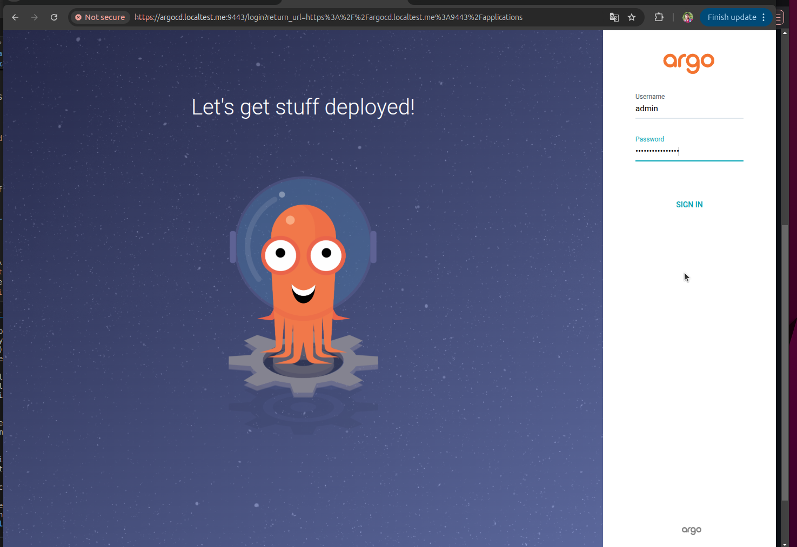
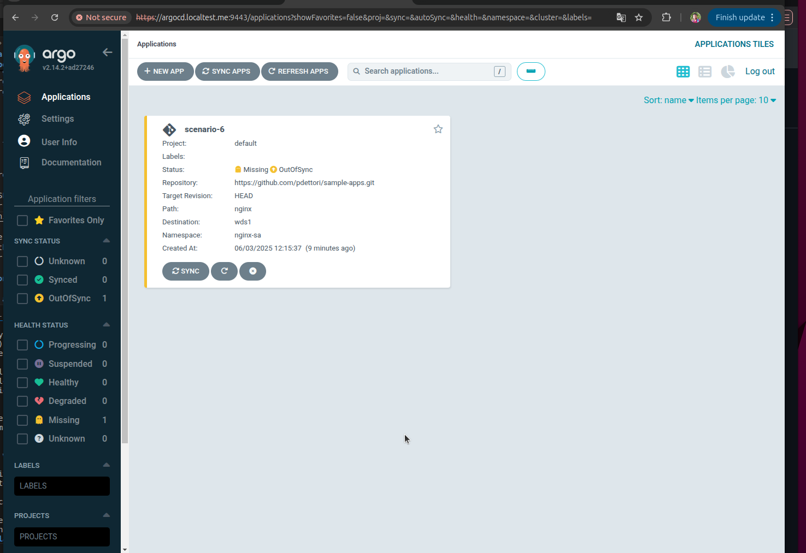

# Using Argo CD with KubeStellar Core chart

## Table of Contents
- [Overview](#overview)
- [Pre-requisites](#pre-requisites)
- [Installing Argo CD using KubeStellar Core chart](#installing-argo-cd-using-kubestellar-core-chart)
- [Deploying Argo CD applications](#deploying-argo-cd-applications)

## Overview

This documents explains how to use the KubeStellar core Helm chart to:

- deploy Argo CD in KubeFlex hosting cluster;
- register every WDS as a target cluster in Argo CD; and
- create Argo CD applications as specified by the chart values.

For a detailed step-by-step installation guide with expected outputs, see [Step-by-Step Installation Guide](core-chart.md).

## Pre-requisites

Before installing Argo CD with KubeStellar Core chart, ensure you have:

- All prerequisites from [installing KubeStellar using the Core chart](core-chart.md#pre-requisites)
- A properly configured KubeFlex hosting cluster
- Helm installed and configured
- kubectl access to your cluster

The settings described in this document are an extension of the KubeStellar Core chart settings described [here](core-chart.md#kubestellar-core-chart-values).

> The KubeStellar core chart can optionally be used to install Argo CD in the KubeFlex hosting cluster and register each KubeStellar WDS as an Argo CD target cluster. The core chart also has the option to define some Argo CD Applications.  
> This section will cover installing Argo CD and mapping WDSes to target clusters; the next section will show how to also define some Applications.

## Installing Argo CD using KubeStellar Core chart

To enable the installation of Argo CD by the KubeStellar Core chart, use the flag `--set argocd.install=true`. Besides deploying an instance of Argo CD, KubeStellar Core chart will take care of registering all the WDSes installed by the chart as Argo CD target clusters.

When deploying in an **OpenShift** cluster, add the flag `--set argocd.openshift.enabled=true`.

When deploying in a **Kubernetes** cluster, use the flag `--set argocd.global.domain=<url>` to provide the URL for the **nginx** ingress, which defaults to `argocd.localtest.me`.

Note that when creating a local **Kubernetes** cluster using our scripts for **Kind** or **k3s**, the **nginx** ingress will be accessible on host port `9443`; therefore the Argo CD UI can be accessed at the address `https://argocd.localtest.me:9443`.

### Example installation with Argo CD

```bash
helm upgrade --install ks-core core-chart \
  --set argocd.install=true
```

**Expected output:**
```
Release "ks-core" has been upgraded. Happy Helming!
NAME: ks-core
LAST DEPLOYED: Thu Jun 12 11:02:16 2025
NAMESPACE: default
STATUS: deployed
REVISION: 3
TEST SUITE: None
NOTES:
For your convenience you will probably want to add contexts to your
kubeconfig named after the non-host-type control planes (WDSes and
ITSes) that you just created (a host-type control plane is just an
alias for the KubeFlex hosting cluster). You can do that with the
following `kflex` commands; each creates a context and makes it the
current one. See
https://github.com/kubestellar/kubestellar/blob/0.28.0-alpha.2/docs/content/direct/core-chart.md#kubeconfig-files-and-contexts-for-control-planes
for a way to do this without using `kflex`.
Start by setting your current kubeconfig context to the one you used
when installing this chart.

kubectl config use-context $the_one_where_you_installed_this_chart
kflex ctx --set-current-for-hosting # make sure the KubeFlex CLI's hidden state is right for what the Helm chart just did

Finally, you can use `kflex ctx` to switch back to the kubeconfig
context for your KubeFlex hosting cluster.

Access Argo CD UI at https://argocd.localtest.me (append :9443 for Kind or k3s installations).
Obtain Argo CD admin password using the command:
kubectl -n default get secret argocd-initial-admin-secret -o jsonpath="{.data.password}" | base64 -d
```

### Retrieve Argo CD admin password

The initial password for the `admin` user can be retrieved using the following command:

```bash
kubectl -n default get secret argocd-initial-admin-secret -o jsonpath="{.data.password}" | base64 -d
```

**Expected output(similar):**
```
EpQ2-OMgvfdHiMiD
```

### Verify Argo CD installation

Verify that all Argo CD components are running:

```bash
kubectl get pods -A | grep -i argo
```

**Expected output (similar to):**
```
default              ks-core-argocd-application-controller-0                     1/1     Running     0          15m
default              ks-core-argocd-applicationset-controller-6669c9f789-wd5h7   1/1     Running     0          15m
default              ks-core-argocd-dex-server-8464bc64b9-dplv5                  1/1     Running     0          15m
default              ks-core-argocd-notifications-controller-66b8ccc4c7-8mjdx    1/1     Running     0          15m
default              ks-core-argocd-redis-76c6b4db57-7cfrs                       1/1     Running     0          15m
default              ks-core-argocd-repo-server-6774bd65db-rxmtz                 1/1     Running     0          15m
default              ks-core-argocd-server-84cbbd8cbd-bpl92                      1/1     Running     0          15m
```

### Access Argo CD UI

Open your browser and navigate to: `https://argocd.localtest.me:9443/`

**Login credentials:**
- **Username**: `admin`
- **Password**: Use the password obtained from the previous command (e.g., `EpQ2-OMgvfdHiMiD`)

> **Note:** If you encounter SSL certificate warnings in your browser, proceed with "Advanced" → "Proceed to argocd.localtest.me (unsafe)" or similar option, as this is expected for local development setups.


## Deploying Argo CD applications

The KubeStellar Core chart can also be used to deploy Argo CD applications as specified by chart values. The example below shows the relevant fragment of the chart values that could be used for deploying an application corresponding to `scenario-6` in [KubeStellar docs](example-scenarios.md#scenario-6---multi-cluster-workload-deployment-of-app-with-serviceaccount-with-argocd).

```yaml
argocd:
  applications: # list of Argo CD applications to be create
  - name: scenario-6 # required, must be unique
    project: default # default: default
    repoURL: https://github.com/pdettori/sample-apps.git
    targetRevision: HEAD # default: HEAD
    path: nginx
    destinationWDS: wds1
    destinationNamespace: nginx-sa # default: default
    syncPolicy: auto # default: manual
```

Alternatively, the same result can be achieved from Helm CLI by using the followig minimal argument (note that the default values are not explicitely set):

```shell
--set-json='argocd.applications=[ { "name": "scenario-6", "repoURL": "https://github.com/pdettori/sample-apps.git", "path": "nginx", "destinationWDS": "wds1", "destinationNamespace": "nginx-sa" } ]'
```


> **Important**: Currently, the KubeStellar controller does not return resource status correctly to Argo CD. This means that deployed applications may not show as "Healthy" or green in the Argo CD UI, even when they are actually running correctly on the workload execution clusters. This is a known limitation and does not indicate that your deployment has failed.