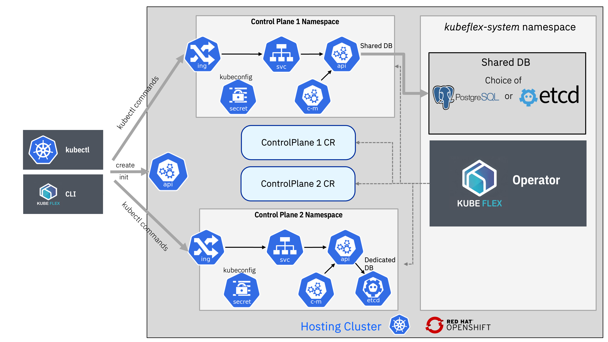

#  KubeFlex

One of the technologies underlying KubeStellar is KubeFlex, a kubernetes-based platform designed to:

- Provide lightweight Kube API Server instances and selected controllers as a service.
- Provide a flexible architecture for the storage backend
- Offer flexibility in choice of API Server build
- Present a single binary command line interface for improved user experience

KubeFlex is a flexible framework that supports various kinds of control planes, such as:

- _k8s_: a basic Kubernetes API Server with a subset of kube controllers.
  The control plane in this context does not execute workloads, such as pods,
  because the controllers associated with these objects are not activated.
  This environment is referred to as ‘denatured’ because it lacks the typical
  characteristics and functionalities of a standard Kubernetes cluster
  It uses about 350 MB of memory per instance with a shared Postgres Database Backend.

- _vcluster_: a virtual cluster that runs on the hosting cluster,
  based on the [vCluster Project](https://www.vcluster.com). This type of control
  plane can run pods using worker nodes of the hosting cluster.

- _host_: the KubeFlex hosting cluster, which is exposed as a control plane.

- _external_: an external cluster that is imported as a control plane (this
  is in the roadmap but not yet implemented)

- _ocm_: a control plane that uses the
  [multicluster-controlplane project](https://github.com/open-cluster-management-io/multicluster-controlplane)
  for managing multiple clusters.

When using KubeFlex, users interact with the API server of the hosting cluster to create or delete control planes.
KubeFlex defines a ControlPlane CRD that represents a Control Plane.

## Learn More

To explore more fully KubeFlex's capabilities [visit the repository at https://github.com/kubestellar/kubeflex](https://github.com/kubestellar/kubeflex)

There is also a [introductory video about KubeFlex](https://youtu.be/vI2O0L5ijVU?si=p32OUaQU96JOs5iH) on the KubeStellar YouTube Channel

