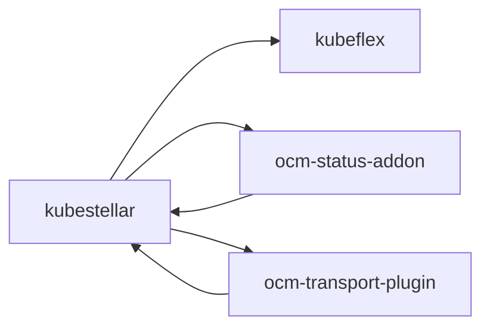
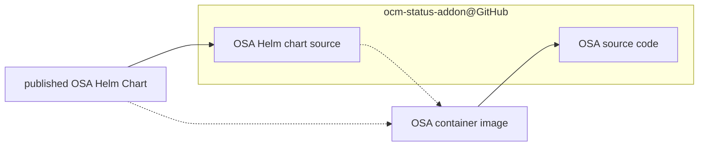
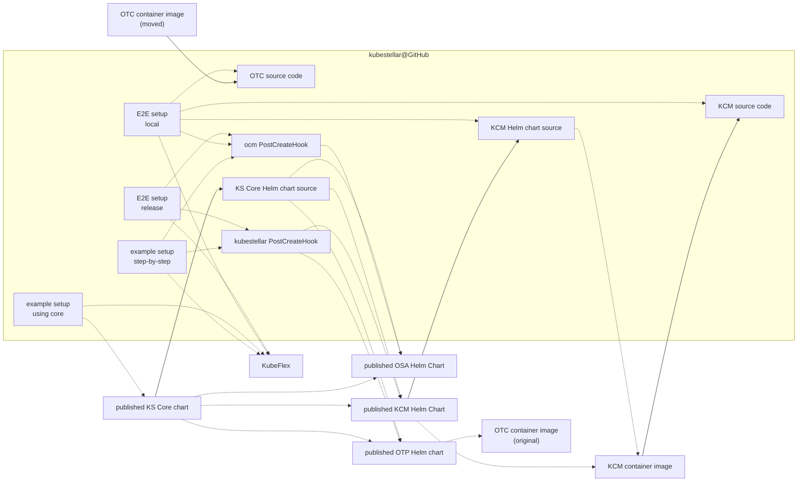
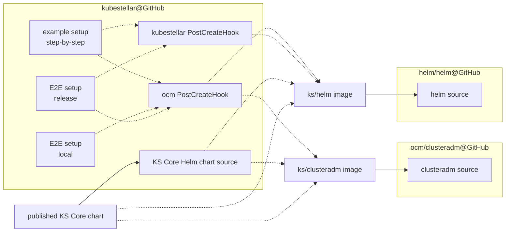
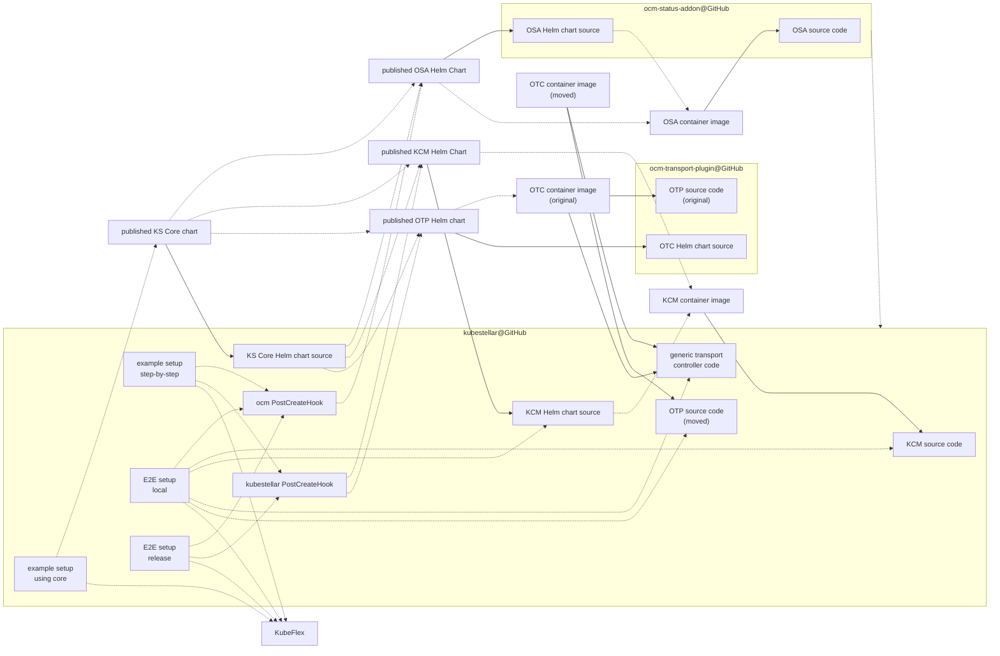

# Packaging and Delivery

## Outline of GitHub repositories

The following is a graph of the GitHub repositories in the `kubestellar` GitHub organization and the dependencies among them. The repo at the tail of an arrow depends on the repo at the head of the arrow. These are not just build-time dependencies but any reference from one repo to another.



The references from ocm-status-addon to kubestellar are only in documentation and are in the process of being removed (no big difficulty is anticipated).

## KubeFlex

See [the GitHub repo](https://github.com/kubestellar/kubeflex).

## OCM Status Addon

The [OCM Status Addon](https://github.com/kubestellar/ocm-status-addon) repo is the source of an [Open Cluster Management Addon](https://open-cluster-management.io/concepts/addon/). It builds one image that has two subcommands that tell it which role to play in that framework: the controller (which runs in the OCM hub, the KubeStellar ITS) or the agent.

### Outline of OCM status addon publishing



The dashed dependencies are at run time, not build time.

"OSA" is OCM Status Addon.

### OCM status addon container image

There is a container image at [ghcr.io/kubestellar/ocm-status-addon](https://github.com/orgs/kubestellar/packages/container/package/ocm-status-addon). This image can operate as either controller or agent.

In its capacity as controller, the code in this image can emit YAML for a Deployment object that runs the OCM Status Add-On Agent. The compiled code has an embedded copy of `pkg/controller/manifests`, which includes the YAML source for the agent Deployment.

The container image is built and published by that repository's release process, which is documented at [its `docs/release.md` file](https://github.com/kubestellar/ocm-status-addon/blob/main/docs/release.md).

By our development practices and not doing any manual hacks, we maintain the association that a container image tagged with `$VERSION` is built from the Git commit that has the Git tag `v$VERSION`.

To support testing, `make ko-local-build` will build a single-platform
image and not push it, only leave it among your Docker images. The
single platform's OS is Linux. The single platform's ISA is defined by
the `make` variable `ARCH`, which defaults to what `go env GOARCH`
prints.

### OCM status addon Helm chart

The OCM Status Add-On Controller is delivered by a Helm chart at [ghcr.io/kubestellar/ocm-status-addon-chart](https://github.com/orgs/kubestellar/packages/container/package/ocm-status-addon-chart). The chart references the container image.

By our development practices and doing doing any manual hacks, we maintain the association that the OCI image tagged `v$VERSION` contains a Helm chart that declares its `version` and its `appVersion` to be `v$VERSION` and the templates in that chart include a Deployment for the OCM Status Add-On Agent using the container image `ghcr.io/kubestellar/ocm-status-addon:$VERSION`.

## OCM Transport Plugin

This thing is in the midst of being moved from a separate repository into the kubestellar repository. The separate repository is [github.com/kubestellar/ocm-transport-plugin](https://github.com/kubestellar/ocm-transport-plugin).

The primary product is the OCM Transport Controller, built from generic transport controller code plus code specific to using OCM for transport.

### OCM Transport Controller container image

This appears at [ghcr.io/kubestellar/ocm-transport-plugin/transport-controller](https://github.com/kubestellar/ocm-transport-plugin/pkgs/container/ocm-transport-plugin%2Ftransport-controller). This will need to move to something like `ghcr.io/kubestellar/kubestellar/ocm-transport-controller`.

TODO: document how the image is built and published, including explain versioning.

### OCM Transport Controller Helm chart

This appears at [ghcr.io/kubestellar/ocm-transport-plugin/chart/ocm-transport-plugin](https://github.com/kubestellar/ocm-transport-plugin/pkgs/container/ocm-transport-plugin%2Fchart%2Focm-transport-plugin). This will need to move to something like `ghcr.io/kubestellar/kubestellar/ocm-transport-controller`.

## KubeStellar

### WARNING

Literal KubeStellar release numbers appear here, and are historical. The version of this document in a given release does not mention that release. See [the release process](release.md) for more details on what self-references are and are not handled.

### Outline of publishing

The following diagram shows most of it. For simplicity, this omits the clusteradm and the Helm CLI container images.



The following diagram shows the parts involving the clusteradm and Helm CLI container images.



The dashed dependencies are at run time, not build time.

"KCM" is the KubeStellar controller-manager.

**NOTE**: among the references to published artifacts, some have a
  version that is maintained in Git while others have a placeholder in
  Git that is replaced in the publishing process. See [the release
  document](release.md) for more details. This is an on-going matter
  of development.

### Local copy of KubeStellar git repo

**NOTE**: Because of [a restriction in one of the code generators that
we
use](https://github.com/kubernetes/code-generator/blob/v0.28.2/kube_codegen.sh#L394-L395),
a contributor needs to have their local copy of the git repo in a
directory whose pathname ends with the Go package name --- that is,
ends with `/github.com/kubestellar/kubestellar`.

### Derived files

Some files in the kubestellar repo are derived from other files there. Contributors are responsible for invoking the commands to (re)derive the derived files as necessary.

Some of these derived files are derived by standard generators from the Kubernetes milieu. A contributor can use the following command to make all of those, or use the individual `make` commands described in the following subsubsections to update particular subsets.

```shell
make all-generated
```

The following command, which we aspire to check in CI, checks whether all those derived files have been correctly derived. It must be invoked in a state where the `git status` is clean, or at least the dirty files are irrelevant; the current commit is what is checked. This command has side-effects on the filesystem like `make all-generated`.

```shell
hack/verify-codegen.sh
```

#### Files generated by controller-gen

- `make manifests` generates the CustomResourceDefinition files,
  which exist in two places:
  `config/crd/bases` and
  `pkg/crd/files`.

- `make generate` generates the deep copy code, which exists in
  `zz_generated.deepcopy.go` next to the API source.

#### Files generated by code-generator

The files in `pkg/generated` are generated by [k/code-generator](https://github.com/kubernetes/code-generator). This generation is done at development time by the command `make codegenclients`.

### KubeStellar controller-manager container image

KubeStellar has one container image, for what is called the
KubeStellar controller-manager. For each WDS, KubeStellar has a pod
running that image. It installs the needed custom resource
_definition_ objects if they are not already present, and is a
controller-manager hosting the per-WDS controllers ([binding controller](architecture.md#binding-controller) and [status controller](architecture.md#status-controller)) from the kubestellar repo.

The image repository is `ghcr.io/kubestellar/kubestellar/controller-manager`.

By our development practices and not doing any manual hacking we maintain the association that the container image tagged `$VERSION` is built from the Git commit having the Git tag `v$VERSION`.

The [release process](release.md) builds and publishes that container image.

`make ko-build-controller-manager-local` will make a local image for just the local
platform. This is used in local testing.

### clusteradm container image

The kubestellar GitHub repository has a script,
`hack/build-clusteradm-image.sh`, that creates and publishes a
container image holding the `clusteradm` command from OCM. The source
of the container image is read from the latest release of
[github.com/open-cluster-management-io/clusteradm](https://github.com/open-cluster-management-io/clusteradm),
unless a command line flag says to use a specific version. This script
also pushes the built container image to
[quay.io/kubestellar/clusteradm](https://quay.io/repository/kubestellar/clusteradm)
using a tag that equals the ocm/clusteradm version that the image was
built from.

This image is used by the [ocm PostCreateHook](#ocm-postcreatehook) to initialize an ITS as an Open Cluster Management hub.

### Helm CLI container image

The container image at `quay.io/kubestellar/helm:3.14.0` was built by `hack/build-helm-image.sh`.

### KubeStellar core Helm chart

This Helm chart is instantiated in a pre-existing Kubernetes cluster and (1) makes it into a KubeFlex hosting cluster and (2) sets up a requested collection of WDSes and ITSes. See [the core chart doc](core-chart.md). This chart is defined in the `core-chart` directory and published to `ghcr.io/kubestellar/kubestellar/core-chart`.

This Helm chart defines and uses two KubeFlex PostCreateHooks, as follows.

- `its` defines a Job with two containers. One container uses the clusteradm container image to initialize the target cluster as an OCM "hub". The other container uses the Helm CLI container image to instantiate the [OCM Status Addon Helm chart](#ocm-status-addon-helm-chart). The version to use is defined in the `values.yaml` of the core chart. This PCH is used for every requested ITS.

- `wds` defines a Job with two containers. One container uses the Helm CLI image to instantiate the [KubeStellar controller-manager Helm chart](#kubestellar-controller-manager-helm-chart). The other container uses the Helm CLI image to instantiate the [OCM Transport Helm chart](#ocm-transport-controller-helm-chart). For both of those subsidiary charts, the version to use is defined in the `values.yaml` of the core chart. This PCH is used for every requested WDS.

By our development practices and not doing any manual hacking, we maintain the association that the OCI image tagged `$VERSION` contains a Helm chart that declares its `version` and its `appVersion` to be `$VERSION` and instantiates version `$VERSION` of [the KubeStellar controller-manager Helm chart](#kubestellar-controller-manager-helm-chart).


### KubeStellar controller-manager Helm Chart

There is a Helm chart that is designed to be instantiated in a KubeFlex hosting cluster, once per WDS. The focus of the chart is getting the KubeStellar controller-manager installed.

The source for the Helm chart is in
the `chart/` directory. `make chart` (re)derives
it from local sources. This is not included in `make all-generated`.

This chart creates (among other things) a `Deployment` object that runs a container from the [KubeStellar controller-manager container image](#kubestellar-controller-manager-container-image).

The chart is published at the OCI repository
`ghcr.io/kubestellar/kubestellar/controller-manager-chart`. A GitHub Actions workflow (in `.github/workflows/goreleaser.yml`) specializes and publishes this chart as part of [the release process](release.md).

By our development practices and not doing any manual hacking, we maintain the association that the OCI image tagged `$VERSION` contains a Helm chart that declares its `version` and its `appVersion` to be `$VERSION` and that chart has a Deployment that uses the kubestellar-controller-manager container image tagged `$VERSION`.

### KubeFlex PostCreateHooks

In addition to the two PostCreateHooks in the core Helm chart described above, there are two more PostCreateHooks defined in the `config/postcreate-hooks/` directory.

These two PostCreateHooks were used in the "step-by-step" variant of the example setup instructions (which are currently out of service). Those instructions told the user to use the PCH sources from a KubeStellar release on GitHub. The version is a literal in the instructions and is updated in the process of preparing for a KubeStellar release. The step-by-step variant is intended to be deleted (in favor of using the core Helm chart) by the time the next release is made.

The setup script for E2E testing (`test/e2e/setup-kubestellar.sh`) uses the local copy of the `ocm` PCH unconditionally and uses the local copy of the `kubestellar` PCH when testing a release.

#### ocm PostCreateHook

The PostCreateHook defined in `config/postcreate-hooks/ocm.yaml` gets used on an ITS to do two things: (1) initialize that space as an OCM "hub", using the image `quay.io/kubestellar/clusteradm:0.8.2`, and (2) install KubeStellar's OCM Status Add-On Controller there. The clusteradm image (described [above](#clusteradm-container-image)) includes the `clusteradm` CLI release `v0.8.2` which is bundled with the OCM release `v0.13.2`. Part (2) uses the Helm CLI in the container image at `quay.io/kubestellar/helm:v3.14.0` to instantiate the [OCM Status Add-On Helm chart](#ocm-status-addon-helm-chart) that was published at `ghcr.io/kubestellar/ocm-status-addon-chart`.

#### kubestellar PostCreateHook

The PostCreateHook defined in
`config/postcreate-hooks/kubestellar.yaml` is intended to be used in
the hosting cluster, once per WDS, and defines a `Job` that has two containers.
One uses [the Helm CLI image](#helm-cli-container-image) to instantiate [the KubeStellar controller-manager Helm chart](#kubestellar-controller-manager-helm-chart). The chart version appears as a literal in the PCH definition and is manually updated during the process of creating a release (see [the release process document](release.md)). The other container uses the Helm CLI image to instantiate OCM Transport Helm chart. The version to instantiate appears as a literal in the PCH definition and is manually updated after each OTP release (see [the release process doc](release.md#reacting-to-a-new-ocm-transport-plugin-release)).

### Scripts and instructions

There are instructions for using a release ([Getting Started](get-started.md) document) and a setup script for end-to-end testing(`test/e2e/common/setup-kubestellar.sh`). The end-to-end testing can either test the local copy/version of the kubestellar repo or test a release. So there are three cases to consider.

#### Example setup instructions

There were two variants of the setup instructions for the examples: an older one --- which is out of service at the moment, is called "step-by-step", and uses the `ocm` and `kubestellar` PostCreateHooks --- and [Getting Started](get-started.md), which uses the [core Helm chart](#kubestellar-core-helm-chart). The latter is the preferred method, and is the only one described here.

The instructions are a Markdown file that displays commands for a user to execute. These start with commands that define environment variables that hold the release of ks/kubestellar and of ks/ocm-transport-plugin to use.

The instructions display a command to instantiate the core Helm chart, at the version in the relevant environment variable, requesting the creation of one ITS and one WDS.

The instructions display commands to update the user's kubeconfig file to have contexts for the ITS and the WDS created by the chart instance. These commands use the KubeFlex CLI (`kflex`). There is also a script under development that will do the job using `kubectl` instead of `kflex`; when it appears, the instructions will display a curl-to-bash command that fetches the script from GitHub using a version that appears as a literal in the instructions and gets manually updated as part of making a new release.

#### E2E setup for testing a release

When setting up to test a release, the setup script uses the following KubeStellar pieces.

The script creates the `ocm` and `kubestellar` PCHes from the local YAML for them. The script uses these PCHes in `kflex` commands that create one ITS and one WDS, respectively.

#### E2E setup for testing local copy/version

When setting up to test a release, the setup script uses the following KubeStellar pieces.

The script creates the `ocm` PCH from the local YAML for it. The script uses this PCH in a `kflex` command that create one ITS.

The scripts builds a local kubestellar controller-manager container image from local sources. Then the script loads that image into the KubeFlex hosting cluster (e.g., using `kind load`).

The script temporarily updates the local kubestellar controller-manager Helm chart to reference the kubestellar controller-manager container image that was loaded into the hosting cluster. Then the script invokes the Helm CLI to instantiate that chart in the hosting cluster, configured to apply to the WDS being set up. Then the script partially undoes its temporary modification of the kubestellar controller-manager Helm chart, using `git checkout --`.

The script builds a local container image for the OCM transport controller from (a) local sources for the generic part and (b) the transport plugin in a ks/ocm-transport-plugin release identified by a literal version number in the script. This version is updated as part of tracking a ks/OTP release. Then the script loads this container image into the hosting cluster. Then the setup script invokes `scripts/deploy-transport-controller.sh`, which creates a Deployment object that runs the published transport controller image using a version that appears as a literal in the script and is manually updated in the process of reacting to a new ks/OTP release.


## Amalgamated graph

Currently only showing kubestellar and ocm-status-addon.

Again, omitting clusteradm and Helm CLI container images for simplicity.

TODO: finish this



Every dotted line is a reference that must be versioned. How do we
keep all those versions right?

Normally a git tag is an immutable reference to an immutable git
commit. Let's not violate that.

Can/should we say that an OCI image (or whatever) tag equals the tag
of the commit that said image (or whatever) was built from? While
keeping `main` always a working system?
