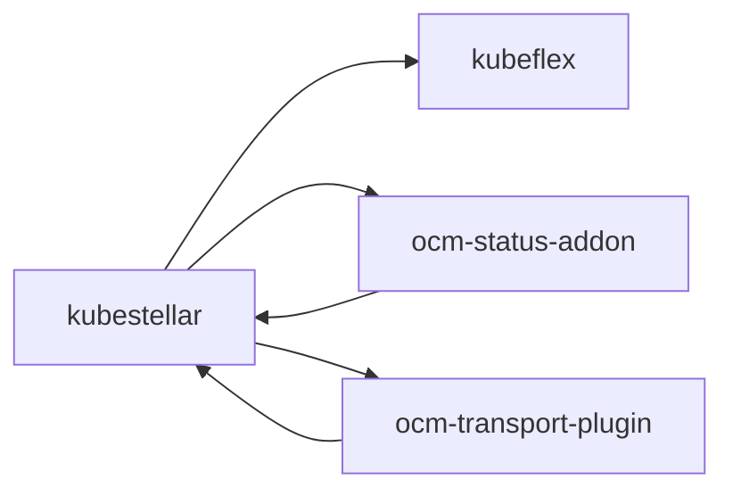
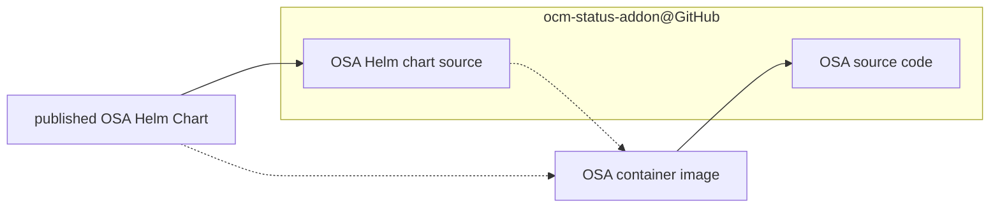
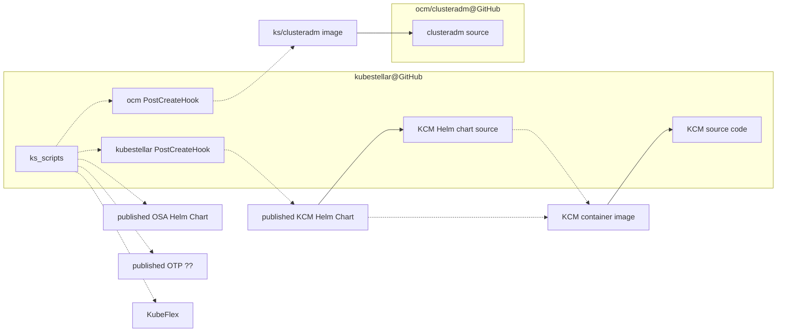
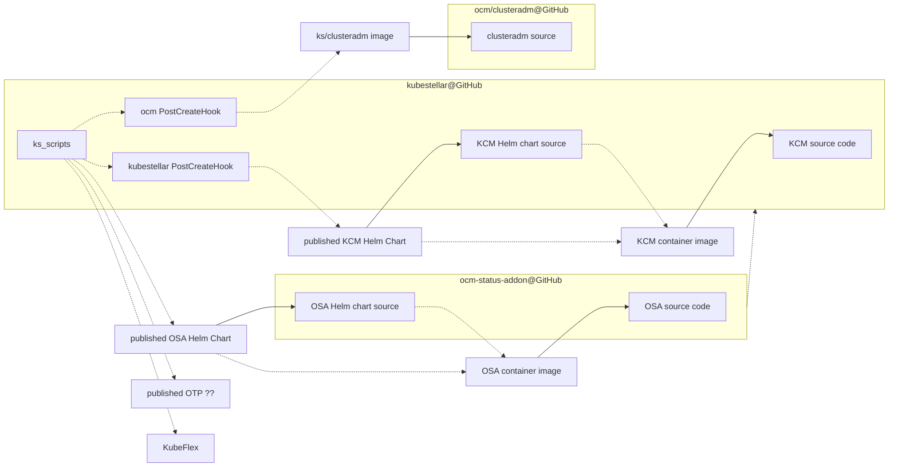

# Packaging and Delivery

## Outline of GitHub repositories

The following is a graph of the GitHub repositories in the `kubestellar` GitHub organization and the dependencies among them. The repo at the tail of an arrow depends on the repo at the head of the arrow. These are not just build-time dependencies but any reference from one repo to another.



The references from ocm-status-addon to kubestellar are only in documentation and are in the process of being removed (no big difficulty is anticipated).

## KubeFlex

See [the GitHub repo](https://github.com/kubestellar/kubeflex).

## OCM Status Addon

The [OCM Status Addon](https://github.com/kubestellar/ocm-status-addon) repo is the source of a RedHat-style operator.

### Outline of OCM status addon publishing



The dashed dependencies are at run time, not build time.

"OSA" is OCM Status Addon.

### OCM status addon container image

There is a container image at [ghcr.io/kubestellar/ocm-status-addon](https://github.com/orgs/kubestellar/packages/container/package/ocm-status-addon).

The container image is built and published by that repo's release process, which is documented at [its `docs/release.md` file](https://github.com/kubestellar/ocm-status-addon/blob/main/docs/release.md).

Following are notable images in that repo.

|         tag   |         git commit                       | SHA256 digest |
| ------------- | ---------------------------------------- | ------------- |
| 0.2.0-alpha.1 | 1c36248df2c4379ab4ce2a5945d5cce3145dc211 | b8ef1802a1d9f30dd65f16f94c86dc0218f2cf30bb34549a6248aeeb2b13eb4a |
| 0.2.0-rc5     | 6753b9e169d47ff1592f9638d1b53c826f7ee1b9 | 35d97e4b523388ee28f537b176b3f8dbbc888e31a46bbd308d67cd5a0735c249 |
| 0.2.0-rc6     | 25d27c0e5c7c70fdd578619b4e8381897cccd441 | 5b5eab49397984ee35cd431b4918f4584e2f56cf0596080e4ec560e46583d8b2 |
| 0.2.0-rc7     | ce5c42d51b389b0389aa3c2252371832eb0e7137 | 070ac0600856deebd227a4ca0fe39ba1b685b0563274a182942af84e4218e502 |
|    latest     | ce5c42d51b389b0389aa3c2252371832eb0e7137 | 070ac0600856deebd227a4ca0fe39ba1b685b0563274a182942af84e4218e502 |

To support testing, `make ko-local-build` will build a single-platform
image and not push it, only leave it among your Docker images. The
single platform's OS is Linux. The single platform's ISA is defined by
the `make` variable `ARCH`, which defaults to what `go env GOARCH`
prints.

### OCM status addon Helm chart

The operator is delivered by a Helm chart at [ghcr.io/kubestellar/ocm-status-addon-chart](https://github.com/orgs/kubestellar/packages/container/package/ocm-status-addon-chart). The chart references the container image.

The following notable versions exist.

| OCI tag = version in chart | appVersion in chart | referenced container tag |
| -------------------------- | ------------------- | ------------------------ |
| v0.2.0-alpha.1             | v0.2.0-alpha.1      | 0.2.0-alpha.1 |
| v0.2.0-rc5                 | v0.2.0-rc5          | 0.2.0-rc5     |
| v0.2.0-rc6                 | v0.2.0-rc6          | 0.2.0-rc6     |
| v0.2.0-rc7                 | v0.2.0-rc7          | 0.2.0-rc7     |

## OCM Transport Plugin

The source is the GitHub repo [github.com/kubestellar/ocm-transport-plugin](https://github.com/kubestellar/ocm-transport-plugin)

### OCM Transport container image

This appears at [ghcr.io/kubestellar/ocm-transport-plugin/transport-controller](https://github.com/kubestellar/ocm-transport-plugin/pkgs/container/ocm-transport-plugin%2Ftransport-controller).

TODO: document how the image is built and published, including explain versioning.

## KubeStellar

### WARNING

Literal KubeStellar release numbers appear here, and are historical. The version of this document in a given release does not mention that release. See [the release process](release.md) for more details on what self-references are and are not handled.

### Outline of publishing



The dashed dependencies are at run time, not build time.

"KCM" is the KubeStellar controller-manager.

"ks_scripts" are the user-facing instructions and the end-to-end tests
that use published artifacts (container images, Helm charts). (There
are also e2e tests that do not use previously published artifacts,
their temporary local artifacts are beyond the scope of this
document.)

**NOTE**: among the references to published artifacts, some have a
  version that is maintained in Git while others have a placeholder in
  Git that is replaced in the publishing process. See [the release
  document](release.md) for more details. This is an on-going matter
  of development.

### Local copy of KubeStellar git repo

**NOTE**: Because of [a restriction in one of the code generators that
we
use](https://github.com/kubernetes/code-generator/blob/v0.28.2/kube_codegen.sh#L394-L395),
a contributor needs to have their local copy of the git repo in a
directory whose pathname ends with the Go package name --- that is,
ends with `/github.com/kubestellar/kubestellar`.

### Derived files

Some files in the kubestellar repo are derived from other files there. Contributors are responsible for invoking the commands to (re)derive the derived files as necessary.

Some of these derived files are derived by standard generators from the Kubernetes milieu. A contributor can use the following command to make all of those, or use the individual `make` commands described in the following subsubsections to update particular subsets.

```shell
make all-generated
```

The following command, which we aspire to check in CI, checks whether all those derived files have been correctly derived. It must be invoked in a state where the `git status` is clean, or at least the dirty files are irrelevant; the current commit is what is checked. This command has side-effects on the filesystem like `make all-generated`.

```shell
hack/verify-codegen.sh
```

#### Files generated by controller-gen

- `make manifests` generates the CustomeResourceDefinition files,
  which exist in two places:
  `config/crd/bases` and
  `pkg/crd/files`.

- `make generate` generates the deep copy code, which exists in
  `zz_generated.deepcopy.go` next to the API source.

#### Files generated by code-generator

The files in `pkg/generated` are generated by [k/code-generator](https://github.com/kubernetes/code-generator). This generation is done at development time by the command `make codegenclients`.

### KubeStellar controller-manager container image

KubeStellar has one container image, for what is called the
KubeStellar controller-manager. For each WDS, KubeStellar has a pod
running that image. It installs the needed custom resource
_definition_ objects if they are not already present, and is a
controller-manager hosting the per-WDS controllers ([binding controller](architecture.md#binding-controller) and [status controller](architecture.md#status-controller)) from the kubestellar repo.

The image repository is
`ghcr.io/kubestellar/kubestellar/controller-manager`. The following notable versions exist.

| image tag | git commit | SHA256 digest |
| --------- | ---------- | ------------- |
| 0.20.0    | a2bcaf75dc895dbef5f6cddcf203b0203423a08a | fac5b208a1f691eb5548a7699494bed2ee6b7502e739a2db840f39bbc05b2fd4 |
| 0.21.0    | dcb232dbcfeb2e90d02315c38e26ba1a380d2cc6 | 3f04a74698d0e59bfe941d6ab016ee438f6a6ea684c0f671c03db0f4d7ee5eee |
| 0.21.1    | 13fcd6a1c10eb377b20e7b1a6c5162209f70a281 | 0e0873088a2a78e578cf97e486ba5348b8728cdf0a270c6741710a241f12af8e |

The [release process](release.md) builds and publishes that container image.

`make ko-build-local` will make a local image for just the local
platform. This is used in local testing.

### KubeStellar controller-manager Helm Chart

There is a Helm chart that is designed to be instantiated in a KubeFlex hosting cluster, once per WDS. The focus of the chart is getting the KubeStellar controller-manager installed.

The source for the Helm chart is in
the `chart/` directory. `make chart` (re)derives
it from local sources. This is not included in `make all-generated`.

This chart creates (among other things) a `Deployment` object that runs a container from the [KubeStellar controller-manager container image](#kubestellar-controller-manager-container-image).

The chart is published at the OCI repository
`ghcr.io/kubestellar/kubestellar/kubestellar-operator-chart`. A GitHub Actions workflow (in `.github/workflows/goreleaser.yml`) specializes and publishes this chart as part of [the release process](release.md).

The following versions exist.

| OCI tag = version in chart | appVersion in chart | referenced container tag |
| -------------------------- | ------------------- | ------------------------ |
| 0.20.0                     | 0.20.0              | 0.20.0 |

### clusteradm container image

The kubestellar GitHub repository has a script,
`hack/build-clusteradm-image.sh`, that creates and publishes a
container image holding the `clusteradm` command from OCM. The source
of the container image is read from the latest release of
[github.com/open-cluster-management-io/clusteradm](https://github.com/open-cluster-management-io/clusteradm),
unless a command line flag says to use a specific version. This script
also pushes the built container image to
[quay.io/kubestellar/clusteradm](https://quay.io/repository/kubestellar/clusteradm)
using a tag that equals the ocm/clusteradm version that the image was
built from.

### KubeFlex PostCreateHooks

There are two `PostCreateHook` objects defined in the `config/postcreate-hooks/` directory.

#### ocm PostCreateHook

The PostCreateHook defined in `ocm.yaml` gets used on an ITS and adds the hub side of OCM there, using the image `quay.io/kubestellar/clusteradm:0.7.2`. See [above](#clusteradm-container-image) about the source of that. Currently this PostCreateHook is used in the E2E tests but this is a problem because of its fixed reference to container image previously built from sources in this same Git repository.

#### kubestellar PostCreateHook

The PostCreateHook defined in `kubestellar.yaml` is intended to be
used in the hosting cluster, once per WDS, and runs container image
`quay.io/kubestellar/helm:v3.14.0` (which is built from [the Helm
source](https://github.com/helm/helm/tree/v3.14.0) by a process that
we need to document) to instantiate the chart from
`oci://ghcr.io/kubestellar/kubestellar/controller-manager-chart`;
the chart version appears as a literal in the PostCreateHook,
currently "0.20.0". Currently the only reference to any copy of this
PostCreateHook is from the [examples doc](examples.md), which
references the copy in the Git commit tagged `v0.20.0`.

## Amalgamated graph

Currently only showing kubestellar and ocm-status-addon.

TODO: finish this



Every dotted line is a reference that must be versioned. How do we
keep all those versions right?

Normally a git tag is an immutable reference to an immutable git
commit. Let's not violate that.

Can/should we say that an OCI image (or whatever) tag equals the tag
of the commit that said image (or whatever) was built from? While
keeping `main` always a working system?
