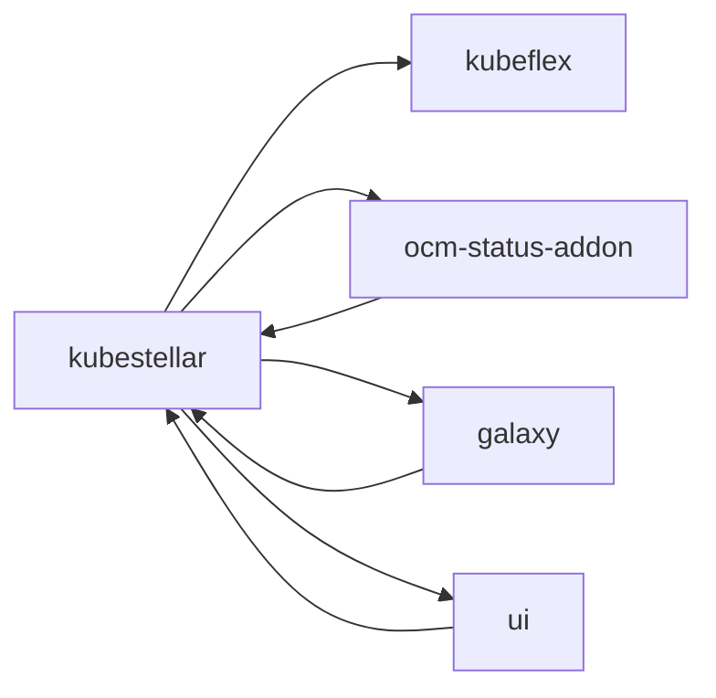

# Subprojects and Additional Repositories

KubeStellar is composed of several subprojects and additional repositories that work together to provide the complete multi-cluster management solution. The following is a comprehensive list of all codebases considered subprojects or additional repositories:

## Active Subprojects

| Repository | Purpose | Status | Location |
|------------|---------|--------|----------|
| **kubeflex** | A flexible and scalable platform for running Kubernetes control plane APIs. Provides the infrastructure for hosting multiple control planes. | Active | [github.com/kubestellar/kubeflex](https://github.com/kubestellar/kubeflex) |
| **ocm-status-addon** | Open Cluster Management addon that provides status synchronization between clusters. Builds container images and Helm charts for OCM integration. | Active | [github.com/kubestellar/ocm-status-addon](https://github.com/kubestellar/ocm-status-addon) |
| **galaxy** | Additional modules, tools and documentation to facilitate KubeStellar integration with other community projects. Includes bash-based scripts for integration. | Active | [github.com/kubestellar/galaxy](https://github.com/kubestellar/galaxy) |
| **ui** | KubeStellarUI application providing a web-based interface for managing multi-cluster deployments. | Active | [github.com/kubestellar/ui](https://github.com/kubestellar/ui) |
| **helm** | Repository used solely for Helm charts distribution and management. | Active | [github.com/kubestellar/helm](https://github.com/kubestellar/helm) |

## Retired/Deprecated Subprojects

| Repository | Purpose | Status | Location |
|------------|---------|--------|----------|
| **ocm-transport-plugin** | OCM Transport Controller for Open Cluster Management integration. | Retired | [github.com/kubestellar/ocm-transport-plugin](https://github.com/kubestellar/ocm-transport-plugin) |

**Note:** The contents of `ocm-transport-plugin` have been merged into the main `kubestellar` repository. This repository is maintained for historical purposes and older releases only.

## Repository Dependencies

The following diagram shows the dependency relationships between repositories:

## Security and Maintenance

All subprojects follow the same security practices and maintenance procedures as the main KubeStellar project:

- **Code Reviews:** All changes require peer review before merging
- **Security Scanning:** Regular security scans and vulnerability assessments
- **Dependency Management:** Automated dependency updates and security patches
- **Release Process:** Coordinated releases with the main KubeStellar project
- **Documentation:** Each subproject maintains its own documentation and follows the main project's documentation standards

For detailed information about each subproject's specific functionality, architecture, and usage, please refer to their respective repositories and the [Packaging and Delivery documentation](packaging.md).
