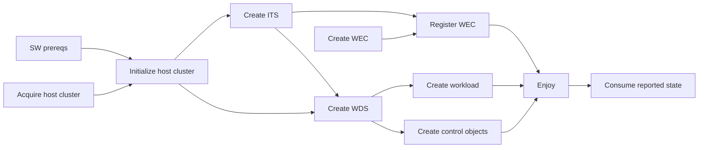

# Outline of Installation and Usage of KubeStellar

See the KubeStellar [overview](../readme.md) for architecture and other information.

This user guide is an ongoing project. If you find errors, please point them out in our [Slack channel](https://kubernetes.slack.com/archives/C058SUSL5AA/) or open an issue in our [github repository](https://github.com/kubestellar/kubestellar)!

Installing and using KubeStellar progresses through the following stages.

1. Install software prerequisites (see [prerequisites](pre-reqs.md)).
1. Acquire the ability to use a Kubernetes cluster to serve as the [KubeFlex](https://github.com/kubestellar/kubeflex/) hosting cluster.
1. Initialize that cluster as a KubeFlex hosting cluster.
1. Create an Inventory and Transport Space (ITS)
1. Create a Workload Description Space (WDS).
1. Create a Workload Execution Cluster (WEC).
1. Register the WEC in the ITS.
1. Maintain workload desired state in the WDS.
1. Maintain control objects in the WDS to bind workload with WEC and modulate the state propagation back and forth.
1. Enjoy the effects of workloads being propagated to the WEC.
1. Consume reported state from WDS.

By "maintain" we mean create, read, update, delete, list, and watch as you like, over time. KubeStellar is eventually consistent: you can change your inputs as you like over time, and KubeStellar continually strives to achieve what you are currently asking it to do.

There is some flexibility in the ordering of those stage. The following flowchart shows the dependencies.

You can have multiple ITSes, WDSes, and WECs, created and deleted over time as you like.

KubeStellar's [Core Helm chart](core-chart.md) combines initializing the KubeFlex hosting cluster, creating some ITSes, and creating some WDSes.

You can find an example run through of steps 2--7 in [the quickstart](get-started.md). This dovetails with [the example scenarios document](example-scenarios.md), which shows examples of the later steps.
