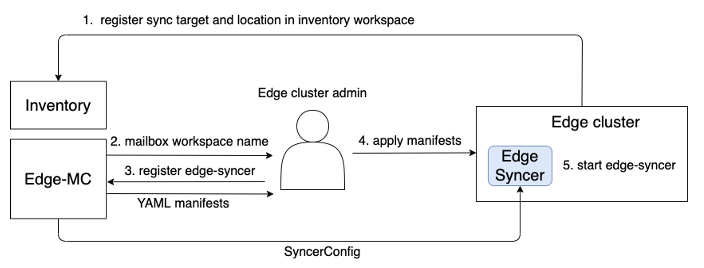

{}
Edge syncer is a new syncer working with mailbox workspace in edge-mc. 
{}


#### Registering Edge Syncer on a p-cluster

Edge-syncer can be deployed on p-cluster easily by the following steps.
1. Create SyncTarget and Location
  - Mailbox controller creates mailbox workspace automatically. 
  - Get mailbox workspace id
2. Use command to register edge-syncer
   ```console
   kubectl ws <mb-ws name>
   kubectl kcp workload edge-sync <EM Sync Target name> --image <EM Syncer Image> -o edge-syncer.yaml
   ```
3. Deploy edge-syncer on p-cluster.



#### Deploy workload objects from edge-mc to p-cluster

To deploy resources to p-clusters, create the following in workload management workspace
- workload objects
  - Some objects are denatured if needed.
  - Other objects are as it is
- APIExport/API Schema corresponding to CRD such as Kubernetes [ClusterPolicyReport](https://github.com/kubernetes-sigs/wg-policy-prototypes/blob/master/policy-report/crd/v1beta1/wgpolicyk8s.io_clusterpolicyreports.yaml).
  - TBD: Conversion from CRD to APIExport/APISchema could be automated by using MutatingAdmissionWebhook on workload management workspace. This automation is already available (see the sciprt [here](https://github.com/kcp-dev/edge-mc/blob/main/hack/update-codegen-crds.sh#L57)). 
- EdgeSyncConfig (This is going to be replaced with EdgePlacement spec) 


After this, Edge-mc will put the following in the mailbox workspace.
- Workload objects (both denatured one and not-denatured one)
- API Binding (to API Export on the workload management workspace)
- EdgeSyncConfig CR


**TODO**: This is something we should clarify..e.g. which existing controller(s) in edge-mc will cover, or just create a new controller to handle uncovered one. @MikeSpreitzer gave the following suggestions.
  - The placement transformer will put the workload objects and syncer config into the mailbox workspaces.
  - The placement translator will create syncer config based on the EdgePlacement objects and what they match.
  - The mailbox controller willput API Binding into the mailbox workspace.

#### EdgeSyncConfig
- The example of EdgeSycnerConfig CR is [here](https://github.com/yana1205/edge-mc/blob/edge-syncer/pkg/syncer/scripts/edge-sync-config-for-kyverno-helm.yaml). Its CRD is [here](https://github.com/yana1205/edge-mc/blob/edge-syncer/pkg/syncer/config/crds/edge.kcp.io_edgesyncconfigs.yaml).
- The CR here is used from edge syncer. 
- The CR is placed at mb-ws to define
  - object selector
  - need of renaturing
  - need of returning reported states of downsynced objects
  - need of delete propagation for downsyncing
- The CR is managed by edge-mc (placement transformer).
  - At the initial implementation before edge-mc side controller become ready, we assume EdgeSyncConfig is on workload management workspace (wm-ws), and then which will be copied into mb-ws like other workload objects.
  - This should be changed to be generated according to EdgePlacement spec. 
- This CR is a placeholder for defining how edge-syncer behaves, and will be extended/splitted/merged according to further design discussion.

#### Downsyncing

- Edge syncer does downsyncing, which copy workload objects on mailbox workspace to p-cluster
- If workload objects are deleted on mailbox workspace, the corresponding objects on the p-cluster will be also deleted according to EdgeSyncConfig. 
- EdgeSyncConfig specifies which objects should be downsynced.
  - object selector: group, version, kind, name, namespace (for namespaced objects), label, annotation
- Cover cluster-scope objects and CRD
  - CRD needs to be denatured if downsyncing is required.
- Renaturing is applied if required (specified in EdgeSyncConfig).
- Current implementation is using polling to detect changes on mailbox workspace, but will be changed to use Informers. 

#### Renaturing
- Edge syncer does renaturing, which converts workload objects to different forms of objects on a p-cluster. 
- The conversion rules (downstream/upstream mapping) is specified in EdgeSyncConfig.
- Some objects need to be denatured. 
  - CRD needs to be denatured when conflicting with APIBinding.

#### Return of reported state
- Edge syncer return the reported state of downsynced objects at p-cluster to the status of objects on the mailbox workspace periodically. 
  - TODO: Failing to returning reported state of some resources (e.g. deployment and service). Need more investigation. 
- reported state returning on/off is configurable in EdgeSyncConfig. (default is on)

#### Resource Upsyncing
- Edge syncer does upsyncing resources at p-cluster to the corresponding mailbox workspace periodically. 
- EdgeSyncConfig specifies which objects should be upsynced from p-cluster.
  - object selector: group, version, kind, name, namespace (for namespaced objects), label, annotation (, and more such as ownership reference?)
- Upsyncing CRD is out of scope for now. This means when upsyncing a CR, corresponding APIBinding (not CRD) is available on the mailbox workspace. This limitation might be revisited later. 
- Upsynced objects can be accessed from APIExport set on the workload management workspace bound to the mailbox workspace (with APIBinding). This access pattern might be changed when other APIs such as summarization are provided in edge-mc. 

#### Feasibility study
We will verify if the design describled here could cover the following 4 scenarios. 
- I can register an edge-syncer on a p-cluster to connect a mailbox workspace specified by name. (edge-syncer registration)
- I can deploy Kyverno and its policy from mailbox workspace to p-cluster just by using manifests (generated from Kyverno helm chart) rather than using OLM. (workload deployment by edge-syncer's downsyncing)
- I can see the policy report generated at p-cluster via API Export on workload management workspace. (resource upsyncing by edge-syncer) 
- I can deploy the denatured objects on mailbox workspace to p-cluster by renaturing them automatically in edge-syncer. (workload deployment by renaturing)
