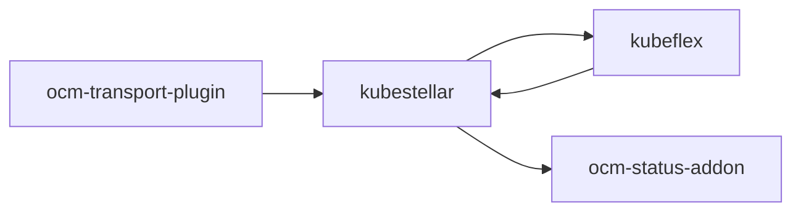
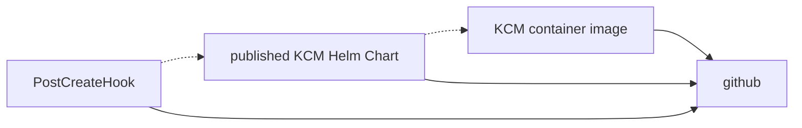

# Packaging and Delivery

## Outline of GitHub repositories

The following is a graph of the GitHub repositories and the dependencies among them. The repo at the tail of an arrow depends on the repo at the head of the arrow.



Note: the `ocm-status-addon` repo is in the process of being moved
into the kubestellar GitHub organization; the actual dependency right
now is on [a private repo](#status-addon).

## KubeFlex

See [the GitHub repo](https://github.com/kubestellar/kubeflex).

## status-addon

The [status-addon](https://github.ibm.com/dettori/status-addon) repo is the source of a RedHat-style operator.

The operator is delivered by a Helm chart at `quay.io/pdettori/status-addon-chart`. Chart versioning? How is the chart built, pushed?

There is also a container image involved.

## OCM Transport Plugin

.. to be written ...

## KubeStellar

### Outline of publishing



The dashed dependencies are at run time, not build time.

"KCM" is the KubeStellar controller-manager.

**NOTE**: at the present level of development, all versions are hand coded and there is only one public version. This will obviously have to change.

### Local copy of KubeStellar git repo

**NOTE**: Because of [a restriction in one of the code generators that
we
use](https://github.com/kubernetes/code-generator/blob/v0.28.2/kube_codegen.sh#L394-L395),
a contributor needs to have their local copy of the git repo in a
directory whose pathname ends with the Go package name --- that is,
ends with `/github.com/kubestellar/kubestellar`.

### Derived files

Some files in the kubestellar repo are derived from other files there. Contributors are responsible for invoking the commands to (re)derive the derived files as necessary.

Some of these derived files are derived by standard generators from the Kubernetes milieu. A contributor can use the following command to make all of those, or use the individual `make` commands described in the following subsubsections to update particular subsets.

```shell
make all-generated
```

The following command, which we aspire to check in CI, checks whether all those derived files have been correctly derived. It must be invoked in a state where the `git status` is clean, or at least the dirty files are irrelevant; the current commit is what is checked. This command has side-effects on the filesystem like `make all-generated`.

```shell
hack/verify-codegen.sh
```

#### Files generated by controller-gen

- `make manifests` generates the CustomeResourceDefinition files,
  which exist in two places:
  [config/crd/bases](../../../config/crd/bases) and
  [pkg/crd/files](../../../pkg/crd/files).

- `make generate` generates the deep copy code, which exists in
  `zz_generated.deepcopy.go` next to the API source.

#### Files generated by code-generator

The files in [pkg/generated](../../../pkg/generated) are generated by [k/code-generator](https://github.com/kubernetes/code-generator). This generation is done at development time by the command `make codegenclients`.

### KubeStellar controller-manager container image

KubeStellar has one container image, for what is called the
KubeStellar controller-manager. For each WDS, KubeStellar has a pod
running that image. It installs the needed custom resource
_definition_ objects if they are not already present, and is a
controller-manager hosting the per-WDS controllers ([placement controller](architecture.md#placement-controller), [status controller](architecture.md#status-controller), and transport controller(TODO: link to doc)).

The image repository is
`ghcr.io/kubestellar/kubestellar/kubestellar-operator`. There is
currently just one supported tag there, `0.20.0-alpha.1`. That was
built from the git repo contents with the tag `v0.20.0-alpha.1`.

`make ko-build-push` will build and push that image, tagging it with
the value of the `make` variable `IMAGE_TAG` (which defaults to
`0.20.0-alpha.1`).

`make ko-build-local` will make a local image for just the local
platform. This is used in local testing.

### KubeStellar controller-manager Helm Chart

There is a Helm chart that is designed to be instantiated in a KubeFlex hosting cluster, once per WDS. The focus of the chart is getting the KubeStellar controller-manager installed.

The source for the Helm chart is in
[core-helm-chart](../../../core-helm-chart). `make chart` (re)derives
it from local sources. This is not included in `make all-generated`.

This chart creates (among other things) a `Deployment` object that runs a container from the image `ghcr.io/kubestellar/kubestellar/kubestellar-operator:0.20.0-alpha.1`.

The chart is published at the OCI repository
`ghcr.io/kubestellar/kubestellar/kubestellar-operator-chart`.  What stores the chart there?

### KubeFlex PostCreateHooks

There are two `PostCreateHook` objects defined in [config/postcreate-hooks](../../../config/postcreate-hooks). What uses these copies of those hook definitions?

- `ocm.yaml` adds `clusteradm` by running a container using the image `quay.io/kubestellar/clusteradm:0.7.2` which is built from [the OCM source](https://github.com/open-cluster-management-io/clusteradm) using the script [build-clusteradm-image.sh](../../../hack/build-clusteradm-image.sh).
- `kubestellar.yaml` runs container image `quay.io/kubestellar/helm:v3.14.0` (which is built from [the Helm source](https://github.com/helm/helm/tree/v3.14.0) by a process that we need to document) to instantiate the chart from `oci://ghcr.io/kubestellar/kubestellar/kubestellar-operator-chart` with chart version `0.20.0-alpha.1`, which is built by (what?) from (what? probably answered above).
