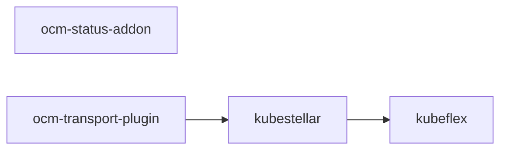
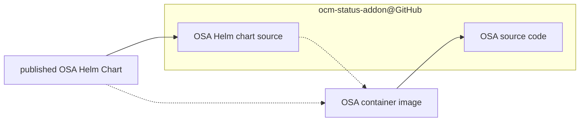
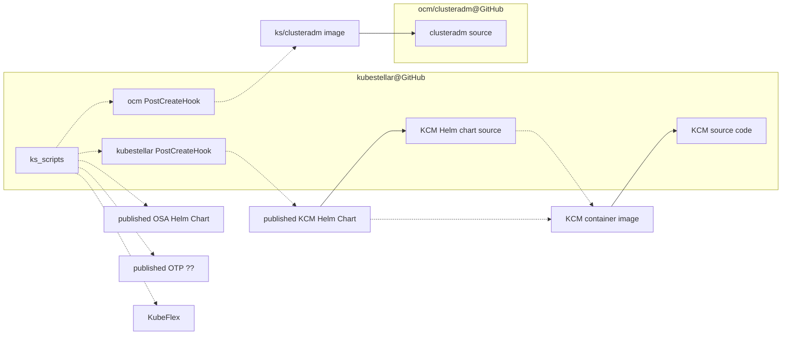
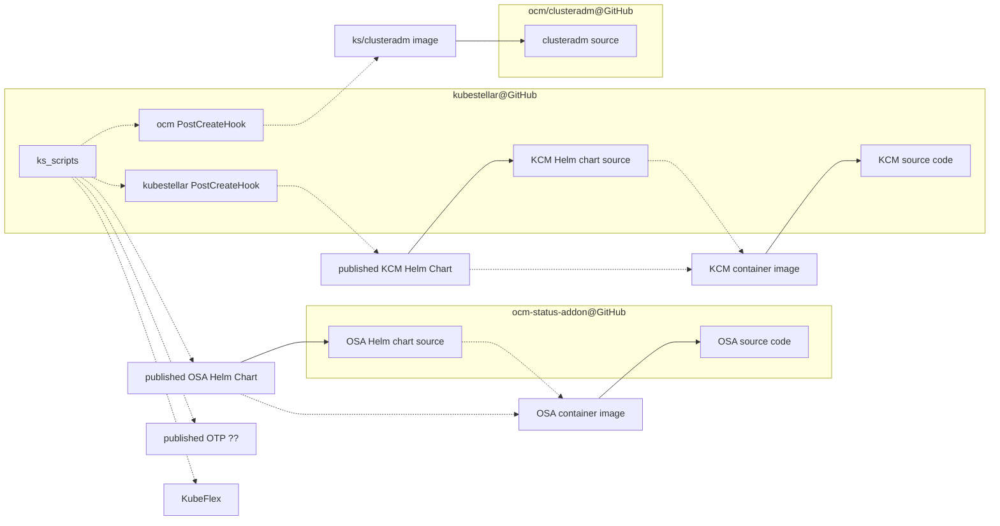

# Packaging and Delivery

## Outline of GitHub repositories

The following is a graph of the GitHub repositories in the `kubestellar` GitHub organization and the dependencies among them. The repo at the tail of an arrow depends on the repo at the head of the arrow.

Note that to _use_ KubeStellar, all of the repos in this graph are involved.



## KubeFlex

See [the GitHub repo](https://github.com/kubestellar/kubeflex).

## OCM Status Addon

The [OCM Status Addon](https://github.com/kubestellar/ocm-status-addon) repo is the source of a RedHat-style operator.

### Outline of OCM status addon publishing



The dashed dependencies are at run time, not build time.

"OSA" is OCM Status Addon.

### OCM status addon container image

There is a container image at [ghcr.io/kubestellar/ocm-status-addon](https://github.com/orgs/kubestellar/packages/container/package/ocm-status-addon).

The container image is built and published using `make`.  The
following `make` variables are relevant.

- `KO_DOCKER_REPO`, defaults to `ghcr.io/kubestellar`
- `CMD_NAME`, defaults to `ocm-status-addon`
- `IMAGE_TAG`, defaults to `0.2.0-alpha.1`
- `IMG`, defaults to `${KO_DOCKER_REPO}/${CMD_NAME}:${IMAGE_TAG}`

`make ko-build-push` will build and publish the container image at
`${IMG}`. This will be a multi-platform manifest, referencing images
for "platforms" `linux/amd64` and `linux/arm64`.

`make ko-local-build` will build the same multi-platform manifest but
not push it, only leave it among your Docker images. Note that if you
have podman pretending to be Docker then it will only receive a
single-platform image, not the multi-platform manifest.


### OCM status addon Helm chart

The operator is delivered by a Helm chart at [ghcr.io/kubestellar/ocm-status-addon-chart](https://github.com/orgs/kubestellar/packages/container/package/ocm-status-addon-chart).

The chart is built and published using `make`. The following `make`
variables are relevant.

- `KO_DOCKER_REPO`, defaults to `ghcr.io/kubestellar`
- `CMD_NAME`, defaults to `ocm-status-addon`
- `IMAGE_TAG`, defaults to `0.2.0-alpha.1`
- `IMG`, defaults to `${KO_DOCKER_REPO}/${CMD_NAME}:${IMAGE_TAG}`

`make chart`: builds the local copy of the chart from local sources,
using `kustomize`. When using the default values of the `make`
variables, the built chart references the container image
`ghcr.io/kubestellar/ocm-status-addon:0.2.0-alpha.1`. TODO: describe
how the chart contents depend on the `make` variables.

`make chart-push` (depends on the `make` target `chart`): pushes the
local copy of the chart to the OCI repository and tag specified in
`${IMG}`.

The following versions exist.

| OCI tag = version in chart | appVersion in chart | referenced container tag |
| -------------------------- | ------------------- | ------------------------ |
| 0.2.0-alpha.1              | 0.2.0-alpha.1       | 0.2.0-alpha.1 |

Note: the Chart.yaml in github uses just "0.2.0" for the version and appVersion in the chart. TODO: bug?

## OCM Transport Plugin

**NOTE**: This is under development, not a part of the functioning
  system yet.

The source is the GitHub repo [github.com/kubestellar/ocm-transport-plugin](https://github.com/kubestellar/ocm-transport-plugin)

### OCM Transport Plugin container image

This will aspirationally appear at [ghcr.io/kubestellar/ocm-transport-plugin](https://github.com/orgs/kubestellar/packages/container/package/ocm-transport-plugin). This level of development has not been reached yet.

TODO: document how the image is built and published, including explain versioning.

## KubeStellar

### Outline of publishing



The dashed dependencies are at run time, not build time.

"KCM" is the KubeStellar controller-manager.

"ks_scripts" are the user-facing instructions that use published
images and so on. There are also e2e tests, but they test the copy of
the repo that they are embedded in, not anything built and published
earlier.

**NOTE**: at the present level of development, all versions are hand coded and there is only one public version. This will obviously have to change.

### Local copy of KubeStellar git repo

**NOTE**: Because of [a restriction in one of the code generators that
we
use](https://github.com/kubernetes/code-generator/blob/v0.28.2/kube_codegen.sh#L394-L395),
a contributor needs to have their local copy of the git repo in a
directory whose pathname ends with the Go package name --- that is,
ends with `/github.com/kubestellar/kubestellar`.

### Derived files

Some files in the kubestellar repo are derived from other files there. Contributors are responsible for invoking the commands to (re)derive the derived files as necessary.

Some of these derived files are derived by standard generators from the Kubernetes milieu. A contributor can use the following command to make all of those, or use the individual `make` commands described in the following subsubsections to update particular subsets.

```shell
make all-generated
```

The following command, which we aspire to check in CI, checks whether all those derived files have been correctly derived. It must be invoked in a state where the `git status` is clean, or at least the dirty files are irrelevant; the current commit is what is checked. This command has side-effects on the filesystem like `make all-generated`.

```shell
hack/verify-codegen.sh
```

#### Files generated by controller-gen

- `make manifests` generates the CustomeResourceDefinition files,
  which exist in two places:
  [config/crd/bases](../../../config/crd/bases) and
  [pkg/crd/files](../../../pkg/crd/files).

- `make generate` generates the deep copy code, which exists in
  `zz_generated.deepcopy.go` next to the API source.

#### Files generated by code-generator

The files in [pkg/generated](../../../pkg/generated) are generated by [k/code-generator](https://github.com/kubernetes/code-generator). This generation is done at development time by the command `make codegenclients`.

### KubeStellar controller-manager container image

KubeStellar has one container image, for what is called the
KubeStellar controller-manager. For each WDS, KubeStellar has a pod
running that image. It installs the needed custom resource
_definition_ objects if they are not already present, and is a
controller-manager hosting the per-WDS controllers ([binding controller](architecture.md#binding-controller), [status controller](architecture.md#status-controller), and transport controller(TODO: link to doc)).

The image repository is
`ghcr.io/kubestellar/kubestellar/kubestellar-operator`. There is
currently just one supported tag there, `0.20.0-alpha.1`. That was
built from the git repo contents with the tag `v0.20.0-alpha.1`.

`make ko-build-push` will build and push that image, tagging it with
the value of the `make` variable `IMAGE_TAG` (which defaults to
`0.20.0-alpha.1`).

`make ko-build-local` will make a local image for just the local
platform. This is used in local testing.

### KubeStellar controller-manager Helm Chart

There is a Helm chart that is designed to be instantiated in a KubeFlex hosting cluster, once per WDS. The focus of the chart is getting the KubeStellar controller-manager installed.

The source for the Helm chart is in
[core-helm-chart](../../../core-helm-chart). `make chart` (re)derives
it from local sources. This is not included in `make all-generated`.

This chart creates (among other things) a `Deployment` object that runs a container from the image `ghcr.io/kubestellar/kubestellar/kubestellar-operator:0.20.0-alpha.1`.

The chart is published at the OCI repository
`ghcr.io/kubestellar/kubestellar/kubestellar-operator-chart`.  The
`make` target `chart-push` depends on target `chart` and publishes the
chart to
`${DOCKER_REGISTRY}/kubestellar-operator-chart:${IMAGE_TAG}`. Make
variable `DOCKER_REGISTRY` defaults to
`ghcr.io/kubestellar/kubestellar` and `IMAGE_TAG` defaults to
`0.20.0-alpha.1` (red flag here).

The following versions exist.

| OCI tag = version in chart | appVersion in chart | referenced container tag |
| -------------------------- | ------------------- | ------------------------ |
| 0.20.0-alpha.1             | 0.1.0               | 0.20.0-alpha.1 |

### clusteradm container image

The kubestellar GitHub repository has a script,
`hack/build-clusteradm-image.sh`, that creates and publishes a
container image holding the `clusteradm` command from OCM. The source
of the container image is read from the latest release of
[github.com/open-cluster-management-io/clusteradm](https://github.com/open-cluster-management-io/clusteradm),
unless a command line flag says to use a specific version. This script
also pushes the built container image to
[quay.io/kubestellar/clusteradm](https://quay.io/repository/kubestellar/clusteradm)
using a tag that equals the ocm/clusteradm version that the image was
built from.

### KubeFlex PostCreateHooks

There are two `PostCreateHook` objects defined in [config/postcreate-hooks](../../../config/postcreate-hooks).

#### ocm PostCreateHook

The PostCreateHook defined in `ocm.yaml` gets used on an ITS and adds the hub side of OCM there, using the image `quay.io/kubestellar/clusteradm:0.7.2`. See [above](#clusteradm-container-image) about the source of that. Currently this PostCreateHook is used in the E2E tests but this is a problem because of its fixed reference to container image previously built from sources in this same Git repository.

#### kubestellar PostCreateHook

The PostCreateHook defined in `kubestellar.yaml` is intended to be used in the hosting cluster, once per WDS, and runs container image `quay.io/kubestellar/helm:v3.14.0` (which is built from [the Helm source](https://github.com/helm/helm/tree/v3.14.0) by a process that we need to document) to instantiate the chart from `oci://ghcr.io/kubestellar/kubestellar/kubestellar-operator-chart` with chart version `0.20.0-alpha.1`. Currently the only reference to any copy of this PostCreateHook is from the [examples doc](examples.md), which references the copy in the Git commit tagged `v0.20.0-alpha.1`.

## Amalgamated graph

Currently only showing kubestellar and ocm-status-addon.

TODO: finish this



Every dotted line is a reference that must be versioned. How do we
keep all those versions right?

Normally a git tag is an immutable reference to an immutable git
commit. Let's not violate that.

Can/should we say that an OCI image (or whatever) tag equals the tag
of the commit that said image (or whatever) was built from? While
keeping `main` always a working system?
