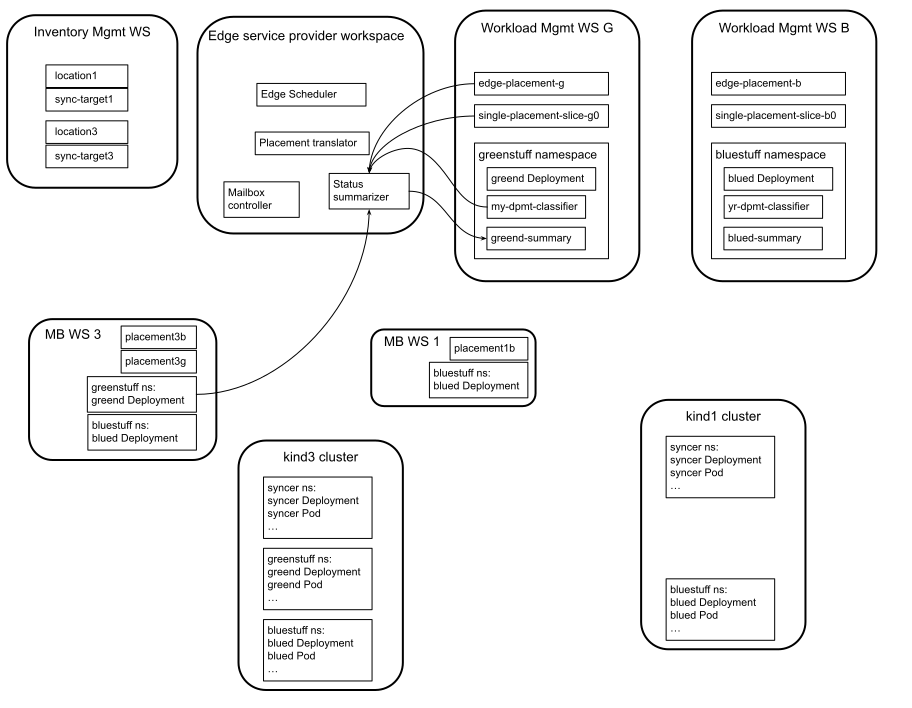

# 2023q1 PoC Example 1

This doc attempts to show a simple example usage of the 2023q1 PoC.
This doc is a work in progress.

This example is presented in stages.  The controllers involved are
always maintaining relationships.  This document focuses on changes as
they appear in this example.

## Stage 1


Stage 1 has the following steps.

1. Create two kind clusters.
    ```shell
    $ kind create cluster kind1
    $ kind create cluster kind3
    ```

2. Start `kcp`.  In the following shell commands it is assumed that
   `kcp` is running and `$KUBECONFIG` is set to the
   `.kcp/admin.kubeconfig` that `kcp` produces.

3. Create an inventory management workspace.
    ```shell
    $ kcp ws root
    $ kcp ws create inv1 --enter
    ```

4. Create a SyncTarget object to represent the kind1 cluster.
    ```shell
    $ kubectl create -f - <<<EOF
    apiVersion: workload.kcp.io/v1alpha1
    kind: SyncTarget
    metadata:
      name: kind1
      labels:
        example: yes
        extended: no
    spec:
      cells:
        foo: bar
    EOF
    ```

5. Create a Location object describing the kind1 cluster.
    ```shell
    $ kubectl create -f - <<<EOF
    apiVersion: scheduling.kcp.io/v1alpha1
    kind: Location
    metadata:
      name: kind1
      annotations:
        env: prod
    spec:
      resource: {group: workload.kcp.io, version: v1alpha1, resource: synctargets}
      instanceSelector:
        matchLabels: {"example":"yes", "extended":"no"}
    EOF
    ```

6. Create a SyncTarget object describing the kind3 cluster.
    ```shell
    $ kubectl create -f - <<<EOF
    apiVersion: workload.kcp.io/v1alpha1
    kind: SyncTarget
    metadata:
      name: kind3
      labels:
        example: yes
        extended: yes
    spec:
      cells:
        bar: baz
    EOF
    ```

7. Create a Location object describing the kind3 cluster.
    ```shell
    $ kubectl create -f - <<<EOF
    apiVersion: scheduling.kcp.io/v1alpha1
    kind: Location
    metadata:
      name: kind3
      annotations:
        env: prod
        extended: yes
    spec:
      resource: {group: workload.kcp.io, version: v1alpha1, resource: synctargets}
      instanceSelector:
        matchLabels: {"example":"yes", "extended":"yes"}
    EOF
    ```

8. Create the edge service provider workspace.
    ```shell
    $ kubectl ws root
    $ kubectl ws create edge --enter
    ```

9. Populate the edge service provider workspace.
    ```shell
    $ kubectl create ...(details TBD)...
    ```

10. The mailbox controller will create two mailbox workspaces, one for
    each SyncTarget.  Check it out.
    ```shell
    $ kubectl get Workspace
    NAME                                                       TYPE        REGION   PHASE   URL                                                     AGE
    niqdko2g2pwoadfb-mb-f99e773f-3db2-439e-8054-827c4ac55368   universal            Ready   https://192.168.58.123:6443/clusters/0ay27fcwuo2sv6ht   22s
    niqdko2g2pwoadfb-mb-c5820696-016b-41f6-b676-d7c0ef02fc5a   universal            Ready   https://192.168.58.123:6443/clusters/dead3333beef3333   22s
    ```

## Stage 2


Stage 2 has the following steps.

1. Create the workload management workspace for the blue workload.
   Then put the blue workload description in it, and create the
   EdgePlacement for the blue workload.  TODO later: add an object
   that prescribes customization.  TODO later: include an object that
   prescribes summarization.
   
    ```shell
    kubectl ws root
    kubectl ws create work-b --enter
    kubectl create ns bluestuff
    kubectl label ns bluestuff common=yes
    kubectl create deployment --image=gcr.io/kuar-demo/kuard-amd64:blue --port=8080 blued # TODO: make it in the bluestuff namespace
    kubectl create -f - <<<EOF
    apiVersion: edge.kcp.io/v1alpha1
    kind: EdgePlacement
    metadata:
      name: edge-placement-b
    spec:
      locationSelectors:
        matchLabels: {"env":"prod"}
      namespaceSelector: {"common":"no"}
    EOF
    ```

2. Create the workload management workspace for the green workload.
   Then put the green workload description in it, and create the
   EdgePlacement for the green workload.  TODO later: add an object
   that prescribes customization.  TODO later: include an object that
   prescribes summarization.
   
    ```shell
    kubectl ws root
    kubectl ws create work-g --enter
    kubectl create ns greenstuff
    kubectl label ns greenstuff common=no
    kubectl create deployment --image=gcr.io/kuar-demo/kuard-amd64:green --port=8080 greend # TODO: make it in the greenstuff namespace
    kubectl create -f - <<<EOF
    apiVersion: edge.kcp.io/v1alpha1
    kind: EdgePlacement
    metadata:
      name: edge-placement-g
    spec:
      locationSelectors:
        matchLabels: {"env":"prod","extended":"yes"}
      namespaceSelector: {"common":"no"}
    EOF
    ```

3. In response to each EdgePlacement, the edge scheduler will create a
   corresponding SinglePlacementSlice object.  These will indicate the
   following resolutions of the "where" predicates.

   | EdgePlacement | Resolved Where |
   | ------------- | -------------- |
   | edge-placement-b | kind1, kind3 |
   | edge-placement-g | kind3 |
   
   Check out the SinglePlacementSlice objects as follows.
   
    ```shell
    $ kubectl get SinglePlacementSlice
    # TODO: show what they look like
    ```

## Stage 3


Stage 3 has the following steps.

In response to the EdgePlacement and SinglePlacementSlice objects, the
placement translator will copy the workloads into the mailbox
workspaces and create TMC placement objects there.

The blue workload goes only to the kind1 cluster.  Examine its TMC
Placement object and blue workload as follows.

```shell
$ kubectl ws root:edge:niqdko2g2pwoadfb-mb-f99e773f-3db2-439e-8054-827c4ac55368
$ kubectl get Placement -o yaml
TODO: show what it looks like
$ kubectl get ns
(will list the syncer workspace and bluestuff)
$ kubectl get Deployment -A
(will list the syncer and blued Deployments)
```

The kind3 cluster gets both the blue and gree workloads.  Examine its
TMC Placement object and workloads as follows.

```shell
$ kubectl ws root:edge:niqdko2g2pwoadfb-mb-c5820696-016b-41f6-b676-d7c0ef02fc5a
$ kubectl get Placement -o yaml
TODO: show what it looks like
$ kubectl get ns
(will list the syncer workspace, bluestuff, and greenstuff)
$ kubectl get Deployment -A
(will list the syncer, blued, and greend Deployments)
```

## Stage 4


Stage 4 has the following steps.

TMC does its thing between the kind1 cluster and its mailbox
workspace.  This is driven by the one TMC Placement object in that
mailbox workspace.

TMC does its thing between the kind3 cluster and its mailbox
workspace.  This is driven by the two TMC Placement objects in that
mailbox workspace, one for the blue workload and one for the green
workload.

## Stage 5



The status summarizer, driven by the EdgePlacement and
SinglePlacementSlice for green, creates a status summary object in the
greenstuff namespace in the green workload workspace holding a summary
of the corresponding Deployment objects.  In this case there is just
one such object, in the mailbox workspace for the kind3 cluster.


The status summarizer, driven by the EdgePlacement and
SinglePlacementSlice for blue, creates a status summary object in the
bluestuff namespace in the blue workload workspace holding a summary
of the corresponding Deployment objects.  Those are the `blued`
Deployment objects in the two mailbox workspaces.
