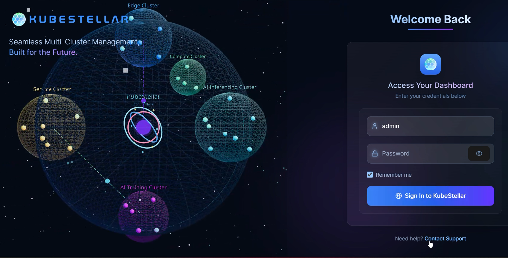

# KubeStellar UI (User Interface)

The KubeStellar UI is an add-on developed to make managing workloads via KubeStellar even simpler and more intuitive.
With its web-based interface, you can view and manage your Workload Definition Space, Inventory and Transport Space, and Binding Policies all interactively, with both drag-and-drop and text-based interface modes available for use.

## Learn More
The Kubestellar UI has [its own section in our User Guide](../ui-docs/ui-overview.md)

To explore more fully under the covers, [visit the UI repository at https://github.com/kubestellar/ui](https://github.com/kubestellar/ui)
