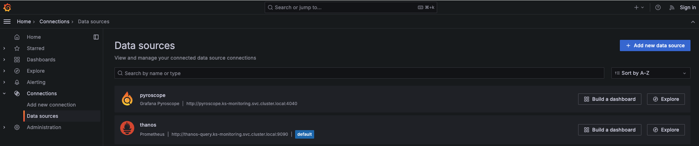
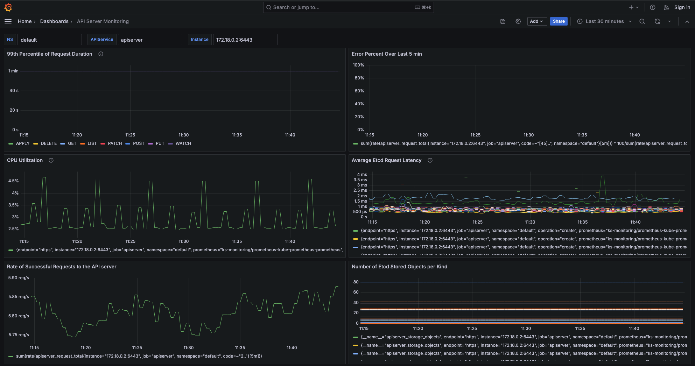

# Monitoring Tools for KubeStellar Control Plane


### Requirement
To follow the instructions here you need to use KubeStellar `main` branch or any future KubeStellar release higher than `0.24.0`. Also, you need to have release `v0.2.0-rc16` or higher for the status-addon controller and agent installed in your environment. If you're using an older release, please follow these instructions to update your environment: 

1.  Remove the status-addon-controller and status-addon-agent from your current environment:

```bash
helm --kube-context its1 -n open-cluster-management delete status-addon
kubectl --context its1 -n cluster1 delete manifestwork addon-addon-status-deploy-0
```

2. Re-deploy the status-addon controller and agents: 

```bash
helm --kube-context its1 upgrade --install ocm-status-addon -n open-cluster-management oci://ghcr.io/kubestellar/ocm-status-addon-chart --version v0.2.0-rc16
```

### Description
This example shows how to deploy monitoring tools (Prometheus/Thanos, Grafana and Pyroscope) for KubeStellar control plane components - see architecture image above. These instructions can be used to deploy monitoring tools to any KubeStellar system. If you already have the monitoring tools installed in your environment, you can skip to `step-2`.


#### 1. Install the monitoring tools:

Starting from a local directory containing the git repo, do the following:

a) Deploy the monitoring tools in a plain K8s hosting cluster (e.g., `kind-kubeflex`):

```bash
cd monitoring
./install-ks-monitoring.sh --cluster-context kind-kubeflex --set core
```

For an OpenShift cluster add the flag `--env ocp` in the commad above. 

Optionally, check the deployment of the monitoring tools:

```bash
kubectl --context kind-kubeflex -n ks-monitoring get pods
```

Output:
```bash
NAME                                                   READY   STATUS    RESTARTS   AGE
grafana-59f4c8bdf5-mgcmk                               1/1     Running   0          2d2h
minio-0                                                1/1     Running   0          2d2h
minio-1                                                1/1     Running   0          2d2h
prometheus-kube-prometheus-operator-79d5cf844f-nm462   1/1     Running   0          2d2h
prometheus-prometheus-kube-prometheus-prometheus-0     2/2     Running   0          2d2h
pyroscope-0                                            1/1     Running   0          2d2h
pyroscope-alloy-0                                      2/2     Running   0          2d2h
thanos-compactor-c8756458-5ssjt                        1/1     Running   0          2d2h
thanos-query-7c7fc49dbb-69wqp                          1/1     Running   0          2d2h
thanos-query-frontend-5fb66b5744-r42g2                 1/1     Running   0          2d2h
thanos-receive-0                                       1/1     Running   0          2d2h
thanos-storegateway-0                                  1/1     Running   0          2d2h
```


b) Deploy the monitoring tools in a plain K8s WEC cluster (e.g., `cluster1`):

```bash
./install-ks-monitoring.sh --cluster-context cluster1 --set wec --kubeflex-hosting-cluster-context kind-kubeflex
```

For OpenShift clusters add the flags `--env ocp` in the commad above. 

Optionally, check the deployment of the monitoring tools:

```bash
kubectl --context cluster1 -n ks-monitoring get pods
```

Output:
```bash
NAME                                                   READY   STATUS    RESTARTS   AGE
prometheus-kube-prometheus-operator-79d5cf844f-vdggz   1/1     Running   0          2d1h
prometheus-prometheus-kube-prometheus-prometheus-0     2/2     Running   0          2d1h
pyroscope-0                                            1/1     Running   0          2d1h
pyroscope-alloy-0                                      2/2     Running   0          2d1h
```


#### 2. Configure Prometheus and Pyroscope to scrape your KubeStellar spaces and Workload Execution Clusters:

a) WDS space:

```bash
./configure-monitoring-wds.sh --kubeflex-hosting-cluster-context kind-kubeflex
```

If you have more than one WDS, you can run the above script with the `--space-name` flag. For example: `./configure-monitoring-wds.sh --space-name wds2`

Optionally, check the prometheus service monitor objects for the WDS space:

```bash
kubectl --context kind-kubeflex -n ks-monitoring get servicemonitor -l "app.kubernetes.io/part-of!=kube-prometheus-stack" | grep "wds1*"
```

Output:
```bash
wds1-apiserver                 64m
wds1-ks-controller-manager     64m
wds1-ks-transport-controller   64m
```

b) ITS space:

```bash
./configure-monitoring-its.sh --kubeflex-hosting-cluster-context kind-kubeflex
```

If you have more than one ITS, you can run the above script with the `--space-name` flag. For example: `./configure-monitoring-its.sh --space-name its2`

Optionally, check the prometheus service monitor objects for the ITS space:

```bash
kubectl --context kind-kubeflex -n ks-monitoring get servicemonitor -l "app.kubernetes.io/part-of!=kube-prometheus-stack" | grep "its1*"
```

Output:
```bash
its1-apiserver                 64m
its1-status-addon-controller   64m
```

c) Workload execution cluster (WEC):

Run the following command for every WEC: `$ ./configure-monitoring-wec.sh --wec-cluster-context <wec-ctx-name>`.

  For example:
  ```bash
  ./configure-monitoring-wec.sh --wec-cluster-context cluster1
  ```

  Optionally, for every WEC (e.g., `cluster1`) check the prometheus service monitor object:

  ```bash
  kubectl --context cluster1 -n ks-monitoring get servicemonitor -l "app.kubernetes.io/part-of!=kube-prometheus-stack"
  ```

  Output:
  ```bash
  NAME                    AGE
  cluster1-status-agent   47s
  ```


#### 3. Connect to Grafana UI: 

a) Port-forward Grafana to localhost, by using the kubectl command:

```bash
kubectl --context kind-kubeflex port-forward -n ks-monitoring svc/grafana 3000:80
```
For OpenShift clusters get the OpenShift route for the Grafana service in the `ks-monitoring` namespace.

b) Check Prometheus and Pyroscope data source configuration: in a browser, go to the Grafana server at http://localhost:3000 and on the left-hand side, go to Home > Connections > Data sources.




#### 4. Import KubeStellar Grafana dashboards into the Grafana UI:

a) Click `Dashboards` in the primary menu

b) Click `New` and select `Import` in the drop-down menu

c) Upload the dashboard JSON files from your local `./grafana` sub-directory into the Grafana UI. You should be able to see the following dashboards:


#### 5. View Grafana dashboard based on KubeStellar spaces and controller component names:

a) API Server Monitoring: input into the following text boxes.
- `NS`: name of the KubeStellar space namespace, e.g., *wds1-system*, *wds2-system*, *its1-system*, etc.
- `APIService`: name of the service for a KubeStellar space apiserver, e.g., *wds1*, *wds2*, *vcluster*, etc.
- `Instance`: hostname and port number for the target KubeStellar space apiserver, e.g., *10.244.0.18:9444*

     

To monitor a WDS space (e.g., wds1) use the following combination of `NS/APIService` parameters: `NS: wds1-system` and `APIService: wds1`. Likewise, to monitor a ITS space (e.g., its1): `NS: its1-system` and `APIService: vcluster`

**Note**: 
- You can also use the following combination of `NS/APIService` values to monitor the apiserver of the hosting cluster or a WEC cluster: `NS: default` and `APIService: apiserver`
- Use the following commands to obtain the IP address of the apiserver in the hosting cluster, WDS (e.g., `wds1`) and ITS (e.g., `its1-system`) spaces:

    ```bash
    kubectl --context <hosting-cluster-context> get Endpoints -A | egrep "NAME| wds| vcluster |kubernetes"
    ```

    For example:

    ```bash
    $ kubectl --context kind-kubeflex get Endpoints -A | egrep "NAME| wds| vcluster |kubernetes"
    ```

    Output:

    ```bash
    NAMESPACE         NAME                                                              ENDPOINTS                                                AGE
    default           kubernetes                                                        172.18.0.2:6443                                          3d20h
    its1-system       vcluster                                                          10.244.0.12:8443,10.244.0.12:8443                        3d20h
    wds1-system       wds1                                                              10.244.0.21:9444                                         3d20h
    ```

    Use the following command to obtain the IP address of the host container for your cluster: `kubectl --context <cluster-context> get Endpoints -n default`

    For example:
 
    ```bash
    kubectl --context cluster1 get Endpoints -n default 
    ```

    Output:

    ```bash
    NAME         ENDPOINTS         AGE
    kubernetes   172.18.0.3:6443   4d14h
    ```

Here are the default port number for the apiservers: 

| apiserver Pod | Default Port #|
| ------------- | ------------- |
| Host-cluster  |     6443      |
| WDS space     |     6443      |
| ITS space     |     8443      |
| WEC-cluster   |     6443      |


b) API Server Priority & Fairness: input into the following text boxes.
- `NS`: name of the KubeStellar space namespace, e.g., *wds1-system*, *wds2-system*, *its1-system*, etc.
- `APIService`: name of the service for a KubeStellar space apiserver, e.g., *wds1*, *wds2*, *vcluster*, etc.
- `Instance`: hostname and port number for the target KubeStellar space apiserver, e.g., *10.244.0.18:9444*

     

**Note**: use the same combinations of `NS` and `APIService` parameters described in `step 5-a` to monitor the apiserver in the WDS space, ITS space, the hosting or WEC clusters. 


c) KubeStellar Controllers Monitoring: input into the following text box and drop-down menu. 

- `NS`: name of the KubeStellar space namespace, e.g., *wds1-system*, *wds2-system*, etc.

- `KSController`: select the KubeStellar controller name. Available options from the drop-down menu: *kubestellar-controller-manager-metrics-service*, *ks-transport-controller*, *status-addon-controller* and *status-agent-controller*. 

- `Instance`: hostname and port number for the target KubeStellar space controller, e.g., *10.244.0.71:8090*

    

To monitor the KubeStellar controllers in a WDS space (e.g., wds1) or ITS space (e.g., its1) use the following combination of `NS/APIService` parameters: 
- `NS: wds1-system` and `KSController: kubestellar-controller-manager-metrics-service`
- `NS: wds1-system` and `KSController: ks-transport-controller`

Likewise, to monitor the KubeStellar controller in a ITS space and WEC (e.g., its1): `NS: its1-system` and `KSController: status-addon-controller` & `NS: open-cluster-management-agent-addon` and `KSController: status-agent-controller`.

Note: 
- Use the following commands to obtain the IP address of the KubeStellar controllers in the WDS (e.g., `wds1`) and ITS (e.g., `its1-system`) spaces and WEC (e.g.,`cluster1`):

  ```bash
  kubectl --context kind-kubeflex -n wds1-system get Endpoints | egrep ".*controller"
  ```
  ```bash
  kubectl --context kind-kubeflex -n its1-system get Endpoints | egrep ".*controller"
  ```
  ```bash
  kubectl --context cluster1 -n open-cluster-management-agent-addon get Endpoints
  ```

Here are the default port number for the KubeStellar Controllers metrics endpoint: 

| KS Controllers            | Default Port #|
| ------------------------- | ------------- |
| KS controller-manager     |     8443      |
| transport-controller      |     8090      |
| status-addon-controller   |     9280      |
| status-agent-controller   |     8080      |


#### 6. View Pyroscope profile graphs for KubeStellar controllers in Grafana: 

a) Connect to Pyroscope dashboard: 
   i) Click `Connections -> Data Sources` in the primary menu
  ii) Click `Explore` in the Pyroscope "datasource" selection

b) Query profiles for the Kubestellar controllers in a hosting cluster: for each controller, input a profile query (see sample below) and then click the button `Run query` (on the top right).
- kubestellar-controller-manager: query: `{service_name="wds1-system/manager"}`
- transport-controller: query: `{service_name="wds1-system/transport-controller"}`
- status-addon-controller: query: `{service_name="its1-system/status-controller"}`

    

c) Query profiles for the Kubestellar controller in a WEC cluster: connect to the UI of the Pyroscope application running in the target WEC, since there is not a single pane of glass to visualize Pyroscope data across all clusters in our monitoring architecture:

  i) Port-forward Pyroscope to localhost, by using the kubectl command:

  ```bash
  kubectl --context cluster1 -n ks-monitoring port-forward svc/pyroscope 9090:4040
  ```
  ii) In the main drop-down menu select the following option (also see screenshot below): `open-cluster-management-agent-addon/status-agent`

  

