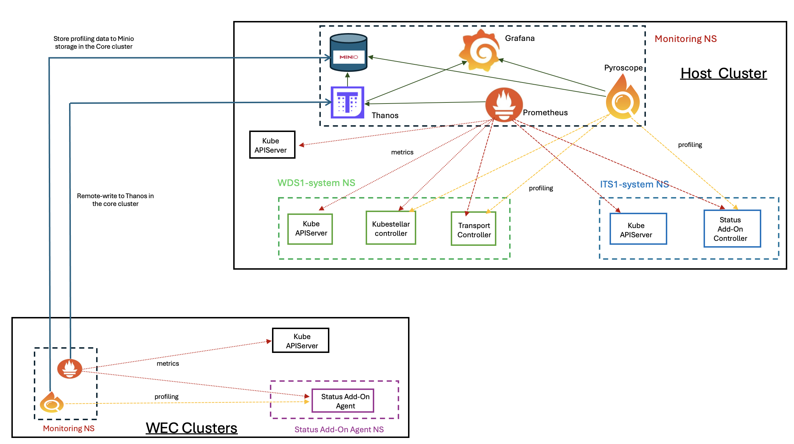

# Monitoring Tools for KubeStellar Control Plane




### Description
This example shows how to deploy monitoring tools (Prometheus, Grafana and Pyroscope) for KubeStellar control plane components - see architecture image above. These instructions can be used to deploy monitoring tools to any KubeStellar system. If you already have the monitoring tools installed in your environment, you can skip to `step-2`.

1. Install the monitoring tools:

    Starting from a local directory containing the git repo, do the following:

    ```bash
    $ cd monitoring
    $ ./install-ks-monitoring.sh
    ```

    Optionally, check the deployment of the monitoring tools:

    ```bash
    $ kubectl -n ks-monitoring get pods
    NAME                                                  READY   STATUS    RESTARTS   AGE
    grafana-7969f6cf5c-lp4g6                              1/1     Running   0          66s
    prometheus-kube-prometheus-operator-b56d747c9-wfs2w   1/1     Running   0          42s
    prometheus-prometheus-kube-prometheus-prometheus-0    2/2     Running   0          39s
    pyroscope-0                                           1/1     Running   0          90s
    pyroscope-alloy-0                                     2/2     Running   0          90s
    ```

2. Configure Prometheus and Pyroscope to scrape your KubeStellar spaces:

    a) WDS space:

    ```bash
    $ ./configure-metrics-wds.sh
    ```

    If you have more than one WDS, you can run the above script with the `--space-name` flag. For example: `./configure-metrics-wds.sh --space-name wds2`
    
    Optionally, check the prometheus service monitor objects for the WDS space:

    ```bash
    $ kubectl -n ks-monitoring get servicemonitor -l "app.kubernetes.io/part-of!=kube-prometheus-stack"
    NAME                           AGE
    wds1-apiserver                 64m
    wds1-ks-controller-manager     64m
    wds1-ks-transport-controller   64m
    ```

    b) ITS space:

    ```bash
    $ ./configure-metrics-its.sh
    ```

    If you have more than one ITS, you can run the above script with the `--space-name` flag. For example: `./configure-metrics-its.sh --space-name its2`
    
    Optionally, check the prometheus service monitor objects for the ITS space:

    ```bash
    $ kubectl -n ks-monitoring get servicemonitor -l "app.kubernetes.io/part-of!=kube-prometheus-stack"
    NAME                           AGE
    its1-apiserver                 64m
    its1-status-addon-controller   64m
    ```


3. Connect to Grafana UI: 

    a) Port-forward Grafana to localhost, by using the kubectl command:

    ```bash
    $ kubectl port-forward -n ks-monitoring svc/grafana 3000:80
    ```

    b) Check Prometheus and Pyroscope data source configuration: in a browser, go to the Grafana server at http://localhost:3000 and on the left-hand side, go to Home > Connections > Data sources.

    


4. Import KubeStellar Grafana dashboards into the Grafana UI:

    a) Click `Dashboards` in the primary menu

    b) Click `New` and select `Import` in the drop-down menu

    c) Upload the dashboard JSON files from your local `./grafana` sub-directory into the Grafana UI. You should be able to see the following dashboards:

    


5. View Grafana dashboard based on KubeStellar spaces and controller component names:

    a) API Server Monitoring: input into the following text boxes.
    - `NS`: name of the KubeStellar space namespace, e.g., *wds1-system*, *wds2-system*, *its1-system*, etc.
    - `APIService`: name of the service for the KS spaces APIserver, e.g., *wds1*, *wds2*, *vcluster*, etc.

         

    To monitor a WDS space (e.g., wds1) use the following parameters: `NS: wds1-system` and `APIService: wds1`. Likewise, to monitor a ITS space (e.g., its1): `NS: its1-system` and `APIService: vcluster`
    
    Note: you can also monitor the APIserver of the hosting cluster using the following values: `SpaceNS: default` and `APIService: apiserver`

    b) KubeStellar Controllers Monitoring: input into the following text box and drop-down menu. 

    - `SpaceNS`: name of the KubeStellar space namespace, e.g., *wds1-system*, *wds2-system*, etc.

    - `KSController`: select the KubeStellar controller name. Available options from the drop-down menu: *kubestellar-controller-manager-metrics-service*, *ks-transport-controller* and *status-addon-controller*. 

        

    To monitor a WDS space (e.g., wds1) use the following parameters: 
    - `SpaceNS: wds1-system` and `KSController: kubestellar-controller-manager-metrics-service`
    - `SpaceNS: wds1-system` and `KSController: ks-transport-controller`

    Likewise, to monitor a ITS space (e.g., its1): `SpaceNS: its1-system` and `KSController: status-addon-controller`
    
