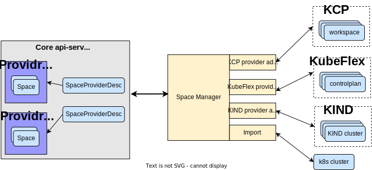
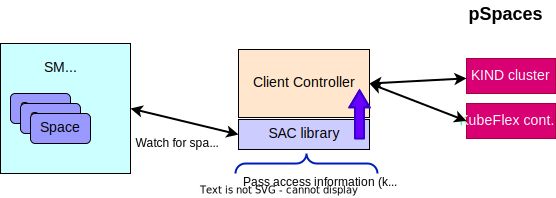
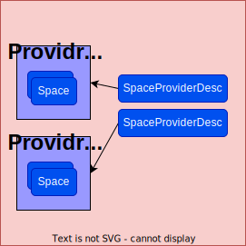

# Space Framework

## terminoloogy 
**Physical Space**, **pSpace** A thing that behaves like a Kubernetes kube-apiserver (including the persistent storage behind it) and the subset of controllers in the kube-controller-manager that are concerned with API machinery generalities (not management of containerized workloads). A kcp logical cluster is an example. A regular Kubernetes cluster is another example.

**Space Object**, **Space** - A kind of Kubernetes API object that _represents_ a pSpace.  Its "kind" is `Space`, we sometimes include the "object" part when writing specifically about the API objects to clearly distinguish them from what they represent.

**Space Provider** - A Thing that manages the life cycle of multiple pSpaces. This includes at minimal create/delete/List operations on pSpaces. KIND is an example for Space Provider (that manages KIND clusters), KCP is another example - KCP manages KCP's workspaces. 

## High level architecture  & Main componenets


The Space Framework (SF) is a generic management framework for space providers and pSpaces. The framework defines an abstraction layer for space providers and pSpace management that allows clients (both CLI/script based and client-go based clients) to use spaces while mantaining the clients decoupled from the specific pSpace and space provider that is being used. 

The The space framework uses two CRDs:
- **SpaceProviderDesc:** This CRD represnts a space provider it holds the information needed in order to interact with a specific Space  provider. 
- **Space:** This CRD represnts a space as defined above. It includes reference to secrets that allow clients to connect to the pSpace that it represents and also several attributes used by the SF that will be described later on. 

The space fromework supports several ways to add new spaces to the frameowrk, this is controlled by definiing differet space types: 

1. Managed Space: The pSpace is created through an explicit request to the management api server to create a new Space. For Managed spaces the space framework initiates a request to the Space provider to create the pSpace, the space frame work will then continously reconsile between the Space and the pSpace states. For managed spaces the desired state is controled through the Space object. For example, in order to delete the pSpace the client need to delete the corresponding Space object and the SF will interact with the space provider in order to delete the pSpace.
2. Imported spaces: A Space can be created by importing an existing pSpace. In this case the Space is not linked to any space provider and the client who imports that Space need to supply the access information that allows other clients to connect to the pSpace. For imported spaces the desired state is derived by the pSpace. This means that the SF is not responsible for the life cycle management of the pSpace but only update the corresponding Space object. For example, when deleteing the space object of an existing imported pSpace the space framework will recreate the space object. 
3. Unmanaged Space: The SF supports discovery of existing pSpaces on a space provider and adding them as "Unmanaged Spaces" into the framework. This mode is similar to the import mode in terms of the "source of truth" - the desired state is defined by the pSpace. However, as oppose to import, here the pSpaces are automatically discovered through the space provider regular interface and the pSpace access information is retrieved from teh space provider similary to how it is done in the managed space case. The SF supports pattern based filtering rules to limit the discovery of pSpaces. 

### Space Manager 
The Space Manager (SM) is a Kuberentes controller that is responsible for maintaing the state of the Space objects. The SM reconcile the Space and SpaceProviderDesc objects, and monitor the state of the pSpaces through the space provider.   
The SM uses a library of space provider adaptors to communicate with the space providers. Currently the SF includes 3 space provider adaptors KCP, KIND, and KubeFlex.

### Space provider adaptors
The space manager uses a set of space provider adaptors that interacts with the space provider. All space provider adaptors implement a simple "space client interface" that includes basic pSpace life cycle operatios. In addition the interface also defines the events that sent from the adaptors to the space manager.

### Space aware client (SAC)
The Space aware client (msclient) allows clients/controllers to easily get access to the underlying space by simply using the space name. There is no direct interaction between the msclient and the Space  provider, and therefore the msclient is transparent to the specific provider of the spaces. 

The only requirement is that the space can be accessed through regular Kube APIs when using the appropriate kubeconfig information. 

**Main features**  
- Constantly watch for changes in the available spaces. The SAC is using an informer on Space objecs using the SF Space client-go APIs.
    - Holds a cache of the pSpace access info for each Space 
- Exposes utility functions to get RestConfig by simpy specifying the space name  

Currently the SAC exposes a simple function that supply the config access info for a space. In the future we will add a SAC space aware ClientSets

## Architecture details 
When a new SpaceProviderDesc is created the SM creates a new namespace that will be used to host all the Space objects representing pSpaces on that space provider.  
The name of the generated namespace will be `paceprovider-<provider name>`



Note: In the future the spaces will be created in their own namespace and not in namespace per provider. 

The Space also holds a reference to the SpaceProviderDesc associated with this Space and some capabilities (e.g., the space type). The status of the space holds a secret reference to the secret holding the access information for that pSpace. As described before for managed spaces the SF retrive that information from teh space provider, create the needed secrets and update the Space object with the secret reference

**Discovery**  
As mentioned before, the Space manager also supports discovery of spaces created out of band (i.e., not through creating Space objects).

Each provider adaptor constantly watch for pSpace creation/deletion events and feeds the SM with those events. In case a pSpace that matches the discovery filtering is detected and there is no corrresponding Space object the SM creates a Space object representing this new detected pSpace and sets its mode to “unmanaged” .

**Cration & Deletion flow of managed Spaces**  
The SM sets the status of the Space according to the actual staus of the pSpace. When a space is created a creation command is sent to the space provider and the state of the the Sapce is set to `Initializing`. Only when the pSpace is becoming avaliable (each space provider validate this in its own way) the SM sets the Space state to `Ready`.   
The SM uses finalizers for the space deletion flow - the Space object is not removed until the corresponding pSpace is deleted by the space provider.

## Examples

**SpaceProviderDesc**
The folowing is SpaceProviderDesc for for a KubeFlex provider type. The secret refernced by `secretRef` should be created before the SpaceProviderDesc object is created.
```
apiVersion: space.kubestellar.io/v1alpha1
kind: SpaceProviderDesc
metadata:
  name: pkflex
spec:
  ProviderType: "kubeflex"
  SpacePrefixForDiscovery: "ks-"
  secretRef:
    namespace: default
    name: pkflex
```

**Space**
The folowing is a Space yaml is used to create a managed space on the previously defined KubeFlex provider. 
The use need to spcify the correct namespace for the space
```
apiVersion: space.kubestellar.io/v1alpha1
kind: Space
metadata:
  name: space5
  namespace: "spaceprovider-pkflex"
spec:
  SpaceProviderDescName: "pkflex"
  Type: "managed"
```