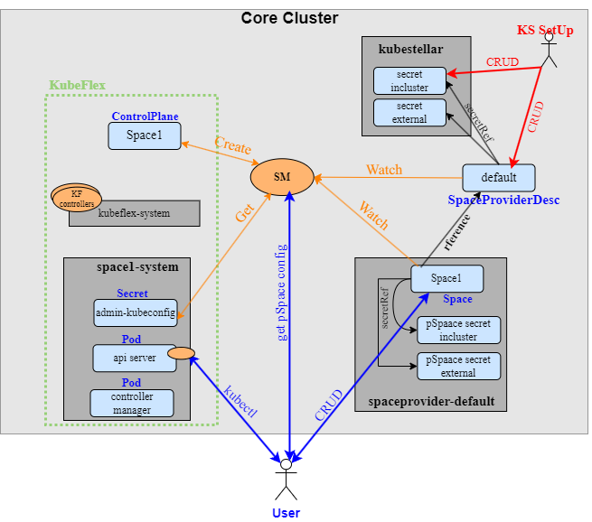

# Using KS with the SF and the KF space provider

### Acronyms
SF: Space Framework  
SM: Space Manager  
KS: KubeStellar (the Multi Cluster Management Module) 

### Solution topology
 In this guide we will describe a specific topology in which all components are hosted on a **single Kube cluster** (In general KubeStellar KubeFlex and the SM can be deployed on different clusters). We will refer to that cluster as the `core-cluster`.



## Deploying and using the SM
The SM deployment is performed as part of the overall KS deployment. The SpaceManager is running on the `core-cluster` as one of the containers in the KS Pod.
### Accessing the SM resources
  The SM uses the core-clster as the hosting cluster for all its resources (e.g., the SM CRDs, secrets, etc..). In order to Get or Update resources related to the SM we basically need to access the core-cluster. As in regular Kube cluster, There are two types of access:
   * **In-cluster:** Accessing the SM from within the core-cluster (e.g., from a container running on this cluster)  
   * **External:** Accessing the SM from outside the core-cluster. 

### Using the SM
The SM acts as an abstraction layer and pSpace inventory that allows clients to create, delete and access pSpaces. 

#### Setup a space provider 
The Space Provider is a backend that manage the underlying pSpaces.
Setting up a space provider is a one time step that is done during the deployment of KS and the SM.  It should be emphasized that only the SM interacts with the Space Provider backend. Users (or KS controllers and scripts) interact only with the SpaceManager and/or directly with the underlying pSpaces

Setting up a space provider includes two steps:
1. Install and setup the space provider backend. KS can use either KubeFlex or KCP as space provider backends:
   * The KubeFlex space provider is deployed into the `core-cluster` using the KubeFlex Helm
   * The KCP space provider backend is deployed in a container in the KS Pod.
2. Define the space provider in the SM:
   * Create the secrets that allows the SM to access the space provider. 
   * Create a SpaceProvidrDesc object that represents the space provider backend. The SpaceProviderDesc includes a Secret reference to the space provider secret mentioned above.   

**Example: fetch a space provider secret**  
The following creates a config file that can be used to access a space provider
```shell
KUBECONFIG=${SM_KUBECONFIG}
s_name=`kubectl get spaceproviderdesc <provider-name> -o jsonpath='{$.spec.secretRef.name}'`
s_ns=`kubectl get spaceproviderdesc <provider-name> -o jsonpath='{$.spec.secretRef.namespace}'`
kubectl get secret $s_name -n $s_ns -o jsonpath='{$.data.kubeconfig}' | base64 -d > provider.kubeconfig
```

#### Creating a space
Once a space provider is defined we can now create spaces. To create a space we simply need to create a Space object. When the space becomes ready the status of the space will include reference to secrets that are used to access the space.   
**Example:**  
Creating a Space named `space1`. Applying this on the core-cluster should include a pSpace on the KubeFlex space provider backend.
```shell
cat <<EOF | kubectl --kubeconfig sm-kubeconfig.config apply -f -
apiVersion: space.kubestellar.io/v1alpha1
kind: Space
metadata:
  name: space1
  namespace: "spaceprovider-pdkf"
spec:
  SpaceProviderDescName: "pdkf"
  Type: "managed"
EOF
```
KS also includes utility script that can be used to create Space  [kubectl-kubestellar-create-space](https://github.com/kubestellar/kubestellar/blob/main/scripts/overlap/kubectl-kubestellar-create-space)

Once the Space becomes ready the Status section is updated with the pSpace access info:

```shell
#TODO  Add a READY space output
```

#### Accessing a pSpace
In order to access a pSpace (get or create/update objects) the following procedure is used:
1. Fetch the pSpace access info from the Space object: The status section of the Space object includes a secret reference (secret name and namespace). That secret holds the access config to the pSpace.
2. Fetch and decode the actual secret into a KubeConfig file
3. The space can now be accessed with regular `kubectl` commands using that KubeConfig file  

**Example: List the namespaces on the pSpace `space1`**

```shell
KUBECONFIG=${SM_KUBECONFIG}

# 1. Fetch the secret name and name space
s_nameE=`kubectl get space space1 -n spaceprovider-pdkf -o jsonpath="{$.status.externalSecretRef.name}")`

s_ns=`kubectl get space space1 -n spaceprovider-pdkf -o jsonpath="{$.status.externalSecretRef.namespace}")`

# 2. Create a config file for `space1`
kubectl get secret ${s_name} -n ${s_ns} -o jsonpath='{$.data.kubeconfig}' | base64 -d | base64 -d > space1.config

# 3. Accessing space1
kubectl --kubeconfig space1.config get ns
```
The above example assumes we access the pSpace from outside the core-cluster. In case we want to access the pSpace fro within the core-cluster we need to replace the `externalSecretRef` with `inClusterSecretRef` in the commands above.

KS also includes utility script that can be used to create the the config file for a pSpace [kubectl-kubestellar-get-config-for-space](https://github.com/kubestellar/kubestellar/blob/main/scripts/overlap/kubectl-kubestellar-get-config-for-space)

