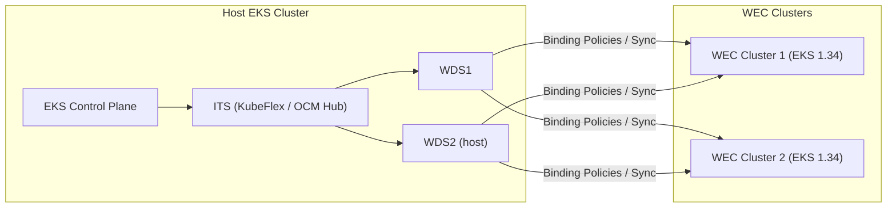

import { Callout } from 'nextra/components'

# KubeStellar on AWS EKS

<div className="rounded-xl border p-5 mb-6 bg-[linear-gradient(180deg,rgba(255,255,255,.8),rgba(255,255,255,.6))] dark:bg-[linear-gradient(180deg,rgba(15,23,42,.6),rgba(15,23,42,.4))] flex items-center gap-5">
  {/* AWS logo removed per request */}
  <div className="flex flex-col gap-1">
    <div className="text-2xl font-semibold">KubeStellar on AWS EKS</div>
    <div className="flex items-center gap-2 text-sm opacity-80">
      <span className="inline-flex items-center px-2.5 py-0.5 rounded-full bg-[#232F3E] text-white font-medium">AWS</span>
      <span> AWS EKS Installation</span>
      <span>(Kubernetes 1.34)</span>
    </div>
  </div>
  <div className="ml-auto" />
</div>

Last updated: 2025 • Author: [Rishi Mondal](https://github.com/MAVRICK-1)

## Overview

This guide installs KubeStellar on AWS EKS (Kubernetes 1.34) following the existing docs style. It covers a host EKS cluster running KubeStellar (ITS + WDS), and optional WECs (Workload Execution Clusters) registered to KubeStellar.

- Prefer a local/dev install? See Getting Started → Installation.

## Visual diagram



## Quick Steps

- [Step 0 — Prerequisites](#step-0-prerequisites)
- [Step 1 — Create Host EKS Cluster](#step-1-create-host-eks-cluster)
- [Step 2 — Install Ingress (NGINX)](#step-2-install-ingress-nginx)
- [Step 3 — Install KubeStellar Core](#step-3-install-kubestellar-core)
- [Step 4 — Create Workload Execution Clusters (WECs) (optional)](#step-4-create-workload-execution-clusters-wecs-optional)
- [Step 5 — Register WECs with KubeStellar](#step-5-register-wecs-with-kubestellar)
- [Step 6 — Deploy a Test App](#step-6-deploy-a-test-app-via-kubestellar)
- [Troubleshooting](#troubleshooting)
- [Cleanup](#cleanup)

## Step 0 — Prerequisites

<div className="grid gap-4" style={{ gridTemplateColumns: 'repeat(auto-fit, minmax(220px, 1fr))' }}>
  <div className="rounded-lg border p-4">
    <b>AWS</b>
    <ul>
      <li>EC2, EKS, IAM, VPC, CloudFormation</li>
      <li>Region: us-east-1</li>
      <li>IPv4 networking</li>
      <li>Egress internet access</li>
    </ul>
  </div>
  <div className="rounded-lg border p-4">
    <b>Local Tools</b>
    <ul>
      <li>kubectl, eksctl, AWS CLI v2, Helm</li>
      <li>kflex, clusteradm</li>
      <li>Linux or macOS</li>
    </ul>
  </div>
  <div className="rounded-lg border p-4">
    <b>Quotas</b>
    <ul>
      <li>vCPU: 12</li>
      <li>Elastic IPs: 4</li>
      <li>Target Groups: 5</li>
      <li>NLBs: 2</li>
    </ul>
  </div>
</div>

### AWS

- Permissions: EC2, EKS, IAM, VPC, CloudFormation
- Region: `us-east-1` recommended
- Networking: IPv4 (public or private subnets)
- Internet egress for images & Helm charts

Minimum quotas:
- vCPU: 12
- Elastic IPs: 4
- Target Groups: 5
- NLBs: 2

### Local machine

- Linux or macOS
- kubectl (latest)
- eksctl (≥ 0.197 for Kubernetes 1.34)
- AWS CLI v2
- Helm v3
- kflex (latest)
- clusteradm (OCM) (latest)

### Install tooling

```bash
# AWS CLI
curl -sSLO https://awscli.amazonaws.com/awscli-exe-linux-x86_64.zip
```

```bash
unzip -q awscli-exe-linux-x86_64.zip && sudo ./aws/install
```

```bash
# kubectl (latest)
curl -sSLO "https://dl.k8s.io/release/$(curl -s https://dl.k8s.io/release/stable.txt)/bin/linux/amd64/kubectl"
```

```bash
chmod +x kubectl && sudo mv kubectl /usr/local/bin/
```

```bash
# eksctl
curl -sSL "https://github.com/weaveworks/eksctl/releases/latest/download/eksctl_$(uname -s)_amd64.tar.gz" | tar xz -C /tmp
```

```bash
sudo mv /tmp/eksctl /usr/local/bin
```

```bash
# Helm
curl -fsSL https://raw.githubusercontent.com/helm/helm/main/scripts/get-helm-3 | bash
```

```bash
# KubeFlex CLI
curl -fsSL https://github.com/kubestellar/kubeflex/releases/download/v0.7.4/kflex_0.7.4_linux_amd64.tar.gz | tar xz
```

```bash
sudo mv kflex /usr/local/bin/
```

```bash
# clusteradm (OCM)
curl -fsSL https://raw.githubusercontent.com/open-cluster-management-io/clusteradm/main/install.sh | bash
```

### Configure AWS

```bash
aws configure
```

```bash
# Region: us-east-1, Output: json
aws sts get-caller-identity
```

## Step 1 — Create Host EKS Cluster (Kubernetes 1.34)

```bash
cat > kubestellar-host-cluster.yaml <<'EOF'
apiVersion: eksctl.io/v1alpha5
kind: ClusterConfig

metadata:
  name: kubestellar-host
  region: us-east-1
  version: "1.34"

kubernetesNetworkConfig:
  ipFamily: IPv4

iam:
  withOIDC: true

managedNodeGroups:
  - name: ng-1
    instanceType: t3.large
    desiredCapacity: 3
    minSize: 2
    maxSize: 4
    volumeSize: 50
    amiFamily: AmazonLinux2023
    privateNetworking: false

addons:
  - name: vpc-cni
    version: latest
  - name: kube-proxy
    version: latest
  - name: coredns
    version: latest
EOF

```

```bash
eksctl create cluster -f kubestellar-host-cluster.yaml
```

```bash
aws eks update-kubeconfig --name kubestellar-host --region us-east-1
```

```bash
kubectl get nodes
```

## Step 2 — Install Ingress (NGINX)

```bash
helm repo add ingress-nginx https://kubernetes.github.io/ingress-nginx
```

```bash
helm repo update
```

```bash
helm install ingress-nginx ingress-nginx/ingress-nginx \
  --namespace ingress-nginx \
  --create-namespace \
  --version 4.12.1 \
  --set controller.extraArgs.enable-ssl-passthrough="" \
  --set controller.service.type=LoadBalancer \
  --set controller.service.annotations."service\.beta\.kubernetes\.io/aws-load-balancer-type"="nlb" \
  --set controller.service.annotations."service\.beta\.kubernetes\.io/aws-load-balancer-nlb-target-type"="instance" \
  --set controller.service.annotations."service\.beta\.kubernetes\.io/aws-load-balancer-scheme"="internet-facing"
```

```bash
kubectl get svc -n ingress-nginx ingress-nginx-controller
```

## Step 3 — Install KubeStellar Core

```bash
export KUBESTELLAR_VERSION=0.27.2
```

```bash
helm upgrade --install ks-core \
  oci://ghcr.io/kubestellar/kubestellar/core-chart \
  --version $KUBESTELLAR_VERSION \
  --set-json='ITSes=[{"name":"its1"}]' \
  --set-json='WDSes=[{"name":"wds1"},{"name":"wds2","type":"host"}]' \
  --timeout 24h
```

## Step 4 — Create Workload Execution Clusters (WECs) (optional)

<Callout type="info">
If you already have clusters to use as WECs, skip this step and go directly to <a href="#step-5-register-wecs-with-kubestellar">Step 5 — Register WECs with KubeStellar</a>.
</Callout>

### Create WEC 1 — cluster1

```bash
cat > cluster1.yaml <<'EOF'
apiVersion: eksctl.io/v1alpha5
kind: ClusterConfig

metadata:
  name: cluster1
  region: us-east-1
  version: "1.34"

managedNodeGroups:
  - name: ng-1
    instanceType: t3.medium
    desiredCapacity: 2
EOF

```

```bash
eksctl create cluster -f cluster1.yaml
```

### Create WEC 2 — cluster2

```bash
cat > cluster2.yaml <<'EOF'
apiVersion: eksctl.io/v1alpha5
kind: ClusterConfig

metadata:
  name: cluster2
  region: us-east-1
  version: "1.34"

managedNodeGroups:
  - name: ng-1
    instanceType: t3.medium
    desiredCapacity: 2
EOF

```

```bash
eksctl create cluster -f cluster2.yaml
```

## Step 5 — Register WECs with KubeStellar

<Callout type="tip">If you skipped Step 4, register your existing clusters here.</Callout>

### Get join token from ITS

```bash
joincmd=$(clusteradm --context its1 get token | awk '/clusteradm join/ {print}')
```

### Register cluster1

```bash
${joincmd/<cluster_name>/cluster1} \
  --context cluster1 \
  --singleton \
  --force-internal-endpoint-lookup \
  --wait-timeout 240s
```

### Register cluster2

```bash
${joincmd/<cluster_name>/cluster2} \
  --context cluster2 \
  --singleton \
  --force-internal-endpoint-lookup \
  --wait-timeout 240s
```

### Accept and label

```bash
clusteradm --context its1 accept --clusters cluster1
```

```bash
clusteradm --context its1 accept --clusters cluster2
```

```bash
kubectl --context its1 label managedcluster cluster1 location-group=edge --overwrite
```

```bash
kubectl --context its1 label managedcluster cluster2 location-group=edge --overwrite
```

## Step 6 — Deploy a Test App via KubeStellar

### Create namespace and deployment

```bash
kubectl apply -f - <<'EOF'
apiVersion: v1
kind: Namespace
metadata:
  name: test-app
EOF

kubectl apply -f - <<'EOF'
apiVersion: apps/v1
kind: Deployment
metadata:
  name: nginx-test
  namespace: test-app
spec:
  replicas: 2
  selector:
    matchLabels:
      app: nginx
  template:
    metadata:
      labels:
        app: nginx
    spec:
      containers:
      - name: nginx
        image: nginx:latest
EOF
```

### Create BindingPolicy to target WECs

```bash
kubectl apply -f - <<'EOF'
apiVersion: control.kubestellar.io/v1alpha1
kind: BindingPolicy
metadata:
  name: nginx-test-policy
  namespace: test-app
spec:
  clusterSelectors:
  - matchLabels:
      location-group: edge
  downsync:
  - objectSelectors:
    - matchLabels:
        app: nginx
EOF
```

### Verify

```bash
kubectl --context cluster1 get deploy -n test-app
```

```bash
kubectl --context cluster2 get deploy -n test-app
```


## Troubleshooting

```bash
# Registration
kubectl --context its1 get managedclusters
```

```bash
# Agent issues
kubectl --context cluster1 -n open-cluster-management-agent get pods
```

```bash
kubectl --context cluster1 get csr
```

```bash
# KubeStellar components
kubectl get controlplanes -A
```

```bash
kubectl logs -n kubeflex-system -l app=kubeflex-controller-manager
```

## Cleanup

```bash
eksctl delete cluster --name cluster1 --region us-east-1
```

```bash
eksctl delete cluster --name cluster2 --region us-east-1
```

```bash
eksctl delete cluster --name kubestellar-host --region us-east-1
```
