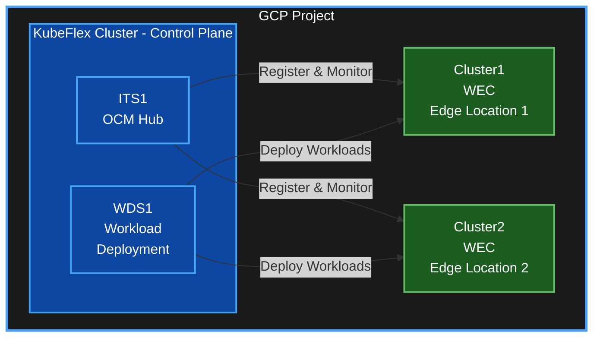

import { Callout } from 'nextra/components'

# KubeStellar GCP Deployment Guide

<div className="rounded-xl border p-5 mb-6 bg-[linear-gradient(180deg,rgba(255,255,255,.8),rgba(255,255,255,.6))] dark:bg-[linear-gradient(180deg,rgba(15,23,42,.6),rgba(15,23,42,.4))] flex items-center gap-5">
  <div className="flex flex-col gap-1">
    <div className="text-2xl font-semibold">KubeStellar GCP Deployment Guide</div>
    <div className="flex items-center gap-2 text-sm opacity-80">
      <span className="inline-flex items-center px-2.5 py-0.5 rounded-full bg-[#232F3E] text-white font-medium">GCP</span>
      <span>GCP Deployment</span>
      <span>(Kubernetes 1.34)</span>
    </div>
  </div>
  <div className="ml-auto" />
</div>

Last updated: 2025 • Author: [Ghanshyam Singh](https://github.com/ghanshyam2005singh)

A comprehensive step-by-step guide to deploy KubeStellar on Google Cloud Platform (GCP) using GKE clusters.

## Table of Contents

1. [Prerequisites](#prerequisites)
2. [Architecture Overview](#architecture-overview)
3. [Step 1: GCP Setup](#step-1-gcp-setup)
4. [Step 2: Install Required Tools](#step-2-install-required-tools)
5. [Step 3: Create GKE Clusters](#step-3-create-gke-clusters)
6. [Step 4: Configure kubectl Contexts](#step-4-configure-kubectl-contexts)
7. [Step 5: Install KubeStellar Core](#step-5-install-kubestellar-core)
8. [Step 6: Register WEC Clusters](#step-6-register-wec-clusters)
9. [Step 7: Verify Installation](#step-7-verify-installation)
10. [Step 8: Test Multi-Cluster Deployment](#step-8-test-multi-cluster-deployment)
11. [Cleanup](#cleanup)
12. [Troubleshooting](#troubleshooting)

---

## Prerequisites

### Required Accounts & Access
- Google Cloud Platform account with billing enabled
- Project with sufficient quotas for GKE clusters
- IAM permissions:
  - `container.admin` (GKE cluster management)
  - `compute.admin` (networking and compute)
  - `iam.serviceAccountUser` (service account access)

### Local Machine Requirements
- Linux/MacOS terminal (Windows WSL2 supported)
- Minimum 8GB RAM, 20GB free disk space
- Stable internet connection

### Software Prerequisites
- `gcloud` CLI (version 400.0.0+)
- `kubectl` (version 1.27+)
- `helm` (version 3.12+)
- `kflex` CLI
- `clusteradm` CLI
- `git`
- `curl`
- `jq`

---

## Architecture Overview

### Cluster Layout



### Components
- **KubeFlex Cluster**: Hosts the KubeStellar control plane
  - **ITS (Inventory & Transport Space)**: OCM hub for cluster management
  - **WDS (Workload Deployment Space)**: Manages workload distribution
- **WEC (Workload Execution Clusters)**: Edge clusters where workloads run

---

## Step 1: GCP Setup

### 1.1 Set Your GCP Project

```bash
# Set your project ID
export GCP_PROJECT_ID="your-project-id"

# Authenticate with GCP
gcloud auth login

# Set the project
gcloud config set project ${GCP_PROJECT_ID}

# Verify
gcloud config get-value project
```

### 1.2 Enable Required APIs

```bash
# Enable necessary GCP APIs
gcloud services enable \
  container.googleapis.com \
  compute.googleapis.com \
  storage-api.googleapis.com \
  cloudresourcemanager.googleapis.com
```

### 1.3 Set Environment Variables

```bash
# GCP Configuration
export GCP_REGION="us-central1"
export GCP_ZONE="us-central1-a"

# Cluster Configuration
export CLUSTER_PREFIX="ks"
export KUBESTELLAR_VERSION="0.27.2"

# Cluster Names
export KUBEFLEX_CLUSTER="${CLUSTER_PREFIX}-kubeflex"
export WEC1_CLUSTER="${CLUSTER_PREFIX}-cluster1"
export WEC2_CLUSTER="${CLUSTER_PREFIX}-cluster2"

# Save to file for later use
cat > ~/kubestellar-gcp-env.sh << 'EOF'
export GCP_PROJECT_ID="your-project-id"
export GCP_REGION="us-central1"
export GCP_ZONE="us-central1-a"
export CLUSTER_PREFIX="ks"
export KUBESTELLAR_VERSION="0.27.2"
export KUBEFLEX_CLUSTER="${CLUSTER_PREFIX}-kubeflex"
export WEC1_CLUSTER="${CLUSTER_PREFIX}-cluster1"
export WEC2_CLUSTER="${CLUSTER_PREFIX}-cluster2"
EOF

# Source it
source ~/kubestellar-gcp-env.sh
```

---

## Step 2: Install Required Tools

### 2.1 Install gcloud CLI

```bash
# For Linux
curl https://sdk.cloud.google.com | bash
exec -l $SHELL

# For macOS
brew install --cask google-cloud-sdk

# Verify installation
gcloud version
```

### 2.2 Install kubectl

```bash
# Install kubectl via gcloud
gcloud components install kubectl

# Or install directly
# For Linux
curl -LO "https://dl.k8s.io/release/$(curl -L -s https://dl.k8s.io/release/stable.txt)/bin/linux/amd64/kubectl"
chmod +x kubectl
sudo mv kubectl /usr/local/bin/

# For macOS
brew install kubectl

# Verify
kubectl version --client
```

### 2.3 Install Helm

```bash
# For Linux
curl https://raw.githubusercontent.com/helm/helm/main/scripts/get-helm-3 | bash

# For macOS
brew install helm

# Verify
helm version
```

### 2.4 Install kflex CLI

```bash
# Download and install kflex
KFLEX_VERSION=0.7.2
curl -L https://github.com/kubestellar/kubeflex/releases/download/v${KFLEX_VERSION}/kflex_${KFLEX_VERSION}_linux_amd64.tar.gz | tar -xz
chmod +x kflex
sudo mv kflex /usr/local/bin/

# Verify
kflex version
```

### 2.5 Install clusteradm CLI

```bash
# Install clusteradm
curl -L https://raw.githubusercontent.com/open-cluster-management-io/clusteradm/main/install.sh | bash

# Verify
clusteradm version
```

### 2.6 Verify All Tools

```bash
# Run verification script
cat > ~/verify-tools.sh << 'EOF'
#!/bin/bash
echo "Verifying required tools..."
tools=("gcloud" "kubectl" "helm" "kflex" "clusteradm" "git" "curl" "jq")
for tool in "${tools[@]}"; do
    if command -v $tool &> /dev/null; then
        echo "✓ $tool is installed"
    else
        echo "✗ $tool is NOT installed"
    fi
done
EOF

chmod +x ~/verify-tools.sh
~/verify-tools.sh
```

---

## Step 3: Create GKE Clusters

### 3.1 Create KubeFlex Cluster (Control Plane)

```bash
# Create the KubeFlex cluster
gcloud container clusters create ${KUBEFLEX_CLUSTER} \
  --zone=${GCP_ZONE} \
  --machine-type=e2-standard-4 \
  --num-nodes=3 \
  --enable-autoscaling \
  --min-nodes=2 \
  --max-nodes=5 \
  --disk-size=50 \
  --enable-stackdriver-kubernetes \
  --enable-ip-alias \
  --network=default \
  --subnetwork=default \
  --enable-cloud-logging \
  --enable-cloud-monitoring \
  --release-channel=regular \
  --addons=HttpLoadBalancing,HorizontalPodAutoscaling

echo "✓ KubeFlex cluster created successfully"
```

### 3.2 Create WEC Cluster 1

```bash
# Create first workload execution cluster
gcloud container clusters create ${WEC1_CLUSTER} \
  --zone=${GCP_ZONE} \
  --machine-type=e2-standard-2 \
  --num-nodes=2 \
  --enable-autoscaling \
  --min-nodes=1 \
  --max-nodes=4 \
  --disk-size=50 \
  --enable-stackdriver-kubernetes \
  --enable-ip-alias \
  --network=default \
  --subnetwork=default \
  --enable-cloud-logging \
  --enable-cloud-monitoring \
  --release-channel=regular \
  --addons=HttpLoadBalancing,HorizontalPodAutoscaling

echo "✓ WEC Cluster 1 created successfully"
```

### 3.3 Create WEC Cluster 2

```bash
# Create second workload execution cluster
gcloud container clusters create ${WEC2_CLUSTER} \
  --zone=${GCP_ZONE} \
  --machine-type=e2-standard-2 \
  --num-nodes=2 \
  --enable-autoscaling \
  --min-nodes=1 \
  --max-nodes=4 \
  --disk-size=50 \
  --enable-stackdriver-kubernetes \
  --enable-ip-alias \
  --network=default \
  --subnetwork=default \
  --enable-cloud-logging \
  --enable-cloud-monitoring \
  --release-channel=regular \
  --addons=HttpLoadBalancing,HorizontalPodAutoscaling

echo "✓ WEC Cluster 2 created successfully"
```

### 3.4 Verify Cluster Creation

```bash
# List all clusters
gcloud container clusters list

# Should show 3 clusters in RUNNING status:
# - ks-kubeflex
# - ks-cluster1
# - ks-cluster2
```

---

## Step 4: Configure kubectl Contexts

### 4.1 Get Cluster Credentials

```bash
# Get credentials for KubeFlex cluster
gcloud container clusters get-credentials ${KUBEFLEX_CLUSTER} \
  --zone=${GCP_ZONE} \
  --project=${GCP_PROJECT_ID}

# Get credentials for WEC1
gcloud container clusters get-credentials ${WEC1_CLUSTER} \
  --zone=${GCP_ZONE} \
  --project=${GCP_PROJECT_ID}

# Get credentials for WEC2
gcloud container clusters get-credentials ${WEC2_CLUSTER} \
  --zone=${GCP_ZONE} \
  --project=${GCP_PROJECT_ID}
```

### 4.2 Rename Contexts for Simplicity

```bash
# Rename contexts to simpler names
kubectl config rename-context "gke_${GCP_PROJECT_ID}_${GCP_ZONE}_${KUBEFLEX_CLUSTER}" kubeflex
kubectl config rename-context "gke_${GCP_PROJECT_ID}_${GCP_ZONE}_${WEC1_CLUSTER}" cluster1
kubectl config rename-context "gke_${GCP_PROJECT_ID}_${GCP_ZONE}_${WEC2_CLUSTER}" cluster2

# Verify contexts
kubectl config get-contexts
```

### 4.3 Set Current Context

```bash
# Switch to KubeFlex cluster
kubectl config use-context kubeflex

# Verify you can access the cluster
kubectl get nodes
```

---

## Step 5: Install KubeStellar Core

### 5.1 Install NGINX Ingress Controller

```bash
# Install NGINX Ingress for GKE
kubectl apply -f https://raw.githubusercontent.com/kubernetes/ingress-nginx/controller-v1.8.2/deploy/static/provider/cloud/deploy.yaml

# Wait for the ingress controller to be ready
kubectl wait --namespace ingress-nginx \
  --for=condition=ready pod \
  --selector=app.kubernetes.io/component=controller \
  --timeout=300s

echo "✓ NGINX Ingress Controller installed"
```

### 5.2 Install KubeStellar Core via Helm

```bash
# Add KubeStellar Helm repository
helm repo add kubestellar https://kubestellar.github.io/kubestellar
helm repo update

# Install KubeStellar Core with ITS and WDS
helm upgrade --install ks-core oci://ghcr.io/kubestellar/kubestellar/core-chart \
  --version ${KUBESTELLAR_VERSION} \
  --set-json='ITSes=[{"name":"its1"}]' \
  --set-json='WDSes=[{"name":"wds1"}]' \
  --set-json='verbosity.default=5' \
  --set-json='kubeflex-operator.verbosity=5' \
  --timeout=24h \
  --create-namespace

echo "✓ KubeStellar Core installed"
```

### 5.3 Wait for Core Components

```bash
# Wait for kubeflex operator to be ready
kubectl wait --for=condition=available deployment/kubeflex-controller-manager \
  -n kubeflex-system --timeout=300s

# Wait for PostgreSQL to be ready
kubectl wait --for=condition=ready pod \
  -l app.kubernetes.io/name=postgresql \
  -n kubeflex-system --timeout=300s

echo "✓ Core components are ready"
```

### 5.4 Configure kflex Contexts

```bash
# Initialize kflex for the hosting cluster
kflex ctx --set-current-for-hosting

# Create and set contexts for control planes
kflex ctx --overwrite-existing-context its1
kflex ctx --overwrite-existing-context wds1

# Verify contexts
kubectl config get-contexts | grep -E 'its1|wds1'
```

### 5.5 Wait for OCM Hub

```bash
# Wait for ITS control plane to be ready
kubectl --context kubeflex wait controlplane.tenancy.kflex.kubestellar.org/its1 \
  --for='jsonpath={.status.postCreateHooks.its-with-clusteradm}=true' \
  --timeout=24h

# Wait for clusteradm job
kubectl --context kubeflex wait -n its1-system job.batch/its-with-clusteradm \
  --for=condition=Complete --timeout=24h

# Wait for cluster-info update
kubectl --context kubeflex wait -n its1-system job.batch/update-cluster-info \
  --for=condition=Complete --timeout=24h

echo "✓ OCM Hub is ready"
```

---

## Step 6: Register WEC Clusters

### 6.1 Get Join Token

```bash
# Get the join command from OCM hub
joincmd=$(clusteradm --context its1 get token | grep '^clusteradm join')

if [ -z "$joincmd" ]; then
    echo "✗ Failed to get join token"
    exit 1
fi

echo "✓ Join token retrieved"
echo "Join command: $joincmd"
```

### 6.2 Join Cluster1

```bash
# Join cluster1 to the OCM hub
eval "${joincmd/<cluster_name>/cluster1} --context cluster1 --singleton"

echo "✓ Cluster1 join request sent"
```

### 6.3 Join Cluster2

```bash
# Join cluster2 to the OCM hub
eval "${joincmd/<cluster_name>/cluster2} --context cluster2 --singleton"

echo "✓ Cluster2 join request sent"
```

### 6.4 Approve CSRs

```bash
# Function to wait for and approve CSR
approve_cluster() {
    local cluster_name=$1
    echo "Waiting for CSR from ${cluster_name}..."
    
    for i in {1..30}; do
        if kubectl --context its1 get csr | grep -q ${cluster_name}; then
            echo "✓ CSR found for ${cluster_name}, approving..."
            clusteradm --context its1 accept --clusters ${cluster_name}
            return 0
        fi
        echo "Waiting... (attempt $i/30)"
        sleep 10
    done
    
    echo "✗ Timeout waiting for CSR from ${cluster_name}"
    return 1
}

# Approve both clusters
approve_cluster cluster1
approve_cluster cluster2
```

### 6.5 Label Clusters

```bash
# Wait for clusters to appear in inventory
sleep 30

# Label cluster1
kubectl --context its1 label managedcluster cluster1 \
  location-group=edge \
  name=cluster1 \
  environment=production \
  region=${GCP_REGION}

# Label cluster2
kubectl --context its1 label managedcluster cluster2 \
  location-group=edge \
  name=cluster2 \
  environment=production \
  region=${GCP_REGION}

echo "✓ Clusters labeled successfully"
```

---

## Step 7: Verify Installation

### 7.1 Check Cluster Status

```bash
# View managed clusters
kubectl --context its1 get managedclusters

# Expected output:
# NAME       HUB ACCEPTED   MANAGED CLUSTER URLS   JOINED   AVAILABLE   AGE
# cluster1   true                                  True     True        2m
# cluster2   true                                  True     True        2m
```

### 7.2 Check KubeStellar Components

```bash
# Check kubeflex-system namespace
kubectl --context kubeflex get all -n kubeflex-system

# Check control planes
kubectl --context kubeflex get controlplanes

# Check ITS components
kubectl --context its1 get all -n open-cluster-management

# Check WDS components
kubectl --context wds1 get all
```

### 7.3 Verify Network Connectivity

```bash
# Test connectivity from WECs to ITS
for cluster in cluster1 cluster2; do
    echo "Testing connectivity from ${cluster}..."
    kubectl --context ${cluster} run test-pod --image=busybox --rm -it --restart=Never -- \
      wget -O- -q --timeout=5 https://kubernetes.default.svc
done
```

### 7.4 Create Verification Report

```bash
# Generate verification report
cat > ~/kubestellar-verification.txt << EOF
=== KubeStellar GCP Deployment Verification ===
Date: $(date)
Project: ${GCP_PROJECT_ID}
Region: ${GCP_REGION}

=== Clusters ===
$(gcloud container clusters list)

=== Managed Clusters ===
$(kubectl --context its1 get managedclusters)

=== Control Planes ===
$(kubectl --context kubeflex get controlplanes)

=== kubectl Contexts ===
$(kubectl config get-contexts)

EOF

cat ~/kubestellar-verification.txt
echo "✓ Verification report saved to ~/kubestellar-verification.txt"
```

---

## Step 8: Test Multi-Cluster Deployment

### 8.1 Create Test Namespace

```bash
# Create namespace in WDS
kubectl --context wds1 create namespace test-app

echo "✓ Test namespace created"
```

### 8.2 Create Sample Application

```bash
# Create a simple nginx deployment
cat <<EOF | kubectl --context wds1 apply -f -
apiVersion: apps/v1
kind: Deployment
metadata:
  name: nginx-test
  namespace: test-app
spec:
  replicas: 2
  selector:
    matchLabels:
      app: nginx
  template:
    metadata:
      labels:
        app: nginx
    spec:
      containers:
      - name: nginx
        image: nginx:1.25
        ports:
        - containerPort: 80
---
apiVersion: v1
kind: Service
metadata:
  name: nginx-service
  namespace: test-app
spec:
  selector:
    app: nginx
  ports:
  - port: 80
    targetPort: 80
  type: ClusterIP
EOF

echo "✓ Sample application created"
```

### 8.3 Create Binding Policy

```bash
# Create binding to deploy to both edge clusters
cat <<EOF | kubectl --context wds1 apply -f -
apiVersion: control.kubestellar.io/v1alpha1
kind: BindingPolicy
metadata:
  name: nginx-binding
  namespace: test-app
spec:
  clusterSelectors:
  - matchLabels:
      location-group: edge
  downsync:
  - objectSelectors:
    - matchLabels:
        app: nginx
EOF

echo "✓ Binding policy created"
```

### 8.4 Verify Deployment

```bash
# Wait a moment for propagation
sleep 30

# Check deployment on cluster1
echo "=== Cluster 1 ==="
kubectl --context cluster1 get deployment -n test-app
kubectl --context cluster1 get pods -n test-app

# Check deployment on cluster2
echo "=== Cluster 2 ==="
kubectl --context cluster2 get deployment -n test-app
kubectl --context cluster2 get pods -n test-app

echo "✓ Multi-cluster deployment verified"
```

### 8.5 Test Application

```bash
# Test nginx on cluster1
kubectl --context cluster1 run test-curl --image=curlimages/curl --rm -it --restart=Never -- \
  curl -s http://nginx-service.test-app.svc.cluster.local

# Test nginx on cluster2
kubectl --context cluster2 run test-curl --image=curlimages/curl --rm -it --restart=Never -- \
  curl -s http://nginx-service.test-app.svc.cluster.local
```

---

## Cleanup

### Complete Cleanup Script

```bash
cat > ~/cleanup-kubestellar-gcp.sh << 'EOF'
#!/bin/bash

# Load environment variables
source ~/kubestellar-gcp-env.sh

echo "Starting cleanup of KubeStellar GCP deployment..."

# Delete GKE clusters
echo "Deleting GKE clusters..."
gcloud container clusters delete ${KUBEFLEX_CLUSTER} --zone=${GCP_ZONE} --quiet &
gcloud container clusters delete ${WEC1_CLUSTER} --zone=${GCP_ZONE} --quiet &
gcloud container clusters delete ${WEC2_CLUSTER} --zone=${GCP_ZONE} --quiet &

# Wait for all deletions to complete
wait

# Clean up kubectl contexts
echo "Cleaning up kubectl contexts..."
kubectl config delete-context kubeflex 2>/dev/null || true
kubectl config delete-context its1 2>/dev/null || true
kubectl config delete-context wds1 2>/dev/null || true
kubectl config delete-context cluster1 2>/dev/null || true
kubectl config delete-context cluster2 2>/dev/null || true

echo "✓ Cleanup completed successfully"
echo "Note: This script does not delete the GCP project or disable APIs"
EOF

chmod +x ~/cleanup-kubestellar-gcp.sh
```

### Run Cleanup

```bash
# Execute cleanup
~/cleanup-kubestellar-gcp.sh
```

### Partial Cleanup (Keep Clusters)

```bash
# Only remove test application
kubectl --context wds1 delete namespace test-app

# Unregister clusters from OCM (keep clusters running)
kubectl --context its1 delete managedcluster cluster1
kubectl --context its1 delete managedcluster cluster2
```

---

## Troubleshooting

### Common Issues and Solutions

#### Issue 1: Cluster Creation Fails

**Symptom**: GKE cluster creation times out or fails

**Solutions**:
```bash
# Check quotas
gcloud compute project-info describe --project=${GCP_PROJECT_ID}

# Check service APIs
gcloud services list --enabled

# Verify zone availability
gcloud compute zones list --filter="name:${GCP_ZONE}"

# Try different machine type
# Use: gcloud compute machine-types list --zones=${GCP_ZONE}
```

#### Issue 2: CSR Not Appearing

**Symptom**: Cluster CSRs don't appear in OCM hub

**Solutions**:
```bash
# Check cluster connectivity
kubectl --context cluster1 get pods -n open-cluster-management-agent

# View agent logs
kubectl --context cluster1 logs -n open-cluster-management-agent \
  -l app=klusterlet-registration-agent

# Verify ITS is ready
kubectl --context its1 get pods -n open-cluster-management

# Re-run join command
clusteradm --context its1 get token
```

#### Issue 3: Workloads Not Propagating

**Symptom**: Applications don't deploy to WEC clusters

**Solutions**:
```bash
# Check binding policy
kubectl --context wds1 get bindingpolicy -A

# Check cluster labels
kubectl --context its1 get managedclusters --show-labels

# View manifestwork
kubectl --context its1 get manifestwork -A

# Check WDS logs
kubectl --context kubeflex logs -n wds1-system -l control-plane=controller-manager
```

#### Issue 4: NGINX Ingress Not Ready

**Symptom**: Ingress controller pods not starting

**Solutions**:
```bash
# Check ingress pods
kubectl --context kubeflex get pods -n ingress-nginx

# View logs
kubectl --context kubeflex logs -n ingress-nginx -l app.kubernetes.io/component=controller

# Delete and reinstall
kubectl --context kubeflex delete namespace ingress-nginx
# Then reinstall from Step 5.1
```

#### Issue 5: High GCP Costs

**Symptom**: Unexpected GCP billing charges

**Solutions**:
```bash
# Reduce cluster sizes
gcloud container clusters resize ${KUBEFLEX_CLUSTER} --num-nodes=1 --zone=${GCP_ZONE}
gcloud container clusters resize ${WEC1_CLUSTER} --num-nodes=1 --zone=${GCP_ZONE}
gcloud container clusters resize ${WEC2_CLUSTER} --num-nodes=1 --zone=${GCP_ZONE}

# Use preemptible nodes (for testing only)
gcloud container clusters create test-cluster \
  --preemptible \
  --num-nodes=2 \
  --machine-type=e2-small

# Stop clusters when not in use
# Note: GKE doesn't support stop/start, use delete/recreate
```

### Debug Commands

```bash
# View all resources in all namespaces
kubectl --context kubeflex get all --all-namespaces

# Check kubeflex control planes status
kubectl --context kubeflex get controlplanes -o yaml

# View OCM cluster status
kubectl --context its1 get managedclusters -o yaml

# Check network policies
kubectl --context kubeflex get networkpolicies --all-namespaces

# View events
kubectl --context kubeflex get events --all-namespaces --sort-by='.lastTimestamp'
```

### Getting Help

```bash
# KubeStellar documentation
# https://docs.kubestellar.io

# GitHub issues
# https://github.com/kubestellar/kubestellar/issues

# Slack community
# https://kubernetes.slack.com/archives/C058SUSL5AA

# View KubeStellar logs
kubectl --context kubeflex logs -n kubeflex-system -l app.kubernetes.io/name=kubeflex
```

---

## Additional Resources

### Environment Variables Reference

```bash
# Save this for quick setup
cat > ~/kubestellar-vars.sh << 'EOF'
# KubeStellar environment variables
export host_context=kubeflex
export its_cp=its1
export its_context=its1
export wds_cp=wds1
export wds_context=wds1
export wec1_name=cluster1
export wec2_name=cluster2
export wec1_context=cluster1
export wec2_context=cluster2
export label_query_both=location-group=edge
export label_query_one=name=cluster1
EOF

source ~/kubestellar-vars.sh
```


---

## Next Steps

After successful deployment:

1. **Explore KubeStellar Features**
   - Multi-cluster scheduling
   - Status collection and aggregation
   - Custom placement policies

2. **Deploy Real Applications**
   - Microservices architectures
   - Edge computing workloads
   - Multi-region deployments

3. **Set Up Monitoring**
   - Install Prometheus/Grafana
   - Configure alerts
   - Set up log aggregation

4. **Security Hardening**
   - Enable RBAC policies
   - Configure network policies
   - Set up mutual TLS

5. **Automation**
   - Create Terraform modules
   - Set up CI/CD pipelines
   - Automate cluster provisioning

---

## Congratulations!

You've successfully deployed KubeStellar on GCP! Your multi-cluster management platform is ready for:

✓ Multi-cluster workload deployment
✓ Edge computing scenarios
✓ Hybrid cloud architectures
✓ Geographic distribution of applications

For questions or issues, reach out to the KubeStellar community on Slack or GitHub.

Happy multi-cluster orchestration! 🚀