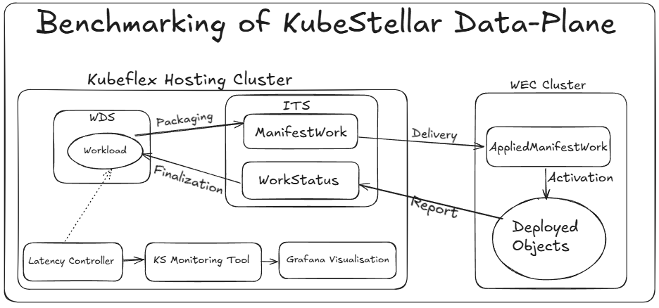
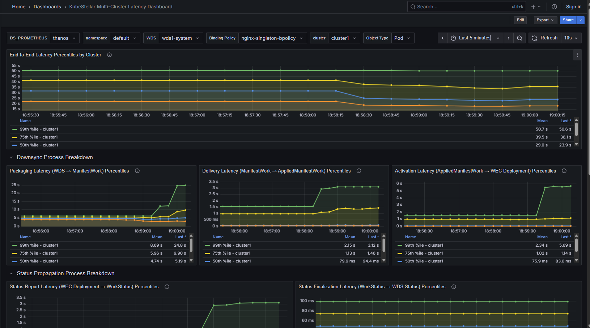

# Framework to Benchmark KubeStellar Data-Plane Latencies

<p align="center">
  
</p>

## Prerequisites

Before deploying the Latency Controller, ensure you have:

1. **KubeStellar Environment**: You must have an environment with KubeStellar installed; see [KubeStellar getting started](https://docs.kubestellar.io/release-0.23.1/direct/get-started/). Alternatively, you can also use KubeStellar e2e script [run-test.sh](https://github.com/kubestellar/kubestellar/blob/main/test/e2e/run-test.sh) to setup an environment.

2. **KubeStellar Monitoring Setup**: setup the KubeStellar monitoring stack using the instructions [Here](https://github.com/kubestellar/kubestellar/tree/main/monitoring#readme)

## Overview

This framework provides a comprehensive monitoring solution designed to measure all data plane latencies across multi-cluster workload deployments in KubeStellar environments. The main component of this system is a KubeStellar latency controller that provides detailed metrics collection and observability (in combination of the Kubestellar monitoring tools) for the life-cycle of workload deployed via KubeStellar: from the workload deployment in a Workload Definition Space (WDS) to its execution in a Workload Execution Clusters (WECs).

The following steps describe the end-to-end workflow of object creation, delivery, and status propagation:

1. **WDS Object Created**
   - Initial object is created in the WDS cluster.

2. **📦 Packaging → ManifestWork Created (ITS)**
   - The workload is packaged into a `ManifestWork` object in the ITS cluster.

3. **📬 Delivery → AppliedManifestWork Created (WEC)**
   - The packaged work is delivered, resulting in an `AppliedManifestWork` in the WEC cluster.

4. **🏭 Activation → Workload Object Created (WEC)**
   - The workload object (e.g., Deployment, Service) is created in the WEC cluster.

5. **📝 Status Report → WorkStatus Created (ITS)**
   - The WEC cluster reports status back to the ITS cluster through a `WorkStatus` object.

6. **✅ Status Finalization → WDS Object Status Updated**
   - The collected status is propagated back and reflected in the original WDS object.

## Features

### Advanced Monitoring Capabilities

- **Multi-Cluster Support**: Monitors workloads across multiple WEC clusters simultaneously  
- **Dynamic Resource Discovery**: Automatically discovers and monitors all Kubernetes namespaced resources
- **Real-time Metrics**: Provides live latency measurements via Prometheus metrics  
- **Workload Count Tracking**: Monitors the number of deployed workload objects per cluster  
- **Status Field Detection**: Intelligently handles resources with and without status fields  

## Installation

### Step 1: Build and Push Controller Image

Build and push your image to the location specified by `IMAGE` var:

a) First set your image:
```bash
IMAGE=<your-registry>/latency-controller:tag
```

b)
```bash
make docker-build $IMAGE
make docker-push $IMAGE
```

### Step 2: Configure Latency Controller

The latency-collector resources need to be applied in the **namespace associated with the WDS space** where the KubeStellar controller will be deployed.  
For example, if your WDS space is `wds1`, then the namespace will be `wds1-system`.

a) Set `WDS` var with the name of your WDS space:
```bash
WDS="wds1"
```

b) Create latency-collector service
```bash
sed s/%WDS%/$WDS/g configuration/latency-collector-svc.yaml | kubectl -n WDS$-system apply -f -
```

c) Create latency-collector service monitor
```bash
sed s/%WDS%/WDS/g configuration/latency-collector-sm.yaml | kubectl -n ks-monitoring apply -f -
```
✅ This way it’s clear that:
- The **service** goes into `<wds-space>-system` (e.g., `wds1-system`).  
- The **service monitor** goes into the monitoring namespace (`ks-monitoring`).

### Step 3: Deploy the Latency Controller

Use the deployment script to install the controller:
```bash
./deploy-latency-controller.sh
--latency_controller_image "<CONTROLLER_IMAGE>"
--binding-policy-name "<BINDING_POLICY_NAME>"
--monitored-namespace "<NAMESPACE_TO_MONITOR>"
--host-context "<HOST_KUBECONFIG_CONTEXT>"
--wds-context "<WDS_CONTEXT>"
--its-context "<ITS_CONTEXT>"
--wec-files "<WEC_NAME1>:<PATH_TO_KUBECONFIG1>,<WEC_NAME2>:<PATH_TO_KUBECONFIG2>"
[--image-pull-policy "<PULL_POLICY>"]
[--controller-verbosity "<VERBOSITY_LEVEL>"]
[--wds-incluster-file "<PATH_TO_WDS_INCLUSTER_CONFIG>"]
[--its-incluster-file "<PATH_TO_ITS_INCLUSTER_CONFIG>"]
```

### Configuration Parameters

| Parameter                   | Description                                                | Required | Default  |
|-----------------------------|------------------------------------------------------------|----------|----------|
| `--latency_controller_image`| Container image for the latency controller                 | ✅        | -        |
| `--binding-policy-name`          | Name of the BindingPolicy to monitor                       | ✅        | -        |
| `--monitored-namespace`     | Namespace to monitor for workloads                         | ✅        | -        |
| `--host-context`            | Kubeconfig context for KubeFlex hosting cluster            | ✅        | -        |
| `--wds-context`             | Kubeconfig context for WDS                                 | ✅        | -        |
| `--its-context`             | Kubeconfig context for ITS                                 | ✅        | -        |
| `--wec-files`               | Comma-separated list of WEC configs (name:path)            | ✅        | -        |
| `--image-pull-policy`       | Image pull policy for the controller                       | ❌        | `Always` |
| `--controller-verbosity`    | Log verbosity level (0-10)                                 | ❌        | `2`      |
| `--wds-incluster-file`      | Path to WDS in-cluster config                              | ❌        | -        |
| `--its-incluster-file`      | Path to ITS in-cluster config                              | ❌        | -        |

Check The latency controller service:
```
kubectl get pods -n wds1-system | grep "latency-controller"
```

Output:
```
NAME                                            READY   STATUS    RESTARTS   AGE
latency-controller-867f84f4cf-tdl8d             1/1     Running   0          62s
```

### Step 3: Import KubeStellar Grafana dashboards into the Grafana UI as in Monitoring Tool:

After deploying the Latency Controller, import the provided Grafana dashboard to visualize the metrics:

1. **Access Grafana**: Connect to your Grafana instance (deployed via KS monitoring setup)  
2. **Import Dashboard**: Import the Grafana dashboard `kubestellar-dashboard.json` into the Grafana UI deployed via KS monitoring setup  

<p align="center">
  
</p>

## Metrics

The Latency Controller exposes the following Prometheus metrics:

- **kubestellar_downsync_packaging_duration_seconds**: Time from WDS object creation to ManifestWork creation  
- **kubestellar_downsync_delivery_duration_seconds**: Time from ManifestWork to AppliedManifestWork creation  
- **kubestellar_downsync_activation_duration_seconds**: Time from AppliedManifestWork to WEC object creation  
- **kubestellar_downsync_duration_seconds**: End-to-end time from WDS to WEC object creation  
- **kubestellar_statusPropagation_report_duration_seconds**: Time for status to flow back from WEC to Workstatus status 
- **kubestellar_statusPropagation_finalization_duration_seconds**: Time for status to flow back from Workstatus to WDS  
- **kubestellar_statusPropagation_duration_seconds** Total time for status to flow back from WEC to WDS sttus updation
- **kubestellar_e2e_latency_duration_seconds**: Complete cycle from workload creation to status update 
- **kubestellar_workload_count**: Number of workload objects deployed in clusters   

All histogram metrics include labels: `workload`, `cluster`, `kind`, `apiVersion`, `namespace`, `bindingpolicy` 
