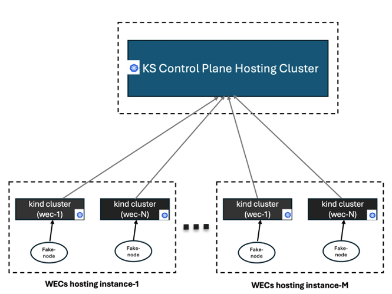

A scalable Kubernetes-based testbed for KubeStellar Performance Tests
---------------------------------------------------------------------



### Requirements
AWS EC2 is the environment used to setup the testbed. So AWS credentials are required.
They can be set by environment variables, e.g. `AWS_ACCESS_KEY` and `AWS_SECRET_KEY`.

### Overview

The testbed consists of (from bottom to top):
- Networking and stroage resources from AWS;
- AWS EC2 instances;
- Kubernetes cluster(s);
- Workload(s): Kubestellar Core and WEC components 


### Deployment Instructions

1. Deploy the core region: 

```
./deploy_core_region.sh --region us-east-2  --num_workers 2 --instance_type t2.xlarge   --aws_key_name mykey  --archt x86_64
```

The above command creates the required AWS infrastructure including a security group and EC2 instances on AWS.
EC2 region, numbers of master nodes and worker nodes, and instance type can be specified in playbook `vars`. Then, it creates a Kubernetes cluster deployed using Kubeadm and KubeStellar core components will be installed.


2. Create the WEC hosting instances:

```
./deploy_edge_region.sh --region us-east-2 --num_workers 1 --instance_type t2.2xlarge --aws_key_name  mykey  --archt x86_64
```

3. Create the WEC kind clusters in the edge region:

a) Update the inventory of the WEC instances to include the IP address of the master node of the K8s cluster created in step-1 above. You can find the required info the in the following file: `.data/hosts_core.

Use the following command to see the WEC ansible inventory:
```
cat .data/hosts_wec
```

Sample output: 
```
[masters]
 <add master node info here!>

[add_workers]
worker1 ansible_host=192.168.56.1
```


b) Create Kind cluster WECs and connect to KS Core cluster

```
ansible-playbook -i .data/hosts_wec deploy_ks_wec.yaml --ssh-common-args='-o StrictHostKeyChecking=no' -e 'num_wecs=1  wec_name_prefix=location'
```

The above command creates kind WEC clusters and connected them to the KubeStellar core cluster created in step-1. 


3. Destroy the infrastructure.

```
./delete_all_infra.sh  --region us-east-2
```
